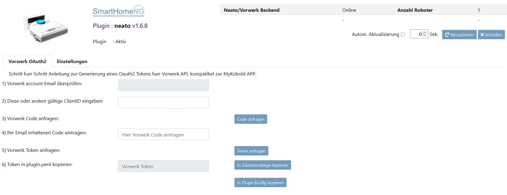
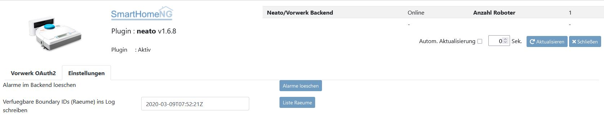

.. index:: Plugins; neato
.. index:: neato

=====
neato
=====

.. image:: webif/static/img/plugin_logo.png
   :alt: plugin logo
   :width: 300px
   :height: 300px
   :scale: 50 %
   :align: left

Neato plugin, mit Unterstützung für Neato und Vorwerk Saugroboter.

Konfiguration
=============

Die Informationen zur Konfiguration des Plugins sind unter :doc:`/plugins_doc/config/neato` beschrieben.

Anforderungen
=============
1) Es muss auf dem SmarthomeNG Rechner en_US.utf8 installiert sein (sudo dpkg-reconfigure locales)

Unterstützte Hardware
=====================

=============== ============= ==========
Roboter          Unterstützt   Getestet
=============== ============= ==========
Neato Botvac D3   ja             nein
Neato Botvac D4   ja             nein
Neato Botvac D5   ja             ja
Neato Botvac D6   ja             nein
Neato Botvac D7   ja             nein
Vorwerk VR300     ja             ja
=============== ============= ==========

Authentifizierung
=================

Das Plugin unterstützt zwei verschiedene Arten der Authentifizierung mit dem Neato oder Vorwerk Backend:

a) Authentifizierung über Emailadresse des Nutzerkontos und zugehöriges Passwort. Nutzbar für Neato und alte Vorwerk API

.. code-block:: yaml

    Neato:
        plugin_name: neato
        account_email: 'your_neato_account_email'
        account_pass: 'your_neato_account_password!'
        robot_vendor: 'neato or vorwerk'

b) Oauth2 Authentifizierung über Emailadresse des Nutzerkontos und Token. Nutzbar nur für Vorwerk mit dem aktuellen MyKobol APP Interface

.. code-block:: yaml

    Neato:
        plugin_name: neato
        account_email: 'your_neato_account_email'
        token: 'HEX_ASCII_TOKEN'
        robot_vendor: 'vorwerk'

Der Token kann hier kompfortabel über die Schritt für Schritt Anleitung des Plugin Webinterfaces generiert werden, siehe Vorwerk OAuth2 Tab.

Wenn eine Nutzung des Webinterfaces nicht möglich ist, kann ein Token auch manuell generiert werden. Hierzu:

a) Neato plugin aktivieren und Emailadresse des Vorwerk Nutzerkontos konfigurieren.

b) Plugin Logging auf Level INFO stellen (in logger.yaml oder via Admin Interface)

c) Plugin Funktion request_oauth2_code ausführen. Hierbei wird ein Code bei Vorwerk angefragt, welcher an die oben angegebene Emaildresse gesendet wird.

d) Nach Erhalt des Codes die Plugin Funktion request_oauth2_token(code) ausführen, wobei als Argument der per Email erhaltene Code übergeben wird.

e) Im Logfile nach dem generierten ASCII Token im Hexadezimalformat suchen

f) Das Hex ASCII Token in der plugin.yaml angeben.

Unterstützte Plugin Attribute
=============================

Folgende Item Attribute (neato_attribute) werden vom Plugin unterstützt:

=========================== ========== =====================
Attribut                      Itemtyp    Lesend/Schreibend
=========================== ========== =====================
name                           str        r
state                          str        r
state_action                   str        r
command                        num        w
is_docked                      bool       r
is_schedule_enabled            bool       r
is_charging                    bool       r
charge_percentage              num        r
command_goToBaseAvailable      bool       r
alert                          str        r
clean_room                     str        w
=========================== ========== =====================

Roboter Status
--------------

Das String Item für den Roboterstatus (state) kann folgende Zustände einnehmen:

======================= ====
Roboterstatus (state)
======================= ====
invalid
idle
busy
paused
error
======================= ====

Das Num Item für den Roboterzustand (state_action) kann folgende Zustände einnehmen:

========================================= =========
Roboterzustand (state_action)               dezimal
========================================= =========
Invalid                                     0
House Cleaning                              1
Spot Cleaning                               2
Manual Cleaning                             3
Docking                                     4
User Menu Active                            5
Suspended Cleaning                          6
Updating                                    7
Copying Logs                                8
Recovering Location                         9
IEC Test                                    10
Map cleaning                                11
Exploring map (creating a persistent map)   12
Acquiring Persistent Map IDs                13
Creating & Uploading Map                    14
Suspended Exploration                       15
========================================= =========

Roboterbefehle
===============

Das Num Item für die Roboterbefehle (command) kann folgende Zustände einnehmen:

============================= =========
Befehl (command)               dezimal
============================= =========
Start cleaning                  61
Stop cleaning                   62
Pause cleaning                  63
Resume cleaning                 64
Find the robot                  65
Send to base                    66
Enable schedule                 67
Disable schedule                68
============================= =========

Web Interface
=============

Das neato Plugin verfügt über ein Webinterface, um  für Vorwerk Saugroboter das OAuth2 Authentifizierungsverfahren direkt durchzuführen und bei Bedarf
den erhaltenen Token direkt in die Konfiguration (plugin.yaml) zu übernehmen.

.. important::

   Das Webinterface des Plugins kann mit SmartHomeNG v1.4.2 und davor **nicht** genutzt werden.
   Es wird dann nicht geladen. Diese Einschränkung gilt nur für das Webinterface. Ansonsten gilt
   für das Plugin die in den Metadaten angegebene minimale SmartHomeNG Version.

Aufruf des Webinterfaces
------------------------

Das Plugin kann aus dem Admin Interface aufgerufen werden. Dazu auf der Seite Plugins in der entsprechenden
Zeile das Icon in der Spalte **Web Interface** anklicken.

Außerdem kann das Webinterface direkt über ``http://smarthome.local:8383/neato`` aufgerufen werden.

Beispiele
---------

Folgende Informationen können im Webinterface angezeigt werden:

Im ersten Tab Vorwerk OAuth2 findet sich direkt die Schritt für Schritt Anleitung zur OAuth2 Authentifizierung. Achtung: Diese wird aktuell nur von Vorwerk Robotern unterstützt:

Im zweiten Tab Einstellungen findet sich zwei Optionen zum Löschen von gemeldeten Alarmmeldungen (z.B. Roboter Behälter leeren) und zum Auslesen aller bekannter RaumIDs (BoundardyIDs) zur
Einzelraumreinigung. Die bekannten Räume werden dazu in das Plugin Logfile geschrieben. Übergeben werden muss hierzu die Vorwerk MapID. Hierzu einmal manuell eine Einzelraumreinigung via Vorwerk/Neato
App anstoßen. Das Plugin extrahiert anschließend automatisch den Namen der MapID und schlägt diese als Eingabe im Eingabefeld des Webinterfaces vor.

SmartVisu
=========

Beispiele
---------

Beispiele für Integrationen in smartVisu:

.. code-block:: html

    
 {{ basic.button('RobotButton_Start', 'Neato.Robot.Command', 'Start', '', '61', 'midi') }} 

    
 {{ basic.button('RobotButton_Stop', 'Neato.Robot.Command', 'Stop', '', '62', 'midi') }} 

    
 {{ basic.button('RobotButton_Pause', 'Neato.Robot.Command', 'Pause', '', '63', 'midi') }} 

    
 {{ basic.button('RobotButton_Resume', 'Neato.Robot.Command', 'Resume', '', '64', 'midi') }} 

    
 {{ basic.button('RobotButton_Find', 'Neato.Robot.Command', 'Find', '', '65', 'midi') }}

    
Name: {{ basic.value('RobotName', 'Neato.Robot.Name') }}

    /** Get the robots name (str)*/

    
Cleaning status: {{ basic.value('RobotState', 'Neato.Robot.State') }}

    /** Get the robots cleaning status (str) */

    
Cleaning status action: {{ basic.value('RobotStateAction', 'Neato.Robot.StateAction') }}

    /** Get the robots cleaning status action (str). Only when it's busy */

    
Docking status: {{ basic.value('RobotDockingStatus', 'Neato.Robot.IsDocked') }}

    /** Get the robots docking status (bool) */

    
Battery status: {{ basic.value('RobotBatteryState', 'Neato.Robot.ChargePercentage') }}

    /** Get the robots battery charge status (num) */

