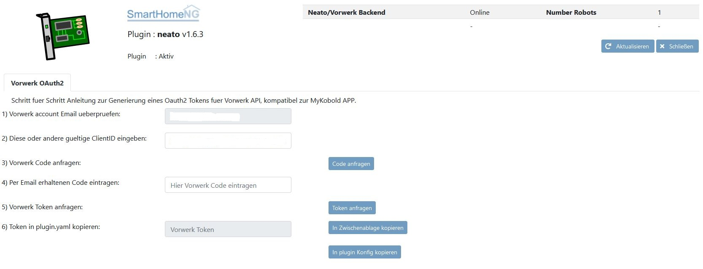

.. index:: Plugins; Neato (Neato und Vorwerk Unterstützung)
.. index:: Neato

=====
neato
=====

Neato plugin, mit Unterstützung für Neato und Vorwerk Saugroboter.

Konfiguration
=============

Die Informationen zur Konfiguration des Plugins sind unter :doc:`/plugins_doc/config/neato` beschrieben.

Requirements
=============
- locale en_US.utf8 must be installed (sudo dpkg-reconfigure locales)

Supported Hardware
==================

=============== ========= ======
Robot           Supported Tested
=============== ========= ======
Neato Botvac D3 yes       no
Neato Botvac D4 yes       no
Neato Botvac D5 yes       yes
Neato Botvac D6 yes       no
Neato Botvac D7 yes       no
Vorwerk VR300   yes       yes
=============== ========= ======

Web Interface
=============

Das neato Plugin verfügt über ein Webinterface, um  für Vorwerk Saugroboter das OAuth2 Authentifizierungsverfahren direkt durchzuführen und bei Bedarf
den erhaltenen Token direkt in die Konfiguration (plugin.yaml) zu uebernehmen.

.. important::

   Das Webinterface des Plugins kann mit SmartHomeNG v1.4.2 und davor **nicht** genutzt werden.
   Es wird dann nicht geladen. Diese Einschränkung gilt nur für das Webinterface. Ansonsten gilt
   für das Plugin die in den Metadaten angegebene minimale SmartHomeNG Version.

Aufruf des Webinterfaces
------------------------

Das Plugin kann aus dem Admin Interface aufgerufen werden. Dazu auf der Seite Plugins in der entsprechenden
Zeile das Icon in der Spalte **Web Interface** anklicken.

Außerdem kann das Webinterface direkt über ``http://smarthome.local:8383/neato`` aufgerufen werden.

Beispiele
---------

Folgende Informationen können im Webinterface angezeigt werden:

Im ersten Tab Vorwerk OAuth2 findet sich direkt die Schritt fuer Schritt Anleitung zur OAuth2 Authentifizierung. Achtung: Diese wird aktuell nur von Vorwerk Robotern unterstuetzt:

Changelog
---------
V1.6.6     added option to clear errors/alarms in neato/vorwerk backend via plugin's webif

V1.6.5     added new function start_robot(boundary_id=None, map_id=None) to enable single room cleaning
           added new function get_map_boundaries_robot(map_id=None) to request available map boundaries (rooms) for a given map
           added new function dismiss_current_alert() to reset current alerts

V 1.6.4    fixed readout for docking state and go to base availability
           combined all neato attribues into one

V 1.6.3    changed attribute charge_percentage from string to integer
           added alert text output, e.g. dustbin full
           Write obtained OAuth2 token obtained via web interface directly to config plugin.yaml

V 1.6.2    Added webinterface

V 1.6.1    Added new Vorwerk Oauth2 based authentication feature (compatible with myKobold APP)

V 1.6.0    Initial working version
