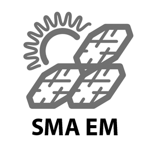

.. index:: Plugins; nuki
.. index:: nuki

====
nuki
====

Das Plugin bindet ein `Nuki Smart Lock <https://nuki.io/de/smart-lock/>`_ an SmartHomeNG an. Es
kann Schließvorgänge auslösen und den Status des Schlosses in Items abbilden. Das Plugin
unterstützt drei Betriebsarten, die über den Parameter **mode** gewählt werden: über die Nuki
Bridge, über MQTT oder über beide gleichzeitig.

Voraussetzungen
================

Für den Bridge-Betrieb (**mode** 2 oder 3) wird eine `Nuki Bridge <https://nuki.io/de/bridge/>`_
benötigt, die bereits mit dem/den Nuki Smart Lock(s) gekoppelt ist. Außerdem muss das
``http``-Modul von SmartHomeNG konfiguriert sein, da die Bridge ihre Statusmeldungen über dessen
Callback-Mechanismus an das Plugin sendet. IP und Port des Callbacks werden dabei automatisch aus
der Konfiguration des ``http``-Moduls ermittelt und können nicht mehr im Plugin selbst gesetzt
werden. Der **service_user**/**service_password** des ``http``-Moduls wird von der Nuki Bridge
nicht unterstützt (kein Basic-Auth) und daher für den Callback ignoriert.

Für den MQTT-Betrieb (**mode** 1 oder 3) muss MQTT in der Nuki App aktiviert und das
``mqtt``-Modul von SmartHomeNG konfiguriert sein.

Konfiguration
=============

Die Informationen zur Konfiguration des Plugins sind unter :doc:`/plugins_doc/config/nuki`
beschrieben.

Item-Attribute
--------------

Ein Item muss den **type** ``num`` haben und die Attribute **nuki_id** und **nuki_trigger**
setzen, um mit dem Nuki Smart Lock verbunden zu werden.

**nuki_id** ordnet das Item dem jeweiligen Smart Lock zu. Im Bridge-Betrieb wird die ID beim
Start von SmartHomeNG (Loglevel INFO/DEBUG) zusammen mit dem Namen des Schlosses ins Logfile
geschrieben und ist zusätzlich im Webinterface des Plugins zu sehen. Im MQTT-Betrieb lässt sich
die ID mit einem MQTT-Tool wie MQTT Explorer ermitteln, sobald MQTT in der Nuki App aktiviert ist.

**nuki_trigger** legt fest, welche Information das Item führt. Ein Item kann jeweils nur einen
Trigger haben. Über die Nuki Bridge stehen **action**, **state**, **doorstate** (nur Nuki 2.0) und
**battery** zur Verfügung, über MQTT die Entsprechungen **mqtt_action**, **mqtt_state**,
**mqtt_mode** und **mqtt_battery_critical** sowie zusätzlich **mqtt_battery_charge_state**.

Bei **nuki_trigger: action** / **mqtt_action** löst das Schreiben eines der folgenden Werte auf das
Item die entsprechende Schließaktion aus (**enforce_updates: true** wird empfohlen, siehe
Beispiel):

======  =========================================
Wert    Aktion
======  =========================================
1       unlock
2       lock
3       unlatch
4       lock 'n' go
5       lock 'n' go with unlatch
6       full lock (nur MQTT)
======  =========================================

Bei **nuki_trigger: state** / **mqtt_state** wird das Item bei jeder Statusänderung auf einen der
folgenden Werte gesetzt:

======  =======================
Wert    Status
======  =======================
0       uncalibrated
1       locked
2       unlocking
3       unlocked
4       locking
5       unlatched
6       unlatched (lock 'n' go)
7       unlatching
254     motor blocked
255     undefined
======  =======================

Bei **nuki_trigger: doorstate** / **mqtt_mode** (nur Nuki 2.0) wird das Item bei jeder Änderung des
Türstatus auf einen der folgenden Werte gesetzt:

======  ==================
Wert    Türstatus
======  ==================
1       deactivated
2       door closed
3       door opened
4       door state unknown
5       calibrating
======  ==================

Bei **nuki_trigger: battery** / **mqtt_battery_critical** führt das Item den Batteriestatus:
``0`` = Batterie in Ordnung, ``1`` = Batterie schwach, sollte bald ersetzt werden.
**mqtt_battery_charge_state** liefert stattdessen den Ladestand der Batterie in Prozent.

Beispiel
========

::

    MyNukiLockViaBridge:

        MyLockState:
            type: num
            nuki_id: 123456789
            nuki_trigger: state

        MyLockBattery:
            type: num
            nuki_id: 123456789
            nuki_trigger: battery

        MyLockAction:
            type: num
            nuki_id: 123456789
            nuki_trigger: action
            enforce_updates: 'true'

    MyNukiLockViaMQTT:

        MyLockState:
            type: num
            nuki_id: 123456789
            nuki_trigger: mqtt_state

        MyLockBattery:
            type: num
            nuki_id: 123456789
            nuki_trigger: mqtt_battery_critical

        MyLockBatteryChargeState:
            type: num
            nuki_id: 123456789
            nuki_trigger: mqtt_battery_charge_state

        MyLockAction:
            type: num
            nuki_id: 123456789
            nuki_trigger: mqtt_action
            enforce_updates: 'true'

Web Interface
=============

Das Webinterface zeigt die konfigurierten Nuki-Items in vier Tabellen: Event-Items (Schlossstatus),
Tür-Items (Türstatus, nur Nuki 2.0), Aktions-Items (inklusive einer Auswahlbox, über die eine
Schließaktion direkt aus dem Webinterface ausgelöst werden kann) und Batterie-Items. Im
Bridge-Betrieb werden zusätzlich Bridge-Token, Callback-URL und die IDs aller über die Bridge
gekoppelten Schlösser angezeigt.
