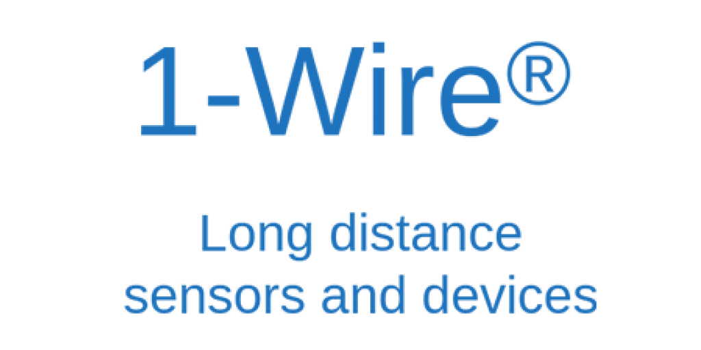
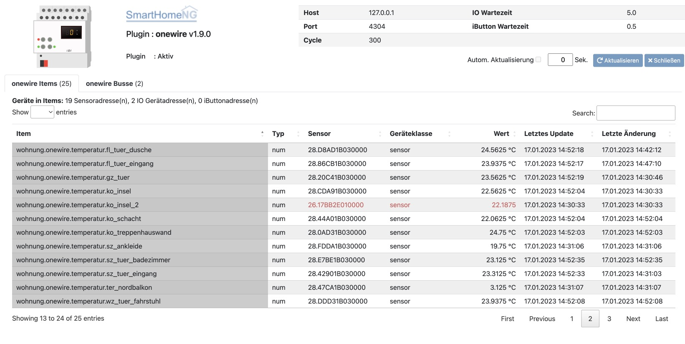
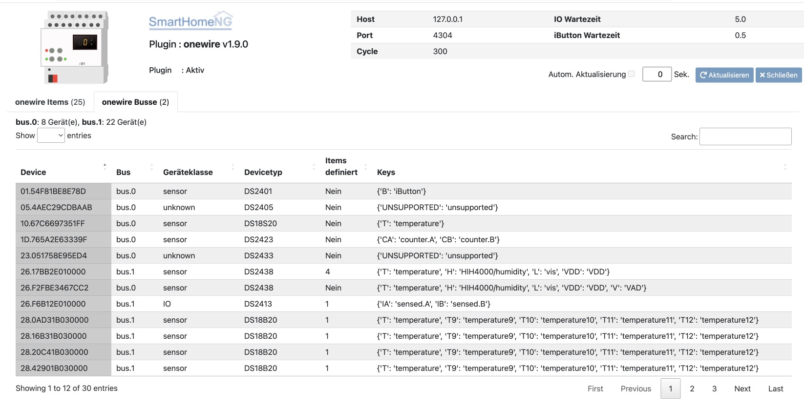

.. index:: Plugins; onewire
.. index:: onewire

=======
onewire
=======

Der 1-Wire bzw. One-Wire oder Eindraht-Bus ist ein Bussystem das mit 2 oder 3 Einzeladern betrieben werden wird.
Es gibt einen parasitären Modus in dem nur 2 Adern genutzt werden und einen Modus in dem eine Zusatzspannung von 5V genutzt wird.

Es gibt für dieses System recht günstige Sensoren so das die Nutzung zur
Temperaturmessung, Feuchtigkeitsmesung, Akkuüberwachung etc.
im Vergleich zu anderen Systemen wie z.B. KNX recht kostengünstig ist.

Anforderungen
=============
Eine vorhandene 1-Wire Schnittstelle mit mindestens einem Sensor wird benötigt sowie ein installiertes
owserver wird benötigt um das Plugin nutzen zu können.

Notwendige Software
-------------------

Das Plugin benötigt einen installierten und lauffähigen `owserver <https://owfs.org>`_.
Die Installation und Konfiguration ist je nach Schnittstelle und Linux Variante und Version leicht unterschiedlich.

Zumeist wird eine USB Schnittstelle DS2490 verwendet. Für die Konfiguration wird typischerweise bei Linux
eine udev-Rule angelegt damit owserver ohne root Rechte betrieben werden kann.

.. code:: bash

    # /etc/udev/rules.d/80-smarthome.rules
    SUBSYSTEM=="usb",ENV{DEVTYPE}=="usb_device",ATTR{idVendor}=="04fa", ATTR{idProduct}=="2490",GROUP="smarthome",MODE="0660"

Der owserver kann auch auf einem anderen System laufen und muß nicht lokal installiert sein.

Unterstützte Geräte
-------------------

Alle 1-Wire Geräte die Unterstützung durch owserver haben werden prinzipiell unterstützt.
Es gibt jedoch einige Geräte deren Werte vom Plugin aktuell nicht auf Items abgebildet werden
können (z.B. Flash Speicher, EEPROMS).

Sicher unterstützt werden zur Zeit:

* DS9490 Busmaster
* DS18B20 (Temperatur)
* Elabnet BMS v1.3  (MS-THS-13)
* Elabnet BMS v2.11 (MS-THS-21) (mit Lichtsensor Modul)
* Elabnet AMS v2.11 (MS-THS-21) (zusätzlich mit DS2406 2-fach I/O und DS2438 0-10V' sind nicht getestet)
* DATANAB DS2438 (Temperatur/Feuchtigkeit)
* D2PC (2-fach I/O DS2406)

|

Konfiguration
=============

Die Plugin Parameter und die Informationen zur Item-spezifischen Konfiguration des Plugins sind
unter :doc:`/plugins_doc/config/onewire` beschrieben.

plugin.yaml
-----------

Bitte die Dokumentation :doc:`Dokumentation </plugins_doc/config/onewire>` lesen, die aus den Metadaten der plugin.yaml
erzeugt wurde (siehe oben).

items.yaml
----------

Bitte die :doc:`Dokumentation </plugins_doc/config/onewire>` lesen, die aus den Metadaten der plugin.yaml erzeugt wurde.

Eine Onewire Adresse startet mit einem zweistelligen Code.
Auf der `Webseite <https://owfs.org/index_php_page_family-code-list.html>`_
findet sich eine Liste dieser **Family Codes**.
Das Plugin orientiert sich an den Codes um die Möglichkeiten eines Sensors zu bestimmen.
Für dieses Plugin werden die Codes in ``ow_addr`` gemäß ``FC.XXXXXXXXXXXX`` erwartet.
Es ist wichtig die Onewire Adressen als String in yaml einzugeben z.B. ``ow_addr: '28.8DEAAA030000'``
sonst kann es unter Umständen dazu kommen das aus der yaml-Datei die Onewire Adresse als Fließkommazahl
interpretiert wird und damit keine Funktion gegeben ist.

Es ist möglich für Busteilnehmer einer Onewire Adresse einen alias zuzuweisen. Das geschieht durch die Angabe eines
Links in der Datei ``/etc/owfs.conf`` auf eine Datei die Paare von Sensor ID und alias definiert:

.. code:: bash

    server: alias = /usr/smarthome/items/ow_aliases

Eine Datei ``ow_aliases`` enthält dann die Sensor ID und zugewiesene alias

.. code:: ini

    28.XXXXXXXXXXXX = kitchen
    28.XXXXXXXXXXXX = bathroom

Wenn auf diese Weise alias definiert werden, kann das Plugin für das Attribut ``ow_addr`` auch den alias nutzen

Da es einige Busteilnehmer gibtm die mehrere unterschiedliche Daten liefern,
reicht es nicht aus nur die Sensor ID in ``ow_addr`` anzugeben.
zusätzlich muß für ein Item auch die gewünschte Datenumwandlung definiert werden.
Das Attribut ``ow_sensor`` definiert diese Datenumwandlung.

* 'T' - Temperatur - alterbnativ T, T9, T10, T11, T12
  (je höher die Zahl, desto genauer der Wert aber desto länger die Abfragezeit)
* 'H' - Luftfeuchtigkeit
* 'L' - Lichtintensität (lux)
* 'V' - Spannung
* 'Ix' - Eingang - kann IA oder IB sein, hängt von der Art des ausgewählten Eingangs ab
* 'Ox' - Ausgang - kann OA oder OB sein, hängt von der Art des ausgewählten Ausgangs ab
* 'VDD' - Spannung der Sensorversorgung (die meisten DS2438 basierenden Sensoren)

iButtons:

* 'BM' - iButton master
* 'B' - iButton

Wenn ein iButton master verwendet wird, fragt das Plugin häufiger ab.
Die Abfrage mit ``B`` liefert ``True`` wenn der iButton erkannt wird, ansonsten ``False``
Wenn I/O Sensoren (2406) verwendet werden, fragt das Plugin diese häufiger ab.

.. note::

    Das Item sollte mit ``cache: true`` oder (falls die Daten in die Datenbank geschrieben werden sollen) mit
    ``database: init`` konfiguriert werden, da es einige Zeit dauern kann, bis alle 1-Wire Devices discovered
    wurden und sonst der Item Wert solange 0 ist.

logic.yaml
----------

Bitte die :doc:`Dokumentation </plugins_doc/config/onewire>` lesen, die aus den Metadaten der plugin.yaml erzeugt wurde.

Funktionen
----------

Das Plugin bietet aktuell keine Funktionen. Es kann jedoch das Attribut ``ibutton_hook``
gesetzt werden auf eine Call-Back Funktion die als Parameter dann die iButton ID und das
Item des Busmasters (z.B. ``sh.onewiresample.bm_ibutton``) bekommt, an dessen Anschluss der iButton detektiert wurde.

Die iButton ID wird zwischengespeichert und die Funktion wird nicht wieder aufgerufen solange
die ID noch im Zwischenspeicher ist. Der temporäre Speicher wird alle 10 Minuten geleert.

Beispielhafte Zuweisung in einer Logik:

.. code:: python

    # Start.py Logik, ist mit in der logics.yaml mit ``crontab: init`` eingetragen
    def sabotagealarm(ibutton_id, item):
        sh.notify("iButton-Alert","Jemand nutzt einen unbekannten iButton ({0}) am 1-Wire Busmaster {1}".format(ibutton_id, item))
        # sh.take_picture()
        # ...

    sh.ow.ibutton_hook = sabotagealarm

|

Beispiel
========

.. code:: yaml

    onewiresample:
        bm_ibutton:
            name: ibutton busmaster to identify ibutton buses
            type: bool
            cache: true
            ow_addr: '81.75172D000000'
            ow_sensor: BM
        ib_guest:
            name: ibutton guest
            type: bool
            cache: true
            ow_addr: '01.787D58130000'
            ow_sensor: B
        temp_outside:
            name: temperature outside
            type: num
            cache: true
            ow_addr: '28.8DEAAA030000'
            # could be T, T9, T10, T11, T12
            ow_sensor: T
        lux_outside:
            name: lux / lightintensity outside
            type: num
            cache: true
            ow_addr: '26.8DD76B010000'
            ow_sensor: L
        humidity_outside:
            name: humidity outside
            type: num
            cache: true
            ow_addr: '26.8DD76B010000'
            ow_sensor: H
        input_water_leak:
            name: input water leak detection
            type: bool
            cache: true
            ow_addr: '3A.C6CC07000000'
            # could be IA, IB
            ow_sensor: IA
        output_led1:
            name: output led1 keys
            type: bool
            cache: true
            ow_addr: '3A.C6CC07000000'
            # could be OA, OB
            ow_sensor: OB
        voltage_sensor:
            name: voltage of the sensor input (0-10V)
            type: num
            cache: true
            ow_addr: '26.A9D76B010000'
            ow_sensor: V

|

Web Interface
=============

Das Plugin liefert eine Übersicht über die im Zusammenhang mit diesem Plugin definierten Items und über die erkannten
1-Wire Busse und die daran vorhandenen Busteilnehmer.

|

Tab 1: Items
------------

Das erste Tab zeigt alle definierten Items zu diesem Plugin an. Zu jedem Item werden folgende Informationen angezeigt:

- Pfad der Items
- Datentyp des Items
- 1-Wire Adresse des Devices/Sensors
- Geräteklasse des Devices (sensor, IO, iButton, iButton master)
- Aktueller Wert des Items. Der Wert wird mit Informationen aus dem 1-Wire Sensor um eine Maßeinheit ergänzt angezeigt
- Zeitpunkt des letzten Updates des Item Wertes
- Zeitpunkt der letzten Änderung des Item Wertes

Falls das entsprechende 1-Wire Device seit dem letzten Start von SmartHomeNG noch nicht erkannt wurde, werden für das
Item die Werte Sensor, Geräteklasse und Wert in rot angezeigt. In diesem Fall fehlt beim Wert auch die Maßeinheit, da
die Information zur Maßeinheit aus dem 1-Wire Device stammt. Der angezeigte Wert des Items ist in diesem Fall der
gecachte Wert aus SmartHomeNG, bzw. der letzte gespeicherte Wert aus der Datenbank (falls das Item mit ``database: init``
konfiguriert wurde)

|

Tab 2: 1-Wire Busse
-------------------

Das zweite Tab zeigt alle per Discovery gefundenen 1-Wire Devices an. Zu jedem Device werden folgende Informationen
angezeigt:

- 1-Wire Bus an den das Device angeschlossen ist
- Geräteklasse des Devices (sensor, IO, iButton, iButton master)
- Device Typ
- Ob Items zu diesem Device definiert sind und wenn ja, wie viele
- Die vom Device unterstützten Keys für Sensoren bzw. I/O Kanäle

