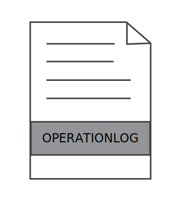

.. index:: Plugins; operationlog
.. index:: operationlog

============
operationlog
============

Das OperationLog-Plugin kann genutzt werden, um Logs zu erzeugen. Diese können im Cache, im RAM und in Dateien gespeichert und durch andere Items oder Plugins angesprochen werden. Weiterhin können sie z.B. in der SmartVISU vom Standardwidget **status.log** angezeigt werden.

.. important::

    Das Plugin ist als "deprecated" abgekündigt. Ersatz ist im nächsten Abschnitt beschrieben.

Ersatz durch Bordmittel
=======================

Details zum Memory und Datei Loghandler sind unter :doc:`Logging Handler </referenz/logging/logging_handler>`
zu finden. Informationen zum Loggen bei Itemänderungen findet man unter
:doc:`log_change </referenz/items/standard_attribute/log_change>`.

Es können beim Nutzen des ``DateTimeRotatingFileHandler`` wie beim operationlog
Plugin Platzhalter zur Benennung der Dateien
genutzt werden: {year}, {month}, {day}, {hour}, {intstamp}, {stamp}. Bei jeder
Logrotation werden wie gewohnt ältere Dateien gelöscht (je nach Konfiguration) und
das neue Log wird auf Basis der aktuellen Uhrzeit benannt.

Beispiel Logik
--------------

In diesem Beispiel werden sämtliche Aufrufe des Loggers in der Logik ex_logging
in das Memorylog namens memory_info und in eine Datei geschrieben.
Letztere wird jede Stunde erneuert und 7 Stunden aufbewahrt. Der Name der Datei
resultiert aus der Konfiguration mittels Platzhaltern oder Standard-Zeitstempel.

Die Logs werden in der Datei ``etc/logging.yaml`` wie folgt konfiguriert:

.. code-block:: yaml

    # etc/logging.yaml
    handlers:
        memory_info:
            (): lib.log.ShngMemLogHandler
            logname: memory_info
            maxlen: 60
            level: INFO
            cache: True

    		data_file:
    			(): lib.log.DateTimeRotatingFileHandler
    			formatter: shng_simple
    			when: 'H'
    			backupCount: 7
    			filename: ./var/log/data-{year}-{month}-{day}_at_{hour}.log
    			encoding: utf8

    loggers:
        logics.ex_logging:
            handlers: [memory_info, data_file]
            level: INFO

Die Logeinträge werden aus der Logik ``logics/<logikname>.py`` wie folgt erstellt:

.. code-block:: python

    # logics/ex_logging.py
    sourceitem = items.return_item(trigger['source'])
    logger.info(f"Logik '{logic.name}' wurde durch {trigger} getriggert. Source = {sourceitem}")
    logger.debug(f"Logik '{logic.name}' (filename '{logic.filename}') wurde getriggert (DEBUG)")

Beispiel Item
-------------

Das Logging wird in der Datei ``etc/logging.yaml`` wie folgt konfiguriert. Bei Bedarf können wie im oberen Beispiel
weitere Handler deklariert und referenziert werden, um das Log auch in (mehrere) Dateien zu schreiben.

.. code-block:: yaml

    # etc/logging.yaml
    handlers:
        memory_info:
            (): lib.log.ShngMemLogHandler
            logname: memory_info
            maxlen: 60
            level: INFO
            cache: True

    loggers:
        items.memory-items:
            handlers: [memory_info]
            level: INFO

Nun können mehrere Items über die entsprechenden Attribute in das Log
schreiben. Möchte man dabei die Möglichkeit des operationlog Plugins, Mitteilungen
über ein Item zu deklarieren, nutzen, kommt das Attribut
``log_rules: "{'itemvalue': '<item>'}"`` zum Einsatz. Ebenso ist es möglich, über
dieses Attribut Limits und weitere Regeln wie Filter etc. zu deklarieren.

.. code-block:: yaml

    item:
        type: num
        log_rules: "{
            'lowlimit' : -1.0,
            'highlimit': 10.0,
            'filter': [1, 2, 5],
            'exclude': '.exclude_values',
            'itemvalue': '.text'
            }"
        log_change: memory-items

        exclude_values:
            type: list
            initial_value: [2, 10]
            cache: True

        text:
            type: str
            initial_value: 'This is the log message'
            cache: True

Das Einbinden in eine SmartVISU Seite erfolgt mittels:

.. code-block:: html

  {{ status.log('', 'memory_info', 10) }}

Konfiguration
=============

.. important::

      Detaillierte Informationen zur Konfiguration des Plugins sind unter :doc:`/plugins_doc/config/operationlog` zu finden.

plugin.yaml
-----------

Das Plugin wird in der ``/etc/plugin.yaml`` konfiguriert:

.. code-block:: yaml

   mylogname1:
       plugin_name: operationlog
       name: mylogname1
       # maxlen = 50
       # cache = yes
       # logtofile = yes
       # filepattern = {year:04}-{month:02}-{day:02}-{name}.log
       # logger =

   mylogname2:
       plugin_name: operationlog
       name: mylogname2
       maxlen: 0
       cache: 'no'
       logtofile: 'yes'
       filepattern: yearly_log-{name}-{year:04}.log

Diese Konfiguration erzeugt zwei Logs mit den Namen **mylogname1** und **mylogname2**.

.. hint::

  Die Konfiguration mehrerer Logger erzeugt jeweils eine Warnung beim Start, die aber keine weitere Auswirkungen hat.

Das erste Log **mylogname1** wird mit den Standardwerten konfiguriert, schreibt den Cache in die Datei ``var/log/cache/mylogname1`` und das Log in die Datei ``var/log/operationlog/yyyy-mm-dd-mylogname1.log``.
Es wird jeden Tag eine neue Logdatei erzeugt und die letzten 50 Einträge werden im RAM gehalten.

Die Einträge des zweiten Logs werden nicht im RAM gehalten und nicht in den Cache geschrieben, sondern nur in die Datei ``var/log/yearly_log-mylogname2-yyyy.log`` geschrieben.

Die Logdateien können frei benannt werden. Die Schlüsselwörter ``{name}``, ``{year}``, ``{month}`` und ``{day}`` werden durch den jeweiligen Namen bzw. die jeweilige Zeit ersetzt. Bei jedem Schreibvorgang in die Logdatei wird der Dateiname geprüft und bei Bedarf eine neue Datei erzeugt.

Wenn die Daten auch in einen Systemlogger von SmartHomeNG geschrieben werden sollen, kann dieser unter ``logger`` angegeben werden.

items.yaml
----------

Ein Item kann für das Logging wie folgt konfiguriert werden:

.. code-block:: yaml

   foo:
       name: Foo

       bar:
           type: num
           olog: mylogname1
           # olog_rules: *:value
           # olog_txt: {id} = {value}
           # olog_level: INFO

foo.bar nutzt die minimale Konfiguration mit Standardwerten. Wenn ein Item geändert wird, wird ein neuer Logeintrag der Kategorie 'INFO' im Log mylogname1 erzeugt. Das Format des Eintrags ist "foo.bar = value".
Der Standardwert ``olog_rules = *:value`` gibt an, dass alle Werte einen Logeintrag auslösen. Es können Itemtypen ``num``, ``bool`` and ``str`` genutzt werden.

In ``olog_rules`` kann eine Liste von Parametern angegeben werden, die einem Item-Wert jeweils einen String zuordnen. Dazu wird die Form ``wert:string`` verwendet.

.. hint::

  Durch den yaml-Parser werden Angaben wie ``True:text1`` und ``False:text2`` (beachte Großschreibung) den bool-Werten `true` und `false` zugeordnet. Wenn das Item vom Typ `str` ist und der Text "True" oder "False" für die jeweilige Regel verwendet werden soll, muss er in Anführungszeichen gesetzt werden: ``"True:text1"`` bzw. ``"False:text2"``
  Umgekehrt werden auch bei einem bool-Item die Angaben ``true:text1`` und ``false:text2`` (beachte Kleinschreibung) nicht als bool-Werte erkannt und führen daher bei Änderung des Items nicht zu einem Logeintrag.

Die zu loggenden Werte können begrenzt werden, indem die Angaben ``lowlimit:<niedrigster Wert>`` und ``highlimit:<höchster Wert>`` verwendet werden, siehe auch untenstehendes Beispiel. Ein Logeintrag wird erzeugt, wenn lowlimit <= item value < highlimit. Aus Kompatibilitätsgründen sind auch die
Einträge ``lowlim`` und ``highlim`` möglich.
Der auszugebende Text kann mit dem Parameter ``olog_txt`` festgelegt werden. Die folgenden vordefinierten Schlüsselwörter können dabei verwendet werden:

.. list-table::
   :header-rows: 1

   * - Key
     - Description
   * - ``{value}``
     - Item-Wert
   * - ``{mvalue}``
     - in ``olog_rules`` zugewiesener Eintrag für den jeweiligen Item-Wert
   * - ``{name}``
     - das Attribut ``name`` des Items
   * - ``{age}``
     - Zeit seit der letzten Änderung des Items
   * - ``{pname}``
     - das Attribut ``name`` des Parent-Items
   * - ``{id} / {item}``
     - die ID des Items
   * - ``{pid}``
     - die ID des Parent-Items
   * - ``{time}``
     - die aktuelle Uhrzeit im Format %H:%M:%S
   * - ``{date}``
     - das aktuele Datum im Format %d.%m.%Y
   * - ``{now}``
     - aktuelle Zeit, wie sie von shtime.now zurück käme (YYYY-MM-DD HH:MM:SS.ssssss+TZ)
   * - ``{stamp}``
     - der aktuelle Unix Zeitstempel
   * - ``{lowlimit} / {lowlim}``
     - unterer Grenzwert für Logeinträge
   * - ``{highlimit} / {highlim}``
     - oberer Grenzwert für Logeinträge

Weiters können beliebige Python-Ausdrücke im Logtext wie folgt verwendet werden:

.. code-block:: yaml

	{eval=<python code>}

Der Code wird in der Logausgabe durch seinen Rückgabewert ersetzt. Mehrfache ``{eval=<python code>}``-Ausdrücke können verwendet werden.

Item Log Beispiele
^^^^^^^^^^^^^^^^^^

.. code-block:: yaml

   foo:
       name: Foo

       bar1:
           type: num
           name: Bar1
           olog: mylogname1
           olog_rules:
             - 2:two
             - 0:zero
             - 1:one
             - '*:value'
           olog_txt: This is a log text for item with name {name} and value {value} mapped to {mvalue}, parent item name is {pname}
           olog_level: ERROR

       bar2:
           type: bool
           name: Bar2
           olog: mylogname1
           olog_rules:
             - True:the value is true
             - False:the value is false
           olog_txt: This is a log text for {value} mapped to '{mvalue}', {name} changed after {age} seconds
           olog_level: warning

       bar3:
           type: str
           name: Bar3
           olog: mylogname1
           olog_rules:
             - t1:text string number one
             - t2:text string number two
             - '*:value'
           olog_txt: "text {value} is mapped to logtext '{mvalue}', expression with syntax errors: {eval=sh.this.item.doesnotexist()*/+-42}"
           olog_level: critical

       bar4:
           type: num
           name: Bar4
           olog: mylogname1
           olog_rules:
             - lowlimit:-1.0
             - highlimit:10.0
           olog_txt: Item with name {name} has lowlimit={lowlimit} <= value={value} < highlimit={highlimit}, the value {eval='increased' if sh.foo.bar4() > sh.foo.bar4.prev_value() else 'decreased'} by {eval=round(abs(sh.foo.bar4() - sh.foo.bar4.prev_value()), 3)}
           olog_level: info

       bar5:
           type: num
           name: Bar5
           remark: logs the values in olog_txt without any timestamp and log level, same as datalog plugin
           olog: mylogname1
           olog_txt: {time};{item};{value}
           olog_level: none

.. hint::

  Das Loglevel NONE sorgt dafür, dass äquivalent zum datalog Plugin Einträge ohne
  standardmäßigem Zeit- und Logleveleintrag erstellt werden.

logics.yaml
-----------

Logiken können wie folgt für Logging konfiguriert werden:

.. code-block:: yaml

   some_logic:
       filename: script.py
       olog: mylogname1
       # olog_txt: The logic {logic.name} was triggered!
       # olog_level: INFO

Um Logging für eine Logik zu aktivieren, reicht es, das ``olog``-Attribut anzugeben. Standardmäßig wird der Text "Logic {logic.name} triggered" ausgegeben.
Bei Bedarf kann der Logtext durch ``olog_txt`` angepasst werden. Abweichend von der Item-Konfiguration können die folgenden Schlüsselwörter verwendet werden:

.. list-table::
   :header-rows: 1

   * - Key
     - Description
   * - ``{plugin.*}``
     - die Plugin-Instanz (z.B: plugin.name für den Namen des Plugins)
   * - ``{logic.*}``
     - das Logik-Objekt (z.B. logic.name für den Namen)
   * - ``{by}``
     - Name des Triggers der Logik
   * - ``{source}``
     - Name der Quelle der Änderung
   * - ``{dest}``
     - Name des Ziels der Änderung

Benutzerdefinierte Python-Ausdrücke können analog zur Item-Konfiguration verwendet werden.

Funktionen
==========

.. code-block:: python

   sh.mylogname1('<level_keyword>', msg)

Erzeugt die Logausgabe von ``msg`` mit dem angegebenen Log-Level in ``<level_keyword>``.

Mit den Log-Level-Schlüsselwörtern ``INFO``\ , ``WARNING`` und ``ERROR`` (Groß- oder Kleinschreibung) werden die Einträge im **status.log**-Widget der SmartVISU in der jeweiligen Farbe Grün, Gelb und Rot angezeigt.
``EXCEPTION`` und ``CRITICAL`` erzeugen ebenfalls rote Einträge. Andere Schlüsselwörter sorgen für eine Anzeige ohne Farbmarkierung.

.. code-block:: python

   sh.mylogname1(msg)

Erzeugt die Logausgabe von ``msg`` im Standard-Level ``INFO``.

.. code-block:: python

   data = sh.mylogname1()

gibt ein ``deque``-Objekt zurück, das die letzten ``maxlen`` Einträge enthält.

Dieses Plugin wurde von den Plugins MemLog und AutoBlind inspiriert und nutzt Teile deren Sourcecodes.

Web Interface
=============

Das Plugin verfügt über kein Web Interface.
