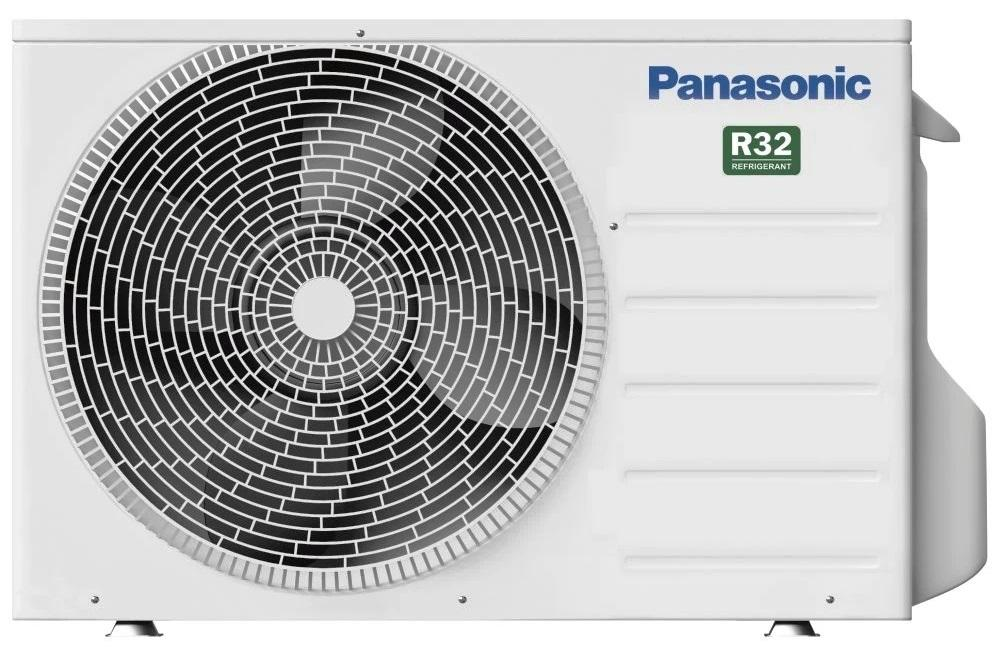
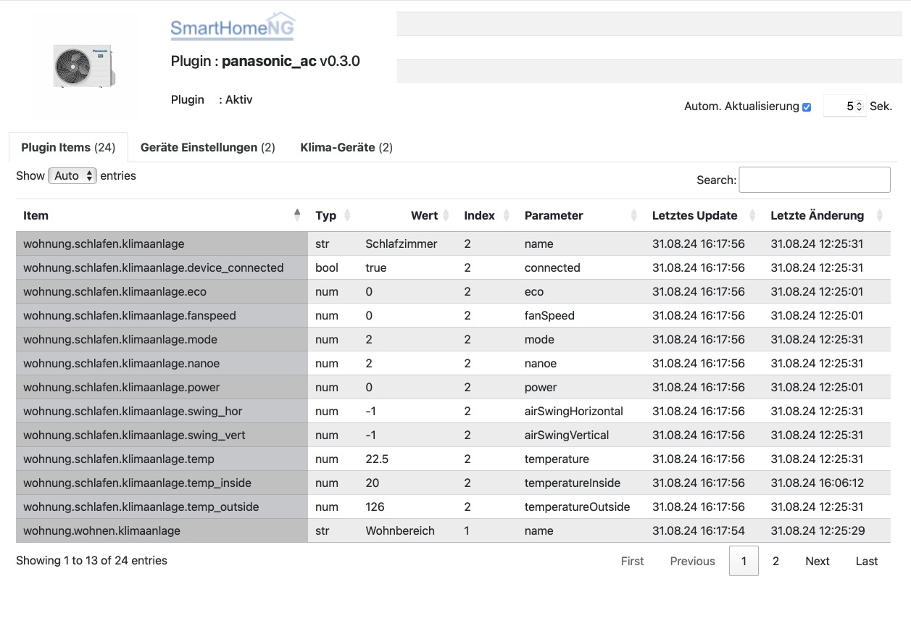
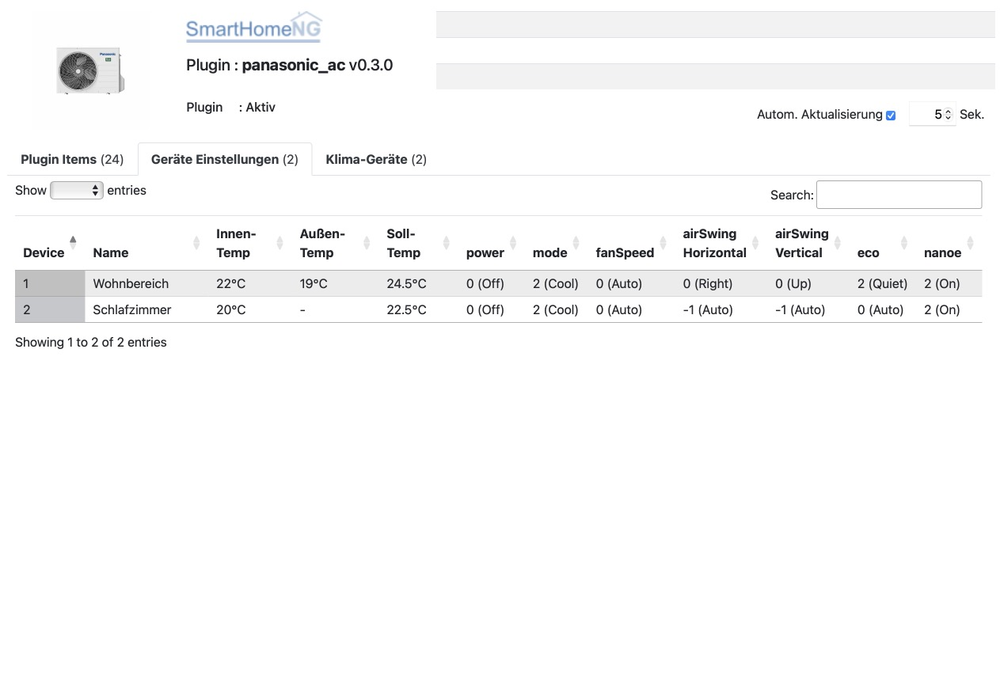
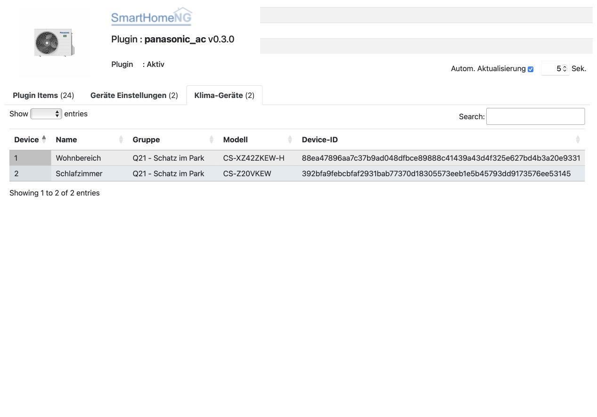

.. index:: Plugins; panasonic_ac
.. index:: panasonic_ac

============
panasonic_ac
============

Mit diesem Plugin können Klimaanlagen der Firma Panasonic vom Typ Etherea gesteuert werden. Die Ansteuerung erfolgt
durch das WLAN Interface der Klimaanlagen und einen von Panasonic zur Verfügung gestellen Cloud Service
(Panasonic Comfort Cloud).

|

Anforderungen
=============

Das Plugin benötigt das Python Package **pcomfortcloud**. Allerdings ist die aktuell releaste Version 0.0.27 dieses
Packages nicht kompatibel mit dem aktuelllen (neuen) Anmeldeverfahren der Panasonic Comfort Cloud. Es wird eine
neuere Version des Packages benötigt, die mit dem Plugin im Unterververzeichnis **packages** des Plugins installiert
wird.

Notwendige Software
-------------------

Es wird eine aktuelle Develop Version des Packages **pcomfortcloud** benötigt. Diese Version muß Stand 18. August 2024
oder neuer sein.

|

Plugin Instanz hinzufügen
=========================

Da das Plugin ohne vorherige Konfiguration weiterer Parameter lauffähig ist, wird die Instanz beim Hinzufügen in
der Admin GUI auch gleich aktiviert und beim Neustart von SmartHomeNG geladen.

|

Konfiguration
=============

Optionale Einstellungen können über die Admin GUI vorgenommen werden. Diese Parameter und die Informationen
zur Item-spezifischen Konfiguration des Plugins sind unter :doc:`/plugins_doc/config/panasonic_ac` beschrieben.

|

Verwendung von structs
----------------------

Mit der Hilfe von Struktur Templates wird die Einrichtung von Items stark vereinfacht. Hierzu wird ein struct Template
vom Plugin mitgeliefert:

- **panasonic_ac.air_condition** - Standard Definition für Panasonic Klimaanlagen

Ein Item für eine Panasonic Klimaanlage kann einfach folgendermaßen konfiguriert werden, indem nur der Index der zu
steuernden Anlage als ``pcc_index`` angegeben wird:

.. code-block:: yaml

    klimaanlage:
        pcc_index: 1
        struct: panasonic_ac.air_condition

Der Index der jeweiligen Klimaanlage kann dem 3. Tab des Webinterfaces entnommen werden. Die Numerierung beginnt bei 1.
Falls also nur eine Klimaanlage mit der Panasonic Comfort Cloud verbunden ist, ist ``pcc_index: 1``

Die struct richtet folgende Unteritems ein: ``temp_inside``, ``temp_outside``, ``temp``, ``power``,
``mode``, ``fanspeed``, ``swing_hor``, ``swing_vert``, ``eco`` und ``nanoe``.

Das Item ``Klimaanlage`` enthält als Wert den Namen der Klimaanlage.

Die Werte für ``Klimaanlage``, ``temp_inside`` und ``temp_outside`` können nur von der Comfort Cloud gelesen
werden. Eine Veränderung des Item-Wertes hal also keine Auswirkung auf die Klimaanlage.

Item Attribute
--------------

Die vollständige Übersicht über die unterstützen Attribute und deren zulässige Werte kann auf der
Seite :doc:`/plugins_doc/config/panasonic_ac` nachgelesen werden.

|

Web Interface
=============

Das panasonic_ac Plugin verfügt über ein Webinterface, mit dessen Hilfe die Items die das Plugin nutzen
übersichtlich dargestellt werden. Außerdem können Informationen zu den Devices angezeigt werden,
die durch die Panasonic Comfort Cloud verwaltet werden.

Aufruf des Webinterfaces
------------------------

Das Plugin kann aus der Admin GUI (von der Seite Plugins/Plugin Liste aus) aufgerufen werden. Dazu auf der Seite
in der entsprechenden Zeile das Icon in der Spalte **Web Interface** anklicken.

Außerdem kann das Webinterface direkt über ``http://smarthome.local:8383/plugin/panasonic_ac`` aufgerufen werden.

|

Beispiele
---------

Folgende Informationen können im Webinterface angezeigt werden:

Oben rechts werden allgemeine Parameter zum Plugin angezeigt. Die weiteren Informationen werden in den
sechs Tabs des Webinterface angezeigt.

Im ersten Tab werden die Items angezeigt, die das Plugin nutzen:

|
|

Im zweiten Tab werden Informationen zur aktuellen Parametrierung des einzelnen Klimaanlagen angezeigt:

|
|

Im dritten Tab werden die Grunddaten der einzelnen Klimaanlagen angezeigt:

|
|

