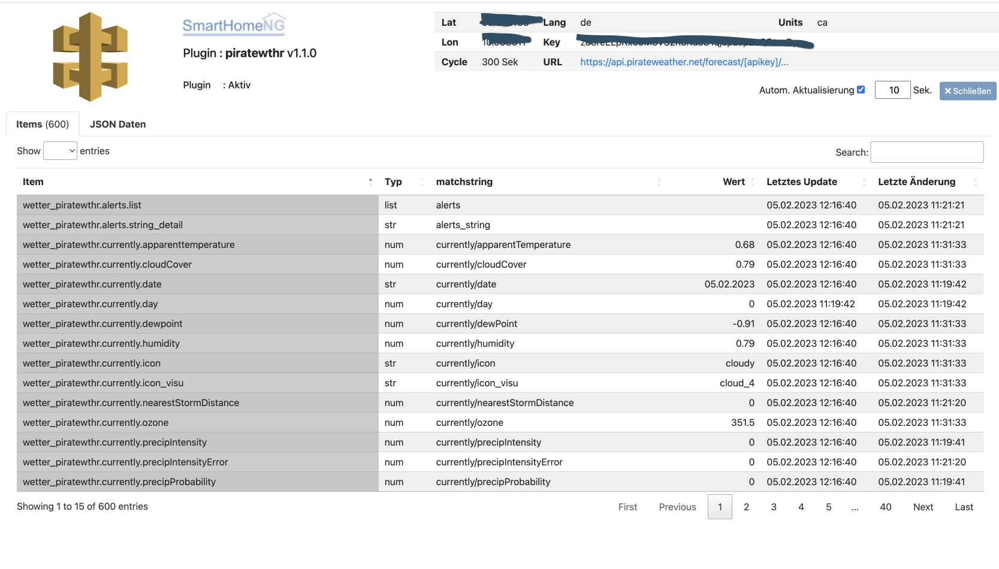

.. index:: Plugins; piratewthr (pirateweather.net / forecast.io Wetterdaten)
.. index:: piratewthr
.. index:: pirateweather.net
.. index:: Wetter; piratewthr
.. index:: struct; piratewthr

==========
piratewthr
==========

Wetterdaten von `pirateweather.net <https://pirateweather.net>`_ lesen.

Pirate Weather stellt ein DarkSky kompatibles API zur Verfügung, um Wetterdaten abzurufen.

darksky.net wurde am 31. März 2020 von Apple gekauft. Als Folge davon werden keine weiteren API Schlüssel vergeben
und das API ist auch nur noch bis Ende März 2023 zugänglich.

|

Konfiguration
=============

Die Informationen zur Konfiguration des Plugins sind unter :doc:`/plugins_doc/config/piratewthr` beschrieben.

Item Konfiguration
------------------

Eine sehr einfache Möglichkeit die benötigten Items das Plugins zu definieren, ist die Nutzung des mit dem
Plugin mitgelieferten struct-Templates.

Hierzu kann einfach ein Item (hier wetter_darksky) angelegt und als ``struct`` vom Typ ``piratewthr.weather`` definiert
werden. Standardmäßig sind unter hourly die nächsten 12 Stunden implementiert.

.. code-block:: yaml

   ...

    wetter_piratewthr:
        struct: piratewthr.weather

Besonderheiten
--------------

Zeiten werden bei piratewthr als Epoch Time angegeben, diese Zeit ist in den struct als ``time_epoch`` hinterlegt.
In den ``time`` Items wird sie durch folgende Konvertierung umformatiert.
Wer möchte, kann dieses Muster für die anderen Zeitangaben (Sonnenauf/untergang, etc.) nutzen.
Das unten definierte ``eval`` Attribut kann überschrieben bzw. bei den relevanten Items hinzugefügt werden.
Unabhängig davon haben alle Items auch einen ``weekday`` und ``date`` Eintrag, die direkt abgefragt werden können.

.. code-block:: yaml

    time:
        type: str
        eval: datetime.datetime.fromtimestamp(value).strftime('%HH:%MM')

Die Originalantwort der Pirate Weather Webseite wird vom Plugin entsprechend aufgedröselt.
Informationen, die unter daily/data und hourly/data angegeben sind, sind nun direkt als
day0, day1, etc. sowie hour0, hour1, etc. abrufbar.
Der ursprüngliche data Eintrag wird aus dem JSON Objekt gelöscht, um die Übersichtlichkeit zu bewahren.
Die stündlichen Informationen werden neben den relativen Angaben
(hour0 = aktuelle Stunde, hour1, kommende Stunde, etc.) auch in den passenden Tagen direkt als Uhrzeit gelistet.
Diese Information ist als Dictionary in den Items day0/hours, day1/hours und day2/hours hinterlegt.
Es empfiehlt sich, das Web Interface zu nutzen, um die vorhandenen Informationen zu erforschen.
Um diese Daten zu nutzen, sind entsprechende Logiken notwendig.

Die relevantesten Berechnungen zu den stundenweisen Vorhersagen sind aber bereits im Plugin implementiert.
Und zwar sind unter den Items bzw. ds_matchstring mit den Namen
``precipProbability_mean``, ``precipIntensity_mean`` und ``temperature_mean`` die durchschnittlichen
Regen- und Temperaturvorhersagen abrufbar.
Hierbei werden die entsprechenden stündlichen Einzelwerte herangezogen, um den Mittelwert zu erstellen.
Auf diese Weise ist es z.B. möglich, die Regenwahrscheinlichkeit für den restlichen heutigen Tag abzufragen.

Instanzen
---------

Wenn mehrere Instanzen des Plugins konfiguriert sind, kann das struct-Template auch mehrfach eingebunden werden.
Hierbei muss bei der eingebundenen struct-Template angegeben werden, für welche Instanz des Plugins sie verwendet
werden soll:

.. code-block:: yaml

   ...

   wetter_ham:
       struct: piratewthr.weather
       instance: ham

   wetter_bos:
       struct: piratewthr.weather
       instance: bos

|

Web Interface
=============

Das piratewthr Plugin verfügt über ein Webinterface, mit dessen Hilfe die Items die das Plugin nutzen
übersichtlich dargestellt werden.

Aufruf des Webinterfaces
------------------------

Das Plugin kann aus dem backend aufgerufen werden. Dazu auf der Seite Plugins in der entsprechenden
Zeile das Icon in der Spalte **Web Interface** anklicken.

Außerdem kann das Webinterface direkt über ``http://smarthome.local:8383/piratewthr`` bzw.
``http://smarthome.local:8383/piratewthr_<Instanz>`` aufgerufen werden.

Beispiele
---------

Folgende Informationen können im Webinterface angezeigt werden:

Oben rechts werden allgemeine Parameter zum Plugin angezeigt.

Im ersten Tab werden die Items angezeigt, die das piratewthr Plugin nutzen:

Im zweiten Tab werden die piratewthr Rohdaten (JSON Format) angezeigt:

.. image:: assets/webif_tab2.jpg
   :class: screenshot
