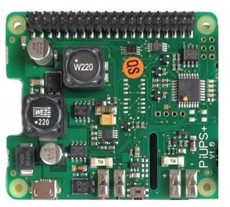

.. index:: Plugins; piusv
.. index:: piusv

========
piusv
========

Unterstützte Geräte
===================

piusv+

Konfiguration
=============

Die Pluginparameter und die Informationen zur Item-spezifischen Konfiguration des Plugins sind
unter :doc:`/plugins_doc/config/piusv` beschrieben.

Web Interface
=============

Das Plugin stellt ein WebIF zur Verfügung, in dem alle mit dem Plugin verknüpften Items gelistet sind.
