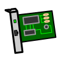

.. index:: Plugins; pluggit
.. index:: pluggit Plugin

=======
pluggit
=======

Das pluggit plugin dient zur Ansteuerung einer Pluggit AP310 KWL.

Einführung
==========

Die aktuelle Version 2.x des Plugins ist eine Neuentwicklung auf Basis der Version v1.2.3 des pluggit Plugins.
Die Version 2.x ist nicht konfigurations-kompatibel zur Version 1.x. Die Konfiguration der Plugin Parameter und der
Item Attribute ist daher neu entsprechend der aktuellen Dokumentation vorzunehmen.

Es ist bei Bedarf jedoch möglich erstmal die alte Version v1.2.3 des pluggit Plugins weiter zu nutzen.
Dazu muss nur ein Eintrag in der Plugin Konfiguration in der etc/plugin.yaml angepasst/eingefügt werden.

Statt

.. code:: yaml

    pluggit:
        plugin_name: pluggit

        ...

muss die zu verwendende Version des Plugins zusätzlich angegeben werden:

.. code:: yaml

    pluggit:
        plugin_name: pluggit
        plugin_version: 1.2.3

        ...

Vorteile gegenüber der Plugin Version v1.2.3
============================================

- wesentlich mehr Parameter der pluggit können abgefragt werden
- einige Parameter lassen sich auch schreiben
- die Werte können intern auch konvertiert werden, sodass man eine vernünftige Ausgabe erhält

Es fehlen auch noch ein paar Dinge
==================================

- die Programmierung des Auto-Wochenprogramms ist noch nicht implementiert
- eine Dokumentation der Parameter

.. Anforderungen
.. =============

.. Anforderungen des Plugins auflisten. Werden spezielle Soft- oder Hardwarekomponenten benötigt?

.. Um das Plugin zu nutzen, muss ...

.. Installation benötigter Software
.. ================================

Konfiguration
=============

Die Plugin Parameter und die Informationen zur Item-spezifischen Konfiguration des Plugins sind
unter :doc:`/plugins_doc/config/pluggit` nachzulesen.

Struct
======

Die zur Nutzung des Plugins benötigten Items können durch die Einbindung der struct **pluggit.pluggit** angelegt
werden.

.. Beispiele
.. ---------

.. Hier können ausführlichere Beispiele und Anwendungsfälle beschrieben werden.

.. Web Interface
.. =============

.. ...

Version History
===============

V2.0.6 - 15.09.2023

- Anpassung für pymodbus 3.5.2: bytorder und wordorder musste korrrigiert werden, statt Little und Big nun LITTLE und BIG
- Python muss >= 3.8 sein und pymodbus >= 3.5.2

V2.0.5 - 11.09.2023

- unter Python 10 muss mindestens die Version 3.3.2 von pymodbus laufen, da sonst Verbindungsprobleme

V2.0.4 - 13.11.2022

- Verbesserungen zur Versionsprüfung "pymodbus"

V2.0.3 - 25.10.2022

- Support für pymodbus 3.0

22.05.2022

- Fehler mit manuellem Bypass behoben

16.02.2022

- CurentUnitMode.ManualBypass dem Item-struct zugefügt
- Log-Level für verschiedene Ausgaben angepasst
- CurrentUnitMode.AwayMode repariert

24.02.2021

- Item-struct um Zugriffe für SmartVISU erweitert
- item_attribut um pluggit_convert erweitert
- scheduler.remove eingebaut

29.08.2020

- bool-Werte konnten nicht geschrieben werden

