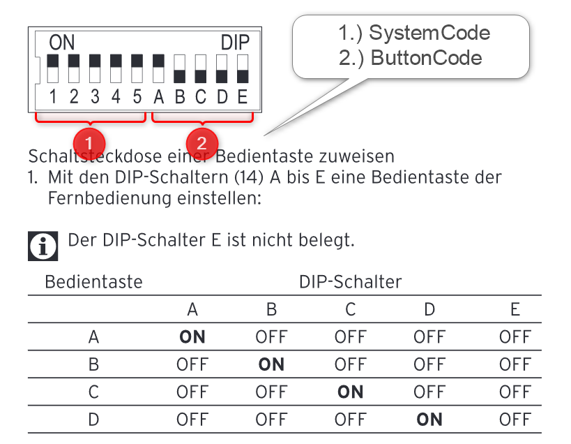
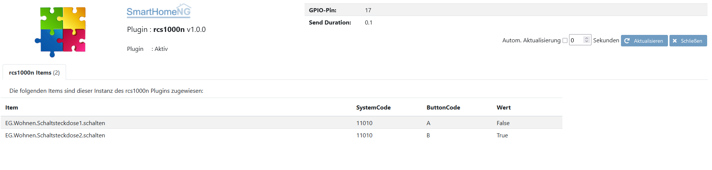

.. index:: Plugins; rcs1000n (Brennenstuhl RCS 1000 N)
.. index:: rcs1000n

========
rcs1000n
========

.. image:: webif/static/img/plugin_logo.png
   :alt: plugin logo
   :width: 300px
   :height: 300px
   :scale: 50 %
   :align: left

Anforderungen
=============
Das rcs1000n Plugin benötigt folgenden Anforderungen an Hanrdware- und Software-Komponenten.

Notwendige Hardware
-------------------

* Raspberry Pi
* 433 MHz Sende-Module
* schaltbare Steckdose über 433 MHz (z.B.: Brennenstuhl RCS 1000 N)

Notwendige Software
-------------------

* die python Library `rpi-rf`

Unterstützte Geräte
-------------------

* Brennenstuhl RCS 1000 N

Konfiguration
=============

Diese Plugin Parameter und die Informationen zur Item-spezifischen Konfiguration des Plugins sind
unter :doc:`/plugins_doc/config/rcs1000n` beschrieben.

plugin.yaml
-----------

Bitte die Dokumentation lesen, die aus den Metadaten der plugin.yaml erzeugt wurde.

Hier ein Beispiel wie das Plugin konfiguriert werden kann.

.. code-block:: yaml

    rcs1000:
        plugin_name: rcs1000n
        rcs1000n_gpio: '17'
        rcs1000n_sendDuration: '0.1'

items.yaml
----------

Bitte die Dokumentation lesen, die aus den Metadaten der plugin.yaml erzeugt wurde.

Hier ein Beispiel wie das Item konfiguriert werden kann.

.. code-block:: yaml

    Schaltsteckdose1:
            name: Funkstedose 1 Wohnen
            remark: Brennenstuhl RCS 1000 N
            schalten:
                type: bool
                rcs_SystemCode: 11010
                rcs_ButtonCode: 'A'
                visu_acl: rw
                struct: uzsu.child

logic.yaml
----------

Bitte die Dokumentation lesen, die aus den Metadaten der plugin.yaml erzeugt wurde.

Funktionen
----------

Bitte die Dokumentation lesen, die aus den Metadaten der plugin.yaml erzeugt wurde.

Web Interface
=============

Diese plugin verfügt über ein Webinterface.

Version History
===============

v1.0.0
------

* initial version.

