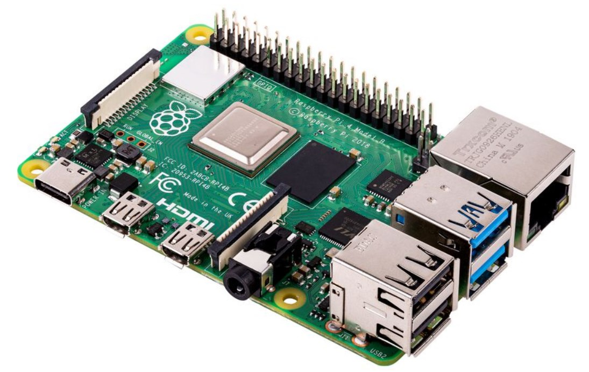
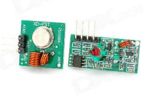
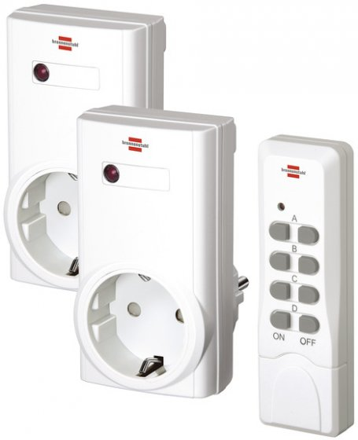
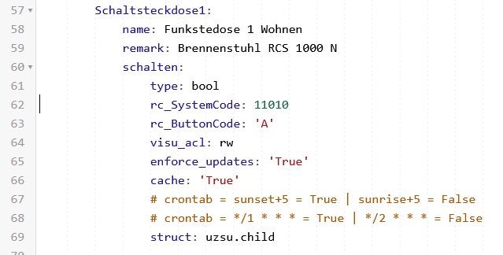

# RCswitch

rcSwitch_python is a `selfcontained` plugin for smarthomeNG to send commands to a RC switch devcie (e.g. Brennenstuhl RCS 1000N).</br>
With this plugin a 433 MHz remote controlled power plugs can be controlled from the smarthomeNG environment.</br>
The plugin supports two setups:

* smarthomeNG runs on the same machine where the 433 MHz sender is connected to
* smarthomeNG accesses a 433 MHz transmitter installed on a remote machine

## Necessary Hardware
- Raspberry Pi or any other board having digital GPIOs</br>

- 433 Mhz transmitter</br>

- 433 Mhz controlled power plug, e.g. Brennenstuhl RCS 1000 N</br>


## Requirements
The plugin depends on the following python based library:
- [rpi-rf](https://pypi.org/project/rpi-rf/)

## Installation:
All steps have to be done on the machine where the 433 MHz transmitter is installed. In case not already done, update the system and install git:

```
sudo apt update
sudo apt upgrade
sudo apt install git-core
```

## Configuration of smarthomeNG
### plugin.yaml
Adding following lines to `../etc/plugin.yaml` in smarthomeNG will enable the rcswitch plugin:

```
rcSwitchpython:
    plugin_name: priv_rcswitch_python
    rcswitch_gpio: 17
    rcswitch_sendDuration: 0.5
```

#### Attributes
* `rcswitch_gpio`: GPIO pin to which the Sender is connected to.
* `rcswitch_sendDuration`: Minimal time between two send acivations

## Setup the Item
In the `../items` an item can be defined like this example:</br>

### items.yaml
Just add following attributes to the items which shall be connected with rcswitch-python:

```
rc_SystemCode: <SystemCode of the device [00000 - 11111]>
rc_ButtonCode: <ButtonConde of the device [A-E]>
```

For compatibility reasons you can also use the "old attributes" of the rcswitch plugin.

```
rc_code:   <SystemCode of the device [00000 - 11111]>
rc_device: <ButtonConde of the device [A-E]>
```


#### Example:

```yaml
Basement:
    LivingRoom:
        RCpowerPlug:
            TV:
                switch:
                    type: bool
                    knx_dpt: 1
                    knx_listen: 14/0/10
                    knx_send: 14/0/13
                    rc_ButtonCode: 'B'
                    rc_SystemCode: 11111
```

---

## Troubleshooting
If the switch does not work, but you are sure that the installation was done properly, make sure that the user (normally) smarthome is part of the group gpio.

If not, it is easy to do this.

```
sudo usermod -aG gpio smarthome
sudo reboot
```

## Changelog

### v1.0.0
* initial version

----------------------------
## Further information
For discussion see:</br>
https://knx-user-forum.de/forum/supportforen/smarthome-py/39094-logic-und-howto-für-433mhz-steckdosen
