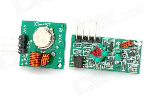

# RCswitch

RCswitch is a plugin for smarthomeNG to send commands to a RC switch devcie (e.g. Brennenstuhl RCS 1000N). With this plugin 433 MHz remote controlled power plugs can be controlled from the smarthomeNG environment.</br>
The plugin supports two setups:

* smarthomeNG runs on the same machine where the 433 MHz sender is connected to
* smarthomeNG accesses a 433 MHz transmitter installed on a remote machine

## Necessary Hardware
- Raspberry Pi or any other board having digital GPIOs</br>

- 433 Mhz transmitter</br>

- 433 Mhz controlled power plug, e.g. Brennenstuhl RCS 1000 N</br>


## Requirements
The plugin depends on python based libraries:
1) [rcSwitch-python](https://github.com/hasenradball/rcSwitch-python)
2) [rpi-rf](https://pypi.org/project/rpi-rf/)
3) ssh and sshpass (only if remote access is needed)

## Installation:
All steps have to be done on the machine where the 433 MHz transmitter is installed. In case not already done, update the system and install git:

```
sudo apt update
sudo apt upgrade
sudo apt install git-core
```
### Install Dependencies
The first step is to install the dependencies, these are described unter the following page:</br>
[rcSwitch-python](https://github.com/hasenradball/rcSwitch-python)</br>

If you have done all these steps you are now in the situation to switch the remote socket via command line like:

```
cd /usr/local/bin/python/rcSwitch-python
python3 ./switchSocket.py <SystemCode> <ButtonCode> <status>
```
This could look like this, if we assume the following codes:</br>
SystemCode = 10000, ButtonCode = 10000, status = 1


```
# using the Button Letter
python3 ./switchSocket.py 10000 A 1
```

### Setup the GPIO-Pin
To set the right `GPIO-Pin`, these has to be done in the python script files:
- switchSocket.py
- switchSocket_test.py

Change the `GPIO-Pin` in the pxthon script file and save it.
```
cd /usr/local/bin/python/rcSwitch-python
sudo nano ./<filename>.py
```

## Optional-Step: Switching via Remote-Machine
In case smarthomeNG wants to access the 433 MHz sender on an remote host, the following steps have to be done on the remote machine where smarthomeNG runs:

### Installation of ssh and sshpass on the Remote Machine
```
sudo apt update
sudo apt upgrade
sudo apt install ssh sshpass
```

### Installation of ssh on the Machine which has the Sender connected
REMARK:</br>
ssh has to be installed on the machine where the 433 MHz sender is connected to via:

```
sudo apt update
sudo apt upgrade
sudo apt install ssh
```

## Configuration of smarthomeNG
### plugin.yaml
Adding following lines to `../etc/plugin.yaml` in smarthomeNG will enable the rcswitch plugin:

```
rc:
    # mandatory parameter
    plugin_name:           rcswitch
    
    # optional parameters
    rcswitch_dir:          {/usr/local/bin/python/rcSwitch-python/src}
    rcswitch_sendDuration: {0.5} 
    rcswitch_host:         {ip/ hostname}
    rcswitch_user:         {user at remote host}
    rcswitch_password:     {password for user at remote host}
```

#### Attributes
* `rcswitch_dir`: has to point to the directory where the `switchSocket.py` script can be found
* `rcswitch_sendDuration`: intended for trouble shooting. Increase this parameter in case switching several power plugs at the same time does not work reliable.</br>
<u>Background:</u></br>
In case several power plugs (with different codes / device numbers) shall be switched at the same time, there must be a short gap between sending the serval commands. Otherwise, the several send commands are executed in parallel, gernerating jam on the rc signal.
* `rcswitch_host`: in case rcswitch is running on a remote machine, the IPv4 address or the HOSTNAME has to be specified.</br>
<u>Note:</u></br>
a SSH server has to be installed on the remote machine.
* `rcswitch_user`: user on the remote machine
* `rcswitch_password`: password for the user on the remote machine

#### Example for Remote switching

```
rc:
    plugin_name:           rcswitch
    rcswitch_dir:          /usr/local/bin/python/rcSwitch-python/src
    rcswitch_sendDuration: 0.5
    rcswitch_host:         192.168.0.4
    rcswitch_user:         pi
    rcswitch_password:     raspberry
```
## Setup the Item
In the `../items` an item can be defined like this example:</br>

### items.yaml
Just add following attributes to the items which shall be connected with rcswitch:

```
rc_code:   <SystemCode of the device [00000 - 11111]>
rc_device: <ButtonConde of the device [A-E]>
```


#### Example:

```yaml
Basement:
    LivingRoom:
        RCpowerPlug:
            TV:
                switch:
                    type: bool
                    knx_dpt: 1
                    knx_listen: 14/0/10
                    knx_send: 14/0/13
                    rc_code: 11111
                    rc_device: 'B'
```

---

## Troubleshooting
If the switch does not work, but you are sure that the installation was done properly, make sure that the user (normally) smarthome is part of the group gpio.

If not, it is easy to do this.

```
sudo usermod -aG gpio smarthome
sudo reboot
```

## Changelog

### v0.1
* initial version. Supports sending on local machine

### v0.2
* support of remote transmitter
* more detailed failure report in case of misconfiguration
* usage of subprocess module instead of the os module
* support of literal device numbers

### v0.3
* add import os at the init

### v1.2.4
* add hostname support

### v2.0.0
* rework of rcswitch into a completly python based plugin (wiringPI is not available anymore with debian bullseye)
----------------------------
## Further information
For discussion see:</br>
https://knx-user-forum.de/forum/supportforen/smarthome-py/39094-logic-und-howto-für-433mhz-steckdosen
