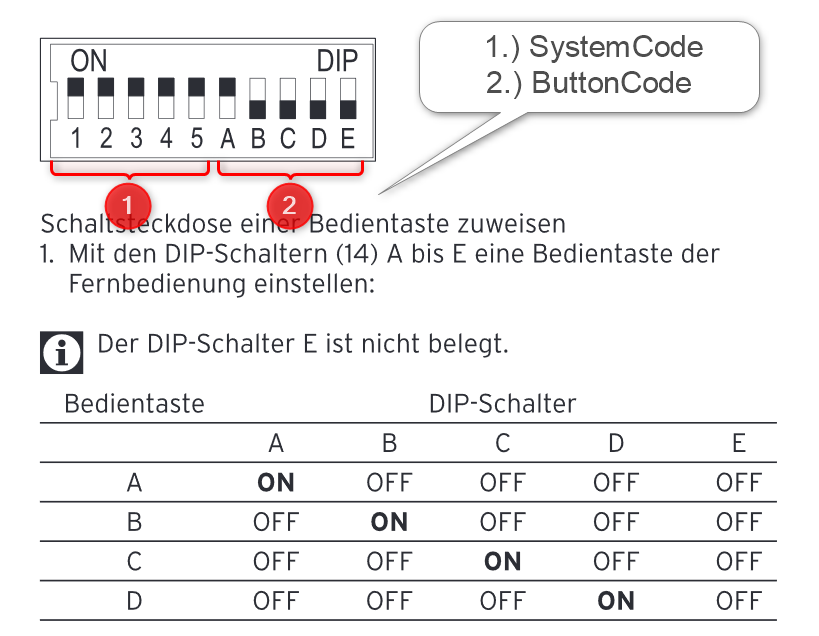

.. index:: Plugins; rcswitch (Brennenstuhl RCS 1000 N)
.. index:: rcswitch

================
Plugins/rcswitch
================

Anforderungen
-------------
Das rcswitch Plugin beötigt folgenden Anforderungen an Hanrdware- und Software-Komponenten.

Notwendige Hardware
~~~~~~~~~~~~~~~~~~~

* Raspberry Pi
* 433 MHz Sende-Module
* schaltbare Steckdose über 433 MHz (z.B.: Brennenstuhl RCS 1000 N)

Notwendige Software
~~~~~~~~~~~~~~~~~~~

* die python Library `rpi-rf`

Unterstützte Geräte
~~~~~~~~~~~~~~~~~~~

* Brennenstuhl RCS 1000 N

Konfiguration
-------------

plugin.yaml
~~~~~~~~~~~

Bitte die Dokumentation lesen, die aus den Metadaten der plugin.yaml erzeugt wurde.

Hier ein Beispiel wie das Plugin konfiguriert werden kann.

.. code-block:: yaml

    rcSwitchpython:
        plugin_name: rcswitch
        rcswitch_gpio: '17'
        rcswitch_sendDuration: '0.5'

    

items.yaml
~~~~~~~~~~

Bitte die Dokumentation lesen, die aus den Metadaten der plugin.yaml erzeugt wurde.

Hier ein Beispiel wie das Item konfiguriert werden kann.

.. code-block:: yaml

    Schaltsteckdose1:
            name: Funkstedose 1 Wohnen
            remark: Brennenstuhl RCS 1000 N
            schalten:
                type: bool
                #rc_device: 'A'   # -> deprecated attribute
                #rc_code: 11010   # -> deprecated attribute
                rc_SystemCode: 11010
                rc_ButtonCode: 'A'
                visu_acl: rw
                struct: uzsu.child

logic.yaml
~~~~~~~~~~

Bitte die Dokumentation lesen, die aus den Metadaten der plugin.yaml erzeugt wurde.

Funktionen
~~~~~~~~~~

Bitte die Dokumentation lesen, die aus den Metadaten der plugin.yaml erzeugt wurde.

Beispiele
---------

Aktuell keine weiteren Beispiele notwendig.

Web Interface
-------------

Aktuell beitzt dieses Plugin kein Web Interface.

Version History
---------------

v0.1
~~~~~~

* initial version. Supports sending on local machine

v0.2
~~~~~~

* support of remote transmitter
* more detailed failure report in case of misconfiguration
* usage of subprocess module instead of the os module
* support of literal device numbers

v0.3
~~~~~~

* add import os at the init

v1.2.2
~~~~~~

* add hostname support

v2.0.0
~~~~~~

* remove wiringPi dependency due to availability reasons with bulleye
* useage of python based GPIO Library `rpi-rf`
* added `cRcSocketSwitch` class
* rework of `__init__.py` to work with `rpi-rf`
