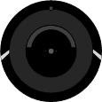

.. index:: Plugins; roombapysh
.. index:: roombapysh

======================
Roomba für SmartHomeNG
======================

Dieses Plugin ermöglicht die Einbindung von iRobot Roomba Staubsaugrobotern.
Das Plugin basiert auf https://github.com/pschmitt/roombapy (ein Fork von https://github.com/NickWaterton/Roomba980-Python) für die Kommunikation.
Es sollte die Roomba Serien 600, 900, i, s und M6 Mop unterstützen, wenn die Geräte per WiFi angesprochen werden können.

Anforderungen
=============

Der Roomba muss per WiFi (LAN) mit SmartHomeNG verbunden sein.

Notwendige Software
-------------------

* Python-Version >= 3.7
* paho-mqtt = >= 1.5.1
* orjson >= 3.8.7
* https://github.com/Pacifica15/roombapy ist als Sub-Module eingebunden, da https://github.com/pschmitt/roombapy nicht mit Python 3.7 kompatibel ist.

Dies beinhaltet Python- und SmartHomeNG-Module

Unterstützte Geräte
-------------------

Roomba Serien

* 600
* 900
* e
* i
* s
* M6 Mop

Getestet wurde das Plugin bisher nur mit einem Roomba e6

Installation
============

.. note::

    Vor der Inbetriebnahme des Plugins bitte paho-mqtt und orjson installieren.

.. code-block:: bash

    pip3 install paho-mqtt
    pip3 install orjson

Konfiguration
=============

Die Plugin Parameter, die Informationen zur Item-spezifischen Konfiguration des Plugins und zur Logik-spezifischen
Konfiguration sind unter :doc:`/plugins_doc/config/roombapysh` beschrieben.

Dort findet sich auch die Dokumentation zu Funktionen, die das Plugin evtl. bereit stellt.

items.yaml
----------

Hier ein Beispiel einer vollständigen Konfiguration von Items.
Die Datei liegt auch im Plugin-Verzeichnis (Harry.yaml).

.. code-block:: yaml

    # Harry.yaml
    Harry:
       connect:
            type: bool
            roombapysh: 'connect'
            visu_acl: rw
            autotimer: 7200 = False
       Status:
           type: num
           roombapysh: 'status'
       IsConnected:
           type: bool
           roombapysh: 'connected'
       ClientError:
            type: str
            roombapysh: 'client_error'
       MissionError:
           type: num
           roombapysh: 'error_code'
       MissionErrorMessage:
            type: str
           roombapysh: 'error_message'
       Mission_State:
            type: str
           roombapysh: 'mission_state'
       Name:
           type: str
           roombapysh: 'name'

       start:
           type: bool
           roombapysh: 'start'
           visu_acl: rw
           autotimer: 2 = False
       pause:
           type: bool
           roombapysh: 'pause'
           visu_acl: rw
           autotimer: 2 = False
       resume:
           type: bool
           roombapysh: 'resume'
            visu_acl: rw
           autotimer: 2 = False
       stop:
           type: bool
           roombapysh: 'stop'
           visu_acl: rw
           autotimer: 2 = False
       dock:
           type: bool
           roombapysh: 'dock'
           visu_acl: rw
           autotimer: 2 = False
       reset:
           type: bool
          roombapysh: 'reset'
           visu_acl: rw
          autotimer: 120 = False
       evac:
           type: bool
           roombapysh: 'evac'
           visu_acl: rw
           autotimer: 120 = False
       locate:
           type: bool
           roombapysh: 'locate'
          visu_acl: rw
           autotimer: 1 = False

       Battery:
           type: num
           roombapysh: 'status_batterie'
       Battery_Cycles:
            type: num
           roombapysh: 'bat_cCount'

       Bin:
            Present:
               type: bool
               roombapysh: 'bin_present'
            Full:
               type: bool
               roombapysh: 'bin_full'

       Dock_Known:
            type: bool
            roombapysh: 'dock_known'

       MissionStatus:
          Cycle:
              type: str
              roombapysh: 'MissionStatus_cycle'
          Phase:
               type: str
              roombapysh: 'MissionStatus_phase'
          Error:
               type: num
               roombapysh: 'MissionStatus_error'
          StartTime:
               type: num
               roombapysh: 'MissionStatus_startTime'
          ExpireTime:
               type: num
               roombapysh: 'MissionStatus_expireTime'
          Initiator:
               type: str
               roombapysh: 'MissionStatus_initiator'
          RunTime:
               type: str
               roombapysh: 'MissionStatus_runTime'

       Runs:
           Cliffs:
              type: num
              roombapysh: 'run_nCliffs'
          Panics:
              type: num
               roombapysh: 'run_nPanics'
          Scrubs:
              type: num
              roombapysh: 'run_nScrubs'
          Time:
               type: str
               roombapysh: 'run_time'

       Missions:
           Total:
               type: num
               roombapysh: 'mission_total'
           OK:
               type: num
               roombapysh: 'mission_OK'
           Err:
               type: num
               roombapysh: 'mission_err'

       LastCommand:
           Command:
               type: str
               roombapysh: 'lastCommand_command'
           time:
               type: num
               roombapysh: 'lastCommand_time'
           initiator:
               type: str
               roombapysh: 'lastCommand_initiator'

Beispiele
=========

Beispiel, wie in der smartVisu der Status des Roomba als Icon angezeigt werden kann:

.. code-block:: jinja

    {{ basic.symbol('', ['Harry.Status'], '', ['scene_robo_vac_cleaner.svg','text_question_mark.svg','scene_robo_vac_cleaner_charging.svg','scene_robo_vac_cleaner_charging.svg','scene_robo_vac_cleaner_active.svg','scene_robo_vac_cleaner_paused.svg','scene_robo_vac_cleaner_dock.svg','scene_robo_vac_cleaner_attention.svg'], [0,1,2,3,4,5,6,7], '', ['#766','#f00','#ff0','#0f0','#0f0','#ff0','#0f0','#f00'],'','','midi') }}

Ein Beispiel, wie eine komplette smartVisu Seite aussehen könnte liegt als roomba.html im Plugin-Verzeichnis

Web Interface
=============

Dieses Plugin hat kein Web Interface

Version History
===============

* Version 1.0.0 initiale Version

