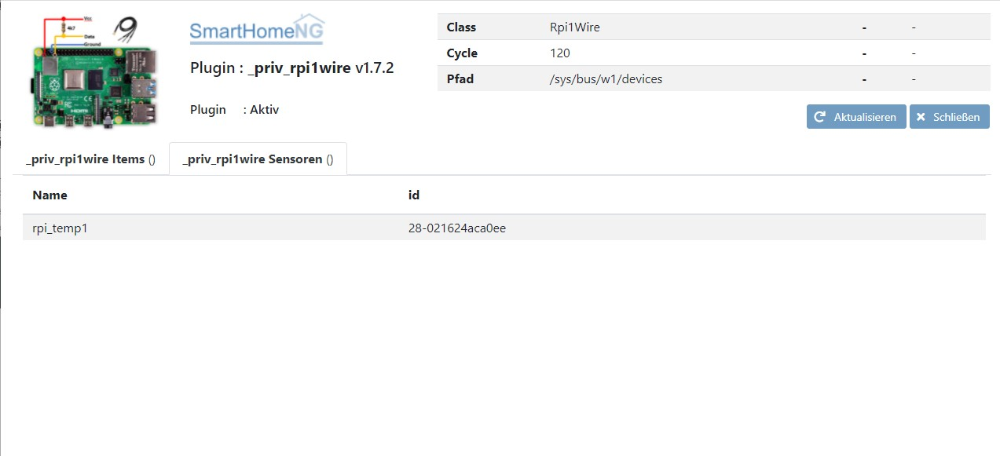
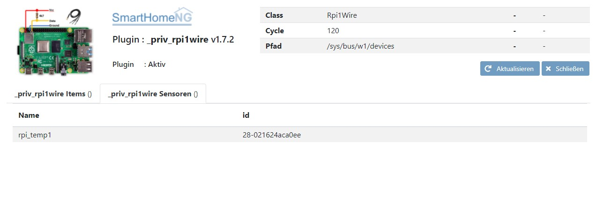

========
rpi1wire
========

Information
===========

Diese shNG Plugin erlaubt einfachen Zugriff auf 1wire Sensoren, die direkt an den Raspberry Pi verbunden sind.
Getestet ist das Plugin mit:

- Raspberry Pi Model B,
- Raspberry Pi 2B,
- Raspberry Pi 3B,
- 1-Wire - Sensor DS18B20

Raspberry Pi Konfiguration
==========================

Um 1wire Sensoren direkt am RPI zu betreiben, muss der RPi entsprechend konfiguriert werden.

Dazu mit

.. code-block:: todotxt

    sudo raspi-config

unter Interface Options das 1-Wire aktivieren.

Weiterhin muss die  Datei ``/boot/config.txt`` gemäß der Verkabelung der 1wire Sensoren angepasst werden.

3-Leitungsanschluss:

.. code-block:: todotxt

    # activating 1-wire without pullup (3-wire-Version)
    dtoverlay=w1-gpio,gpiopin=4,pullup=off

2-Leitungsanschluss:

.. code-block:: todotxt

    # activating 1-wire with pullup (2-wire-Version)
    dtoverlay=w1-gpio,gpiopin=4,pullup=on

Zusätzlich muss ``/etc/modules`` ebenfalls gemäß der Verkabelung angepasst werden:

.. code-block:: todotxt

    #(3-wire-Version)
    w1-gpio pullup=0
    w1-therm

.. code-block:: todotxt

    #(2-wire-Version)
    w1-gpio pullup=1
    w1-therm

Weitere Details können hier gefunden werden: http://www.kompf.de/weather/pionewiremini.html

Konfiguration
=============

Die Informationen zur Konfiguration des Plugins sind unter :doc:`/plugins_doc/config/rpi1wire` beschrieben bzw. in der **plugin.yaml** nachzulesen.

Nachfolgend noch einige Zusatzinformationen.

Konfiguration des Plugins
-------------------------

Die Konfigruation des Plugins erfolgt über das Admin-Interface. Dafür stehen die folgenden Einstellungen zur Verfügung:

- `dirname`: Verzeichnis des Onewire, in dem der RPi die Werte der 1-wire Sensoren hält
- `cycle`: Zeitabstand in Sekunden in dem die Sensoren abgefragt werden

Item Konfiguration
------------------
Um die Werte von 1-Wire Sensoren in Items zu bekommen, muss in dem entsprechenden Item das Attribut ``rpi1wire_id`` konfiguriert werden.
Anzugeben ist die Sensoradresse im Format xx-yyyyyyyyyyyy (Bitte darauf achten, dass bei rein numerischen Sensoradressen diese in '' eingeschlossen werden müssen) oder der 1-Wire Sensor Alias'
Der Datentyp des Items ist num.

Zusätzlich steht das Attribut ``rpi1wire_sys`` mit den möglichen Werten ``list``, ``count`` und ``update`` zur Verfügung. Dabei bedeuten:

- ``list`` - Liste alle gefundenen Sensoren (Datentyp ist str)
- ``count`` - Anzahl alle gefundenen Sensoren (Datentyp ist num)
- ``update`` - Triggeritem, um ein nach neuen Sensoren zu suchen und eine Aktualisierung auszulösen (Datentyp ist bool)

.. code-block:: yaml

    someitem:
        somelist:
            rpi1wire_sys: list
            name: Sensor-List
            type: str
            visu_acl: ro
        somecount:
            rpi1wire_sys: count
            name: Sensors
            type: num
            visu_acl: ro
        someupdate:
            rpi1wire: update
            name: Update Sensors
            type: bool
            inital_value: 0
            visu_acl: rw

Beispiele
=========

Beispiel 1
----------

.. code-block:: yaml

    someroom:
         mytemperature:
            name: my Name
            type: num
            visu_acl: ro
            rpi1wire_id: rpi_temp1
            database: yes

Beispiel 2
----------

.. code-block:: yaml

    someroom:
         mytemperature:
            name: my Name
            name: Wohnzimmer Raumtemperatur
            type: num
            visu_acl: ro
            rpi1wire_id: 28-0215018970ff
            database: yes

    rpi1wire:
         update:
            name: Update Sensor-List
            type: bool
            rpi1wire_sys: update
            visu_acl: rw
            initial_value: 0
        sensor_list:
            rpi1wire_sys: list
            name: Sensor List
            type: str
            visu_acl: ro
        sensor_count:
            rpi1wire_sys: count
            name: Sensor Count
            type: num
            visu_acl: ro

Web Interface des Plugins
=========================

rpi1wire Items
-----------------

Das Webinterface zeigt die Items an, für die rpi1wire Attribute konfiguriert ist.

rpi1wire Sensores
-------------------

Das Webinterface zeigt alle gefundenen Sensoren mit der jeweiligen ID an.

