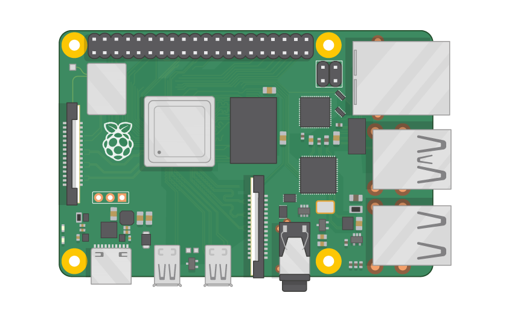

.. index:: Plugins; rpi_info
.. index:: rpi_info

========
rpi_info
========

Unterstützte Geräte
===================

Raspberry Pi

Konfiguration
=============

Diese Plugin Parameter und die Informationen zur Item-spezifischen Konfiguration des Plugins sind
unter :doc:`/plugins_doc/config/rpi_log` beschrieben.

Funktionen
==========

Bitte die Dokumentation lesen, die aus den Metadaten der plugin.yaml erzeugt wurde.

Beispiele
=========

Hier können ausführlichere Beispiele und Anwendungsfälle beschrieben werden.

Web Interface
=============

Das Plugin stellt ein WebIF zur Verfügung, in dem alle mit dem Plugin verknüpften Items gelistet sind.
