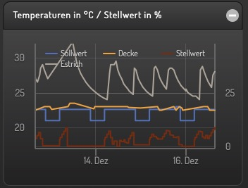
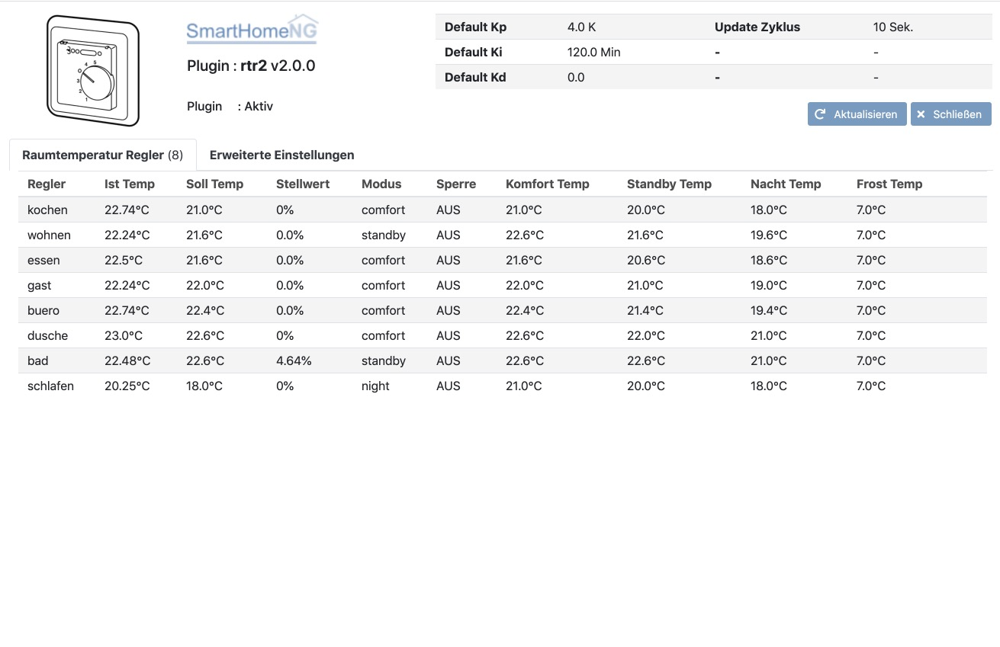
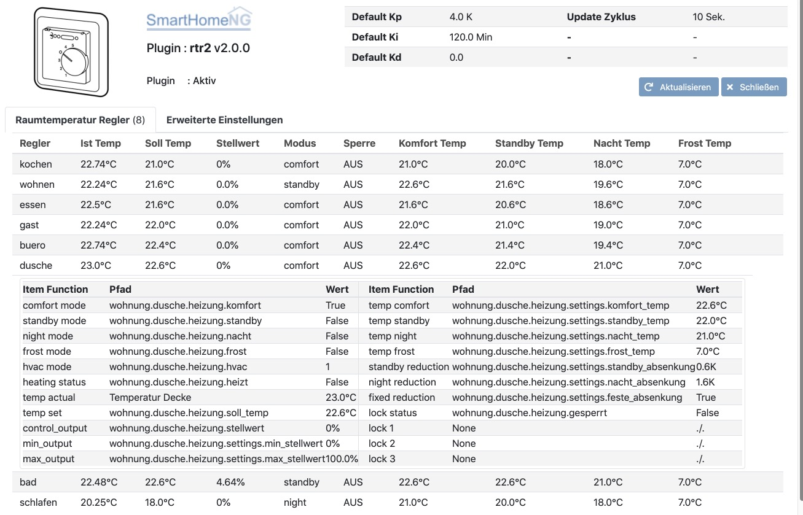

.. index:: Plugins; rtr2 (Raumtemperatur Regler v2)
.. index:: rtr2 rtr

====
rtr2
====

Das Plugin implementiert einen oder mehrere Raumtemperatur Regler. Es ist eine komplette Neuentwicklung mit einem
erweiterten Funktionsumfang gegenüber dem alten rtr Plugin:

- Umfangreiches Webinterface
- Struktur Templates, die das Einrichten im Item Baum vereinfachen
- Auf die Struktur Templates abgestimmtes smartVISU Widget zur einfachen Einrichtung der Visualisierung

Plugin Instanz hinzufügen
=========================

Da das Plugin ohne vorherige Konfiguration weiterer Parameter lauffähig ist, wird die Instanz beim Hinzufügen in
der Admin GUI auch gleich aktiviert und beim Neustart von SmartHomeNG geladen.

Das Plugin ist zurzeit nicht Multi-Instance fähig. Es kann daher nur eine Plugin Instanz in SmartHomeNG eingerichtet
werden. In dieser Instanz können jedoch mehrere Raumtemperatur Regler eingerichtet werden.

Konfiguration
=============

Standardwerte mit denen ein neuer Raumtemperatur Regler (RTR) eingerichtet wird, können in den Parametern des Plugins
konfiguriert werden. Falls ein neuer RTR mit abweichenden Einstellungen eingerichtet werden soll, können die Werte
im RTR-Item in einem Attribut angegeben werden. Diese Angaben (wie auch die Parameter mit den Standardwerten) sind
jedoch nur für den ersten Start eines RTR von Interesse, da die Einstellungen jedes RTR gecached werden und beim
Neustart von SmartHomeNG wieder hergestellt werden.

Diese Plugin Parameter und die Informationen zur Item-spezifischen Konfiguration des Plugins sind
unter :doc:`/plugins_doc/config/rtr2` beschrieben.

Verwendung von structs
----------------------

Mit der Hilfe von Struktur Templates wird die Einrichtung von Items stark vereinfacht. Hierzu wird Raumtemperatur
Regler (RTR) das Template **rtr2.rtr** vom Plugin mitgeliefert.

Ein RTR kann einfach folgendermaßen konfiguriert werden, indem nur die Id des zur erstellenden RTR als Attribut
``rtr2_id`` angegeben wird. Die ID kann ein normaler Text sein, z.B. der Name des Raumes der gesteuert werden soll.

.. code-block:: yaml

    test_rtr:
        struct: rtr2.rtr
        rtr2_id: dusche

Hierdurch wird eine Item Struktur angelegt, welche die benötigten Items deklariert. Für diese Items können noch
weitere Attribute angegeben werden.

Für einige der Items ist das sogar notwendig, damit der RTR seine Aufgabe erfüllen kann:

  - Das Sub-Item ``test_rtr.ist_temp`` muss die aktuelle Raumtemperatur enthalten. Das wird im folgenden Beispiel
    dadurch sichergestellt, dass das Item die Temperatur von einer KNX Gruppenadresse liest. Außerdem sorgt in dem
    Beispiel ``database: init`` dafür, dass die jeweils gemessene Temperatur in der Datenbank gespeichert wird.

  - Das Sub-Item ``test_rtr.stellwert`` muss mit einem Heizungs-Aktor verbunden werden, damit die Steuerungs-
    Funktion des RTR auch Auswirkungen hat. Im folgenden Beispiel erfolgt das dadurch, dass der Stellwert auf
    eine KNX Gruppenadresse geschrieben wird, die mit einem Heizungs-Aktor verbunden ist. Außerdem sorgt in dem
    Beispiel ``database: init`` dafür, dass der jeweilige Stellwert in der Datenbank gespeichert wird.

.. code-block:: yaml

    test_rtr:
        struct: rtr2.rtr
        rtr2_id: dusche

        ist_temp:
            knx_dpt: 9
            knx_cache: 11/3/3
            database: init

        stellwert:
            knx_dpt: 5001
            knx_send: 4/2/36
            database: init

Mit diesem minimalen Set an Angaben ist der RTR grundsätzlich betriebsbereit und kann seine Aufgabe erfüllen.

Die gewünschte Soll-Temperatur kann durch setzen des Wertes des Items ``test_rtr.soll_temp`` eingestellt werden.
Falls die Soll-Temperatur auch in der Datenbank gespeichert werden soll, so muss das Item mit dem Attribut
``database: init`` angegeben werden, wie im Beispiel unten zu sehen ist.

.. code-block:: yaml

    test_rtr:
        struct: rtr2.rtr
        rtr2_id: dusche

        ist_temp:
            knx_dpt: 9
            knx_cache: 11/3/3
            database: init

        stellwert:
            knx_dpt: 5001
            knx_send: 4/2/36
            database: init

        soll_temp:
            database: init

Darüber hinaus gibt es eine große Zahl weiterer Einstellungen, die am RTR vorgenommen werden können.

Einstellen des Modus
--------------------

Der Raumtemperatur Regler (RTR) verfügt über vier Modi (komfort, standby/normal, nacht, frostschutz). Für jeden dieser
Modi gibt es ein Sub-Item, mit dem der entsprechende Modus gewählt werden kann. Dazu muss der Wert **True** in
das entsprechende Item geschrieben werden.

Wenn der Wert **False** in das **komfort** oder **nacht** Modus-Item geschrieben wird, so wird der Modus **standby**
aktiviert.

hvac
~~~~

Weiterhin gibt es ein Sub-Item ``hvac`` in welches der Modus als Zahl geschrieben werden kann. Statt den Modus
über die boolschen Items ``komfort``, ``normal``, ``nacht`` und ``frost`` kann der Modus über einen numerischen
Wert zwischen 1 und 4 im Item ``hvac`` gesetzt werden.

Frostschutz
~~~~~~~~~~~

Der Modus Frostschutz verhält sich anders als die anderen 3 Modi. Wenn der Frostschutz Modus aktiv ist und in
das **frost** Sub-Item der Wert **False** geschrieben wird, wird der Modus wiederhergestellt, der vor Aktivierung
des Frostschutzes aktiv war.

Falls während der Frostschutz aktiv ist, der Komfort Modus, der Standby/Normal Modus oder der Nacht Modus aktiviert
wird, führt das nicht zum Ende des Frostschutz Modus. Vielmehr wird der aktivierte Modus zwischengespeichert und
erst durch Abschaltung des Frostschutzes aktiviert.

Der Frostschutz wird nur dadurch deaktiviert, dass das **frost** Item auf False gesetzt wird oder das **hvac** Item
auf einen Wert zwischen 1 und 3 gesetzt wird.

Bei setzen des hvac Modus während der Frostschutz Modus aktiv ist, wird der gewählte Modus gesetzt und nicht der
zwischengespeicherte Modus, der vor aktivieren des Frostschutzes aktiv war.

Automatische Nachtabsenkung
~~~~~~~~~~~~~~~~~~~~~~~~~~~

Eine automatische Nachtabsenkung kann auf vielen Wegen implementiert werden. Eine einfache Methode ist die
Verwendung des ``crontab`` Attributes für die Modus-Items ``komfort`` und ``nacht``:

.. code-block:: yaml

    test_rtr:
        struct: rtr2.rtr
        rtr2_id: dusche

        komfort:
            crontab: 30 4 * * = True

        nacht:
            crontab: 0 21 * * = True

Hierdurch wird täglich um 4:30 Uhr der Komfort-Modus aktiviert und täglich um 21:00 Uhr die Nachtabsenkung.

automatischer Frostschutz
-------------------------

Eine automatische Aktivierung des Frostschutzes kann für viele Zwecke nützlich sein. Im folgenden Beispiel wird
der Frostschutz aktiviert, wenn das Fenster geöffnet wird, um Heizenergie zu sparen. Dazu wird das ``frost`` Attribut
mit dem Item verbunden, welches den Status des Fensterkontaktes enthält.

.. code-block:: yaml

    test_rtr:
        struct: rtr2.rtr
        rtr2_id: dusche

        frost:
            eval: True if sh.wohnung.dusche.fenster.griff() > 0 else False
            eval_trigger: wohnung.dusche.fenster.griff

Es wird hierbei auf einen Wert größer 0 verglichen, da der Fenstergriff separate Stati für gekippt und geöffnet
liefert.

Structure Template
------------------

Das vom Plugin mitgelieferte Template definiert die folgende Item Struktur:

Die genaue Definition der einzelnen Items kann in der Admin GUI unter **Items/Struktur Templates** angesehen werden.

Item Attribute
--------------

Wenn man das struct Template nicht nutzen möchte kann man die Items natürlich auch einzeln einrichten. Dazu muss man
bei jedem Item die zwei folgenden Attribute spezifizieren.

Das Plugin verwendet die zwei Item Attribute: ``rtr2_id`` und ``rtr2_function``.

Mit ``rtr2_id`` wird festgelegt auf welchen Raumtemperatur Regler (RTR) zugegriffen werden soll.

Mit ``rtr2_function`` wird festgelegt, welche Funktion des RTR abgefragt oder gesteuert werden soll.
Es sind die folgenden Funktionen implementiert (einige erlauben nur die Abfrage):

    - ``comfort_mode``
    - ``standby_mode``
    - ``night_mode``
    - ``frost_mode``
    - ``hvac_mode``
    - ``heating_status``
    - ``lock_status``
    - ``temp_set``
    - ``temp_actual``
    - ``control_output``
    - ``setting_temp_comfort``
    - ``setting_temp_standby``
    - ``setting_temp_night``
    - ``setting_night_reduction``
    - ``setting_standby_reduction``
    - ``setting_fixed_reduction``
    - ``setting_temp_frost``

Die vollständige Übersicht über die unterstützen Funktionen und die Datentypen dazu kann auf der
Seite :doc:`/plugins_doc/config/rtr2` in der Beschreibung des Item Attributes ``rtr2_function`` nachgelesen
werden.

Um den Heiz-Status eines RTR mit der Id **dusche** abzufragen, muss ein Item folgendermaßen konfiguriert werden:

.. code-block:: yaml

    heizt:
        type: bool
        rtr2_id: dusche
        rtr2_function: heating_status

|

Abweichende Reglerparameter
===========================

Möchte man dem Regler von den globalen Einstellungen abweichende Werte übergeben, wird dies über ``rtr_settings`` und
``rtr2_controller_settings`` erledigt. Die Paramter hierfür sind wie folgt anzugeben:

.. code-block:: yaml

    test_rtr:
        rtr2_id: dusche
        rtr2_settings:
          - 22.0 # Temperatur Komfort Modus
          - 3.0  # Temperaturreduktion Nacht Modus
          - 1.0  # Temperaturreduktion Standby Modus
          - True # fixed_reduction
          - 2    # HVAC Modus
          - 7.0  # Temperatur Frost Modus
        rtr2_controller_settings:
          - 4.0 # Kp
          - 120 # Ki
          - 3.0 # Kd (wird nicht verwendet, wird nur für den noch nicht implementierten PID Regler benötigt)

Zu Beachten ist, dass man die letzten Parameter immer weglassen kann, aber nicht die davor. Die weggelassenen Parameter
werden dann mit den definierten Standardwerten belegt. Möchte man z.B nur eine neue Temperaturreduktion für den
Nacht Modus angeben, muss man also auch die Temperatur für den Komfort Modus angeben. Das würde wie folgt aussehen.

.. code-block:: yaml

    test_rtr:
        rtr2_id: dusche
        rtr2_settings:
          - 22.0
          - 2.0

|

Visualisierung
==============

Das Plugin liefert zwei Widgets für die smartVISU mit, welches auf das struct Template des Plugins abgestimmt ist und
sich dadurch einfacher nutzen lässt. Außerdem zeigt das Widget zusätzlich an, falls der der Raumtemperatur Regler (RTR)
über ein Item gesperrt wurde.

RTR Widget
----------
Dieses Widget dient zur Bedienung des Raumtemperatur Reglers (RTR). Es greift im Hintergrund auf das
Widget **device.rtr** der smartVISU zurück, ist jedoch einfacher zu konfigurieren, da es auf die Item Struktur
des struct Templates abgestimmt ist. Außerdem wird zusätzlich zum **device.rtr** Widget auch der Sperr-Status
des RTR angezeigt.

Das Widget hat nur drei Parameter, von denen nur einer benötigt wird:

  - Item, welches das struct Attribut enthält
  - Schrittgröße für die Temperatur Verstellung (falls der Wert leer gelassen wird, wird der Standardwert 0.5 genutzt)
  - Text der vor dem Stellwert angezeigt wird (falls der Wert leer gelassen wird, wird 'heizt mit' angezeigt)

Das Widget wird folgendermaßen genutzt:

.. code-block:: yaml

    visu_heizung:
        name: Raumtemperaturregler Decke
        sv_widget: "{{ rtr2.rtr('wohnung.dusche.heizung', '0.2', '') }}"

Die Darstellung des RTR in der Visu sieht folgendermaßen aus:

Wenn der RTR über ein Item gesperrt wurde, wird der Stellwert auf 0% gesetzt und zusätzlich ein Lock-Icon angezeigt:

|

Plot Widget
-----------
Dieses Widget dient zur Anzeige der Temperatur- und Stellwert Daten des Raumtemperatur Reglers (RTR). Es kann
anstelle des Widgets **plot.rtr** verwendet werden, wenn man mehr Informationen darstellen will. Es greift im
Hintergrund auf das Widget **plot.period** der smartVISU zurück, ist jedoch einfacher zu konfigurieren, da es auf
die Item Struktur des struct Templates abgestimmt ist. Voraussetzung ist, dass für die anzuzeigenden Items die
Daten mit dem database Plugin gespeichert werden.

Standardmäßig werden der Sollwert, die aktuelle Temperatur und der Stellwert angezeigt. Es können Kurven für bis
zu zwei weitere Temperaturen angezeigt werden, falls dieses gewünscht wird.

Das Widget hat sechs Parameter, von denen nur einer benötigt wird:

  - Item, welches das struct Attribut enthält
  - Beschriftung der Ist-Temperatur (falls der Wert leer gelassen wird, wird 'Ist Temp.' angezeigt)
  - Item mit den Daten der 1. zusätzlichen Temperatur (falls der Wert leer gelassen wird, wird keine zusätzliche Temperatur angezeigt)
  - Beschriftung für die 1. zusätzliche Temperatur
  - Item mit den Daten der 2. zusätzlichen Temperatur (falls der Wert leer gelassen wird, wird keine 2. zusätzliche Temperatur angezeigt)
  - Beschriftung für die 2. zusätzliche Temperatur

Das Widget wird folgendermaßen genutzt (incl. Anzeige einer zusätzlichen Temperatur):

.. code-block:: yaml

    visu_heizung:
        name: Temperaturen in °C / Stellwert in %
        sv_widget: "{{ rtr2.plot('wohnung.dusche.heizung', 'Decke', 'wohnung.dusche.heizung.ist_estrich', 'Estrich') }}"

Die Darstellung der Daten in der Visu sieht folgendermaßen aus:

|

Web Interface
=============

Das rtr2 Plugin verfügt über ein Webinterface, mit dessen Hilfe die Raumtemperatur Regler (RTR) und die mit dem Regler
verbundenen Items übersichtlich dargestellt werden. Außerdem können weitere Informationen zu den RTRs werden.

Aufruf des Webinterfaces
------------------------

Das Plugin kann aus der Admin GUI (von der Seite Plugins/Plugin Liste aus) aufgerufen werden. Dazu auf der Seite
in der entsprechenden Zeile das Icon in der Spalte **Web Interface** anklicken.

Außerdem kann das Webinterface direkt über ``http://smarthome.local:8383/plugin/rtr2`` aufgerufen werden.

|

Beispiele
---------

Folgende Informationen können im Webinterface angezeigt werden:

Oben rechts werden allgemeine Parameter zum Plugin angezeigt. Die weiteren Informationen werden in den
verschiedenen Tabs des Webinterface angezeigt.

Im ersten Tab werden die Raumtemperatur Regler mit den wichtigsten Informationen angezeigt.

|
|

Wenn man auf die Zeile eines Raumtemperatur Reglers klickt, werden alle mit dem Regler verbundenen Items angezeigt:

|
|

Im zweiten Tab werden erweiterte Informationen zu den Raumtemperatur Reglern angezeigt:

.. image:: assets/webif_tab2.jpg
   :class: screenshot

|
|

