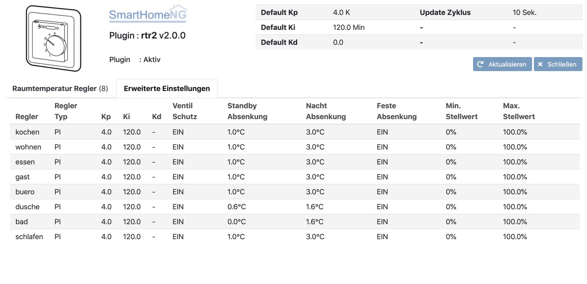

.. index:: Plugins; rtr2 (Raumtemperatur Regler v2)
.. index:: rtr rtr2

rtr2
####

Das Plugin implementiert einen oder mehrere Raumtemperatur Regler. Es ist eine komplette Neuentwicklung mit einem
erweiterten Funktionsumfang gegenüber dem alten rtr Plugin:

- Umfangreiches Webinterface
- Struktur Templates, die das Einrichten im Item Baum vereinfachen
- Auf die Struktur Templates abgestimmtes smartVISU Widget zur einfachen Einrichtung der Visualisierung

Plugin Instanz hinzufügen
=========================

Da das Plugin ohne vorherige Konfiguration weiterer Parameter lauffähig ist, wird die Instanz beim Hinzufügen in
der Admin GUI auch gleich aktiviert und beim Neustart von SmartHomeNG geladen.

Das Plugin ist zurzeit nicht Multi-Instance fähig. Es kann daher nur eine Plugin Instanz in SmartHomeNG eingerichtet
werden. In dieser Instanz können jedoch mehrere Raumtemperatur Regler eingerichtet werden.

Konfiguration
=============

Standardwerte mit denen ein neuer Raumtemperatur Regler (RTR) eingerichtet wird, können in den Parametern des Plugins
konfiguriert werden. Falls ein neuer RTR mit abweichenden Einstellungen eingerichtet werden soll, können die Werte
im RTR-Item in einem Attribut angegeben werden. Diese Angaben (wie auch die Parameter mit den Standardwerten) sind
jedoch nur für den ersten Start eines RTR von Interesse, da die Einstellungen jedes RTR gecacht werden und beim
Neustart von SmartHomeNG wieder hergestellt werden.

Diese Plugin Parameter und die Informationen zur Item-spezifischen Konfiguration des Plugins sind
unter :doc:`/plugins_doc/config/rtr2` beschrieben.

Verwendung von structs
----------------------

Mit der Hilfe von Struktur Templates wird die Einrichtung von Items stark vereinfacht. Hierzu wird Raumtemperatur
Regler (RTR) das Template **rtr2.rtr** vom Plugin mitgeliefert.

Ein RTR kann einfach folgendermaßen konfiguriert werden, indem nur die Id des zur erstellenden RTR als Attribut
``rtr2_id`` angegeben wird. Die ID kann ein normaler Text sein, z.B. der Name des Raumes der gesteuert werden soll.

.. code-block:: yaml

    test_rtr:
        struct: rtr2.rtr
        rtr2_id: dusche

Hierdurch wird eine Item Struktur angelegt, welche die benötigten Items deklariert. Für diese Items können noch
weitere Attribute angegeben werden.

Für einige der Items ist das sogar notwendig, damit der RTR seine Aufgabe erfüllen kann:

  - Das Sub-Item ``test_rtr.ist_temp`` muss die aktuelle Raumtemperatur enthalten. Das wird im folgenden Beispiel
    dadurch sichergestellt, dass das Item die Temperatur von einer KNX Gruppenadresse liest. Außerdem sorgt in dem
    Beispiel ``database: init`` dafür, dass die jeweils gemessene Temperatur in der Datenbank gespeichert wird.

  - Das Sub-Item ``test_rtr.stellwert`` muss mit einem Heizungs-Aktor verbunden werden, damit die Steuerungs-
    Funktiomn des RTR auch auswirkungen hat. Im folgenden Beispiel erfolgt das dadurch, dass der Stellwert auf
    eine KNX Gruppenadresse geschrieben wird, die mit einem Heizungs-Aktor verbunden ist. Außerdem sorgt in dem
    Beispiel ``database: init`` dafür, dass der jeweilige Stellwert in der Datenbank gespeichert wird.

.. code-block:: yaml

    test_rtr:
        struct: rtr2.rtr
        rtr2_id: dusche

        ist_temp:
            knx_dpt: 9
            knx_cache: 11/3/3
            database: init

        stellwert:
            knx_dpt: 5001
            knx_send: 4/2/36
            database: init

Mit diesem minimalen Set an Angaben ist der RTR grundsätzlich betriebsbereit und kann seine Aufgabe erfüllen.

Die gewünschte Soll-Temperatur kann durch setzen des Wertes des Items ``test_rtr.soll_temp`` eingestellt werden.
Falls die Soll-Temperatur auch in der Datenbank gespeichert werden soll, so muu das Item mit dem Attribut
``database: init`` angegeben werden, wie im Beispiel unten zu sehen ist.

.. code-block:: yaml

    test_rtr:
        struct: rtr2.rtr
        rtr2_id: dusche

        ist_temp:
            knx_dpt: 9
            knx_cache: 11/3/3
            database: init

        stellwert:
            knx_dpt: 5001
            knx_send: 4/2/36
            database: init

        soll_temp:
            database: init

Darüber hinaus gibt es eine große Zahl weiterer Einstallungen, die am RTR vorgenommen werden können.

Einstellen des Modus
--------------------

Der Raumtemperatur Regler (RTR) verfügt über vier Modi (komfort, standby, nacht, frostschutz). Für jeden dieser
Modi gibt es ein Sub-Item, mit dem der entsprechende Modus gewählt werden kann. Dazu muss der Wert **True** in
das entsprechende Item geschrieben werden.

Wenn der Wert **False** in das **komfort** oder **nacht** Modus-Item geschrieben wird, so wird der Modus **standby**
aktiviert.

Wenn der Frostschutz Modus aktiv ist und in das **frost** Sub-Item der Wert **False** geschrieben wird, wird der
Modus wiederhergestellt, der vor Aktivierung des Frostschutzes aktiv war.

Weiterhin gibt es ein Sub-Item ``hvac`` in welches der Modus als Zahl (1 bis 4) geschrieben werden kann (1=konfort,
2=standby, 3=nacht, 4=frost).

Automatische Nachtabsenkung
~~~~~~~~~~~~~~~~~~~~~~~~~~~

Eine automatische Nachtabsenkung kann auf vielen Wegen implementiert werden. Eine einfache Methode ist die
Verwendung des ``crontab`` Attributes für die Modus-Items ``komfort`` und ``nacht``:

.. code-block:: yaml

    test_rtr:
        struct: rtr2.rtr
        rtr2_id: dusche

        komfort:
            crontab: 30 4 * * = True

        nacht:
            crontab: 0 21 * * = True

Hierdurch wird täglich um 4:30 Uhr der Komfort-Modus aktiviert und täglich um 21:00 Uhr die Nachtabsenkung.

Item Attribute
--------------

Das Plugin verwendet zwei Item Attribute: ``rtr2_id`` und ``rtr2_function``.

Mit ``rtr2_id`` wird festgelegt auf welchen Raumtemperatur Regler (RTR) zugegriffen werden soll.

Mit ``hue2_function`` wird festgelegt, welche Funktion des RTR abgefragt oder gesteuert werden soll.
Es sind die folgenden Funktionen implementiert (einige erlauben nur die Abfrage):

    - ``comfort_mode``
    - ``standby_mode``
    - ``night_mode``
    - ``frost_mode``
    - ``hvac_mode``
    - ``heating_status``
    - ``lock_status``
    - ``temp_set``
    - ``temp_actual``
    - ``control_output``
    - ``setting_temp_comfort``
    - ``setting_temp_standby``
    - ``setting_temp_night``
    - ``setting_night_reduction``
    - ``setting_standby_reduction``
    - ``setting_fixed_reduction``
    - ``setting_temp_frost``

Die vollständige Übersicht über die unterstützen Funktionen und die Datentypen dazu kann auf der
Seite :doc:`/plugins_doc/config/rtr2` in der Beschreibung des Item Attributes ``rtr2_function`` nachgelesen
werden.

Um den Heiz-Status eines RTR mit der Id **dusche** abzufragen, muss ein Item folgendermaßen konfiguriert werden:

.. code-block:: yaml

    heizt:
        type: bool
        rtr2_id: dusche
        rtr2_function: heating_status

|

Web Interface
=============

Das rtr2 Plugin verfügt über ein Webinterface, mit dessen Hilfe die Raumtemperatur Regler (RTR) und die mit dem Regler
verbundenen Items übersichtlich dargestellt werden. Außerdem können weitere Informationen zu den RTRs werden.

Aufruf des Webinterfaces
------------------------

Das Plugin kann aus der Admin GUI (von der Seite Plugins/Plugin Liste aus) aufgerufen werden. Dazu auf der Seite
in der entsprechenden Zeile das Icon in der Spalte **Web Interface** anklicken.

Außerdem kann das Webinterface direkt über ``http://smarthome.local:8383/plugin/rtr2`` aufgerufen werden.

|

Beispiele
---------

Folgende Informationen können im Webinterface angezeigt werden:

Oben rechts werden allgemeine Parameter zum Plugin angezeigt. Die weiteren Informationen werden in den
verschiedenen Tabs des Webinterface angezeigt.

Im ersten Tab werden die Raumtemperatur Regler mit den wichtigsten Informationen angezeigt.

.. image:: assets/webif_tab1_1.jpg
   :class: screenshot

|
|

Wenn man auf die Zeile eines Raumtemeratur Reglers klickt, werden alle mit dem Regler verbundenen Items angezeigt:

.. image:: assets/webif_tab1_2.jpg
   :class: screenshot

|
|

Im zweiten Tab werden erweiterte Informationen zu den Raumtemeratur Reglern angezeigt:

|
|

