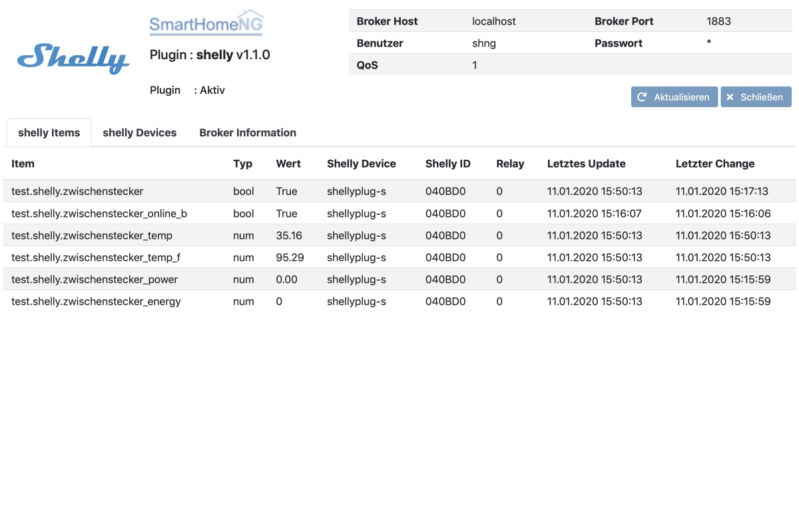
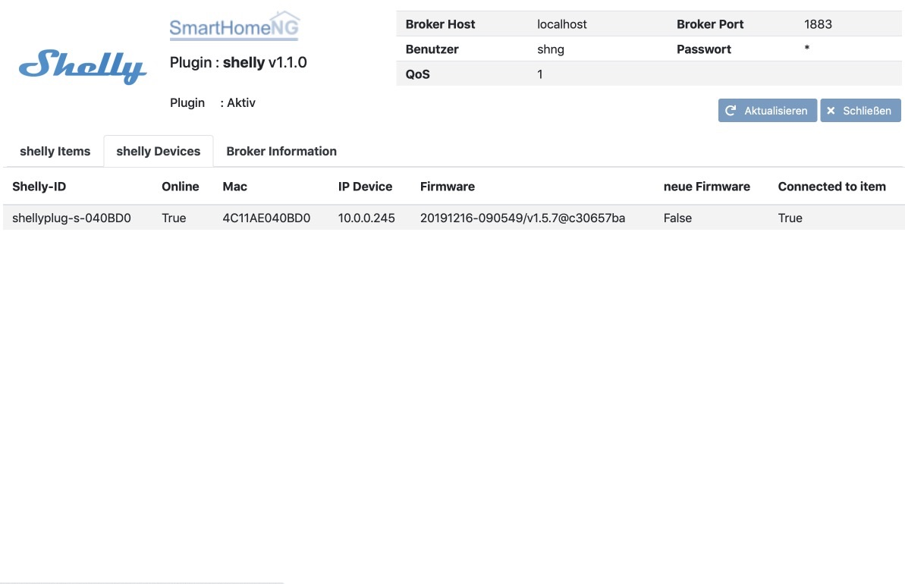
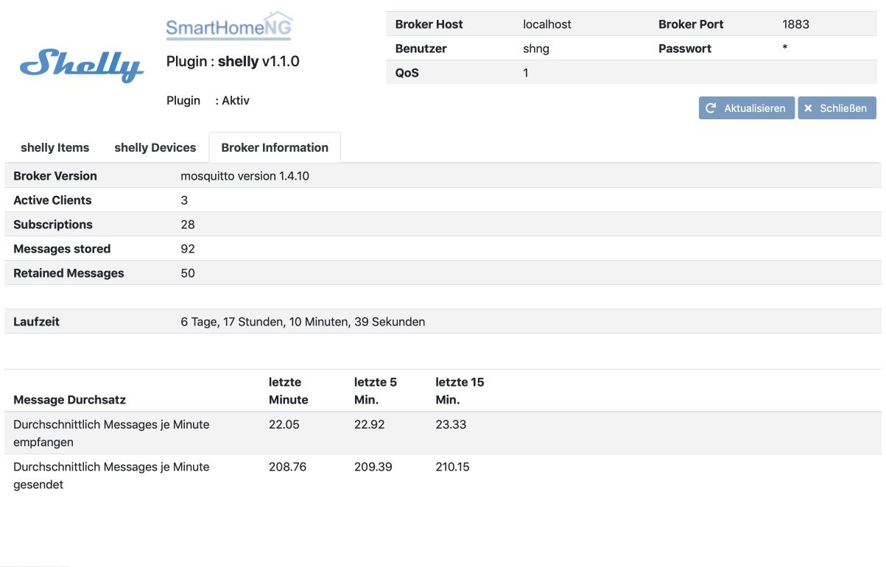

.. index:: shelly
.. index:: Plugins; shelly
.. index:: mqtt; shelly Plugin

======
shelly
======

Das Plugin dienst zur Steuerung von Shelly Devices über MQTT. Zur Aktivierung von MQTT für die Shelly Devices bitte
die Dokumentation des jeweiligen Devices zu Rate ziehen.

Zurzeit werden folgende Shelly Devices unterstützt:

- Shelly1/pm
- Shelly2
- Shelly2.5
- Shelly4Pro
- Shelly Plug
- Shelly PlugS
- Shelly H&T
- Shelly Flood
- Shelly Door/Window 2

Es werden alle Relays eines Shelly Devices (bis zu 4) unterstützt. Weiterhin werden die folgenden
Attribute/Parameter der Devices unterstützt, soweit die Devices selbst diese unterstützen:

- humidity
- state
- tilt
- vibration
- lux
- illumination
- flood
- battery
- power
- energy
- temperature
- temperature_f

sowie der online-Status.

.. attention::

    Das Plugin kommuniziert über MQTT und benötigt das neue mqtt Modul, welches die Kommunikation mit dem MQTT Broker
    durchführt. Dieses Modul muß geladen und konfiguriert sein, damit das Plugin funktioniert.

Shelly Device in Betrieb nehmen
===============================

Um Shelly Plugs mit diesem Plugin zu nutzen, müssen sie in das lokale WLAN eingebunden sein und die MQTT Unterstützung
muss aktiviert sein.

Einbindung ins WLAN
-------------------

Shelly in den AP-Modus versetzen

- in die Steckdose stecken/an Strom anschließen
- Falls die LED nicht rot/blau blinken, den Taster drücken -> Shelly Plug wird in den AP Mode versetzt
- WLAN SSID suchen und verbinden (z.B. bei ShellyPlug-S die SSID shellyplug-s-xxxxxx)
- Im Browser die Seite http://IP 192.168.33.1 aufrufen
- Einstellungen im Shelly vornehmen -> Einstellungen im Shelly-Hauptmenü

In das lokale WLAN einbinden
~~~~~~~~~~~~~~~~~~~~~~~~~~~~

- Fläche **Internet & Security** klicken
- **WIFI MODE - CLIENT** aufklappen
- Haken bei **Connect the Shelly device to an existing WiFi Network** setzen
- SSID und Password eingeben
- **SAVE** klicken
- Mit dem Browser unter der neuen IP Adresse (http://shellyplug-s-xxxxxx) im lokalen WLAN verbinden

Firmware Update durchführen
~~~~~~~~~~~~~~~~~~~~~~~~~~~

- Fläche **Settings** klicken
- **FIRMWARE UPDATE** aufklappen
- **UPDATE FIRMWARE** klicken

MQTT konfigurieren
~~~~~~~~~~~~~~~~~~

- Fläche **Internet & Security** klicken
- **ADVANCED - DEVELOPER SETTINGS** aufklappen
- Haken bei **Enable action execution via MQTT** setzen
- Falls der MQTT Broker ein Login erfordert, Username und Password eingeben
- Adresse des Brokers in der Form <IP>:<Port> eingeben (z.B.: 10.0.0.140:1883)
- Max QoS vorzugsweise auf **1** setzen
- **SAVE** klicken

Konfiguration
=============

Item structs
------------

Zur Vereinfachung der Einrichtung von Items sind für folgende Shelly Devices Item-structs vordefiniert:

- shellyplug
- shellyplug_s
- shellyht
- shellyflood

Unter Verwendung der entsprechenden Vorlage kann die Einrichtung einfach durch Angabe der shally_id des
entsprechenden Devices erfolgen:

.. code:: yaml

    plug1:
        name: Mein erster Shellyplug-S
        type: bool
        shelly_id: '040BD0'
        struct: shelly.shellyplug_s

Damit werden außer dem Schalter selbst, Unteritems für Online-Status, Leistung, Energieverbrauch und Temperatur
des Devices (in °C und °F) angelegt.

weitere Informationen
---------------------

Informationen zur Konfiguration und die vollständige Beschreibung der Item-Attribute sind
unter :doc:`/plugins_doc/config/shelly` zu finden.

Web Interface des Plugins
=========================

Shelly Items
------------

Das Webinterface zeigt die Items an, für die ein Shelly Device konfiguriert ist.

Der Item Wert, sowie die Zeitangaben zu letzten Update und zum letzten Change werden periodisch aktualisiert.

Shelly Devices
--------------

Das Webinterface zeigt Informationen zu den konfigurierten Shelly Devices an, sowie etwa hinzugekommen Devices die
in SmartHomeNG noch nicht konfiguriert (mit einem Item vebunden) sind.

Ein Klick auf die Shelly ID öffnet die Shelly Konfigurationsseite des Devices.

Broker Information
------------------

Das Webinterface zeigt Informationen zum genutzten MQTT Broker an.

