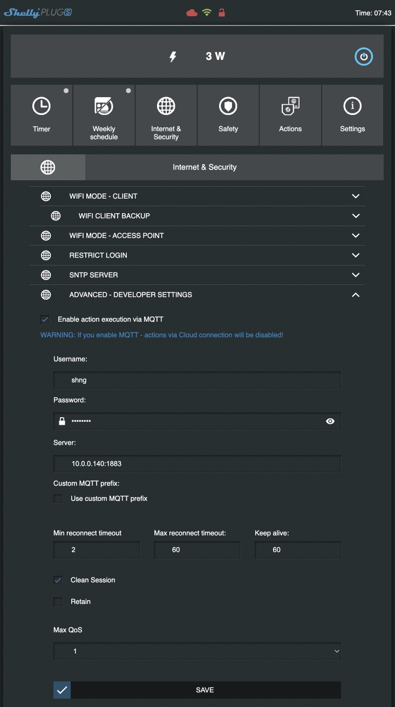
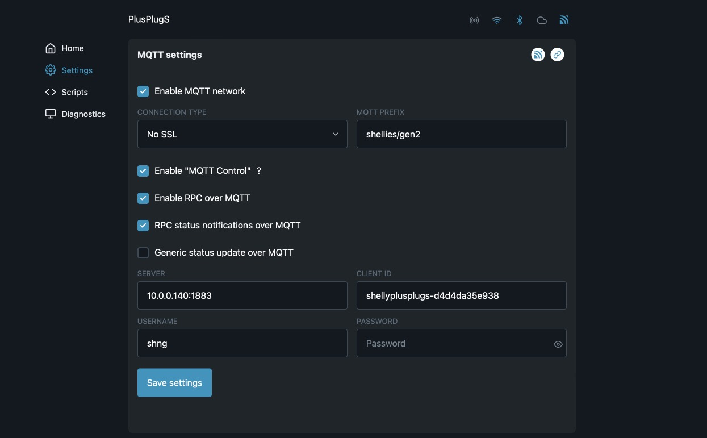

Shelly Device in Betrieb nehmen
===============================

*** Ausgelagert ***

Um Shelly Plugs mit diesem Plugin zu nutzen, müssen sie in das lokale WLAN eingebunden sein und die MQTT Unterstützung
muss aktiviert sein.

Einbindung ins WLAN
-------------------

Shelly in den AP-Modus versetzen

- in die Steckdose stecken/an Strom anschließen
- Falls die LED nicht rot/blau blinken, den Taster drücken -> Shelly Plug wird in den AP Mode versetzt
- WLAN SSID suchen und verbinden (z.B. bei ShellyPlug-S die SSID shellyplug-s-xxxxxx)
- Im Browser die Seite http://192.168.33.1 aufrufen
- Einstellungen im Shelly vornehmen -> Einstellungen im Shelly-Hauptmenü

Gen1 Devices einbinden
~~~~~~~~~~~~~~~~~~~~~~

- Fläche **Internet & Security** klicken
- **WIFI MODE - CLIENT** aufklappen
- Haken bei **Connect the Shelly device to an existing WiFi Network** setzen
- SSID und Password eingeben
- **SAVE** klicken
- Mit dem Browser unter der neuen IP Adresse (http://shellyplug-s-xxxxxx) im lokalen WLAN verbinden

Gen2 Devices einbinden
~~~~~~~~~~~~~~~~~~~~~~

- In der Navigation links auf **Settings** klicken
- Im Abschnitt 'Network Settings' auf **Wi-Fi** klicken
- Im Abschnitt 'Wi-Fi 1 settings' Haken bei **Enable Wi-Fi Network** setzen
- SSID und Password eingeben
- **SAVE** klicken
- Mit dem Browser unter der neuen IP Adresse (http://shellyplug-s-xxxxxx) im lokalen WLAN verbinden

|

Firmware Update durchführen
---------------------------

Die Devices werden im allgemeinen mit einer älteren Firmware Version ausgeliefert. Deshalb sollte als erstes ein
Firmware Update durchgeführt werden.

Update für Gen1 Devices
~~~~~~~~~~~~~~~~~~~~~~~

- Fläche **Settings** klicken
- **FIRMWARE UPDATE** aufklappen
- **UPDATE FIRMWARE** klicken

Update für Gen2 Devices
~~~~~~~~~~~~~~~~~~~~~~~

- In der Navigation links auf **Settings** klicken
- Im Abschnitt 'Device Settings' auf **Firmware** klicken
- Den Button für die aktuelle **stable** Firmware klicken

|

MQTT konfigurieren
------------------

Für Gen1 Devices
~~~~~~~~~~~~~~~~

- Fläche **Internet & Security** klicken
- **ADVANCED - DEVELOPER SETTINGS** aufklappen
- Haken bei **Enable action execution via MQTT** setzen
- Falls der MQTT Broker ein Login erfordert, Username und Password eingeben
- Adresse des Brokers in der Form <IP>:<Port> eingeben (z.B.: 10.0.0.140:1883)
- Max QoS vorzugsweise auf **1** setzen
- **SAVE** klicken

Für Gen2 Devices
~~~~~~~~~~~~~~~~

- In der Navigation links auf **Settings** klicken
- Im Abschnitt 'Connectivity' auf **MQTT** klicken
- Den Haken bei **Enable MQTT Network** setzen
- Den 'MQTT PREFIX' auf **shellies/gen2** konfigurieren
- IP-Adresse und Port des MQTT Brokers unter 'SERVER' konfigurieren
- Falls der Broker eine Anmeldung erfordert, 'USERNAME' und 'PASSWORD' konfigurieren
- **SAVE** klicken

.. note::

    Bei späteren Rekonfigurationen ist im allgemeinen das PASSWORD Feld leer und das Password muss
    (bevor **Save Settings** geklickt wird) erneut eingegeben werden. Sonst verbindet sich das Device
    nicht dem Broker.

|

