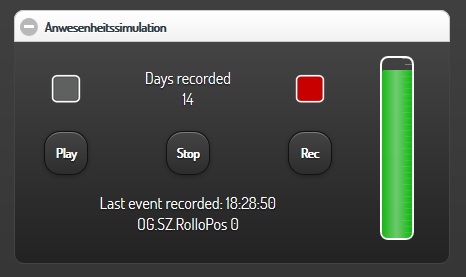

.. index:: Plugins; simulation
.. index:: simulation

==========
simulation
==========

Aufnahme und Abspielen von Aktionsreihenfolgen

Konfiguration
=============

Die Informationen zur Konfiguration des Plugins sind unter :doc:`/plugins_doc/config/simulation` beschrieben.

Für jedes aufzuzeichnende Item ist das Attribut ``sim: track`` hinzuzufügen. Es werden nur
**num** und **bool** Items unterstützt.

Beispiel
--------

.. code:: yaml

    eg:
        flur:
            licht:
                type: bool
                visu_acl: rw
                knx_dpt: 1
                knx_cache: 1/1/1
                knx_send: 1/1/0
                enforce_updates: 'yes'
                sim: track

Plugin Items
------------

Im Item-Baum müssen einige Items speziell für das Plugin integriert werden. Hierzu
steht das ``struct: general`` zur Verfügung. Dieses struct enthält folgende **sim** Attribute:

**state**: Status des Plugins

- 00: Stop = Das Plugin ist deaktiviert.
- 01: Standby = Das Plugin wird zu einem späteren Zeitpunkt aufzeichnen.
- 02: Record = Das Plugin zeichnet alle konfigurierten Dateien auf.
- 04: Play = Das Plugin spielt das Eventfile ab.

**control**: Wird vom Nutzer gesetzt, um die Funktion des Plugins zu definieren.

- 01: Stop = Aufnahme oder Abspielen stoppen.
- 02: Play = Etwaige Aufzeichnungen werden gestoppt, das Abspielen gestartet.
- 03: Record = Etwaiges Abspielen wird gestoppt, die Aufzeichnung gestartet.

**message**: Im Falle einer Aufzeichnung enthält das Item das zuletzt erkannte Event.
Beim Abspielen beinhaltet es das nächste Event. Im Falle eines Fehlers wird eine
Fehlermeldung angezeigt. Dieses Item kann z.B. in einer Visualierung genutzt werden,
um die aktuelle Aktion sichtbar zu machen.

**tank**: Zeigt die Anzahl an Tagen an, die bereits im Eventfile gespeichert sind.
Das Maximum beträgt 14 Tage.
Diese Information ist hilfreich um zu sehen, ob bereits genug Daten für ein Abspielen
vorhanden sind.

Aufzeichnung
============

Das Plugin schreibt direkt ab dem Start alle Events von Items, die das ``sim: track``
Attribut haben, in eine Datei. Beim ersten Start wird diese Datei angelegt, bei weiteren
Starts werden Events dieser Datei bis maximal 14 Tage hinzugefügt, ältere Tage werden
automatisch gelöscht.

Wurde das Plugin erstmalig gestartet (beim Start von SHNG oder durch Setzen des Control Items
auf den Wert 03), ist es im Standby Modus. Die Aufzeichnung beginnt erst um Mitternacht,
um nur vollständige Tage aufzuzeichnen. Sind bereits Werte vom heutigen Tag in der
Aufzeichnung vorhanden und es wird ein neues Event erkannt, wird die Aufzeichnung wie folgt
in die Datei geschrieben:

- Das neue Event findet mindestens 15 Minuten nach dem zuletzt aufgezeichneten Event statt: Die Aufzeichnung beginnt sofort und speichert die restlichen Events des Tages.
- Das neue Event findet uhrzeitmäßig innerhalb von 15 Minuten nach dem letzten Event statt, pausiert das Plugin bis zur entsprechenden Uhrzeit des nächsten Tages. Dadurch werden zu große Lücken im Eventprotokoll verhindert.
- Wird das Control-Item auf **01** gestellt, stoppt die Aufzeichnung sofort.

Abspielen
=========
Durch Setzen des Control-Items auf den Wert **02** wird das Abspielen der aufgezeichneten
Events gestartet und die Aufzeichnung automatisch gestoppt. Die Aufzeichnungsdatei wird
Zeile für Zeile eingelesen und abgespielt. Ist das File zuende, stoppt die Simulation.
Das Datum der Aufzeichnung wird ignoriert. Folgt ein Eintrag, der zeitlich VOR dem vorigen Eintrag liegt, springt das Abspielen automatisch auf den nächsten Tag.

Visualisierung
==============

Das Item stellt ein Widget für die smartvisu bereit. Dieses sieht wie folgt aus:

Die png Dateien für die farblichen Leuchten/LED-Anzeigen sind im Ordner **lamps** zu finden.

Event Datei Format
==================

Jedes Event wird wie folgt gespeichert:

.. code:: text

    Day;Time;Item;Value;Trigger e.g:

    Tue;06:05:27;OG.Tobias.Deckenlicht;True;KNX

Unter Trigger wird die source gespeichert, die das Item geändert hat.
Um Mitternacht wird ein "NextDay" in eine neue Zeile eingefügt.

Statusdiagramm
==============

Das folgende Schaubild zeigt die Statusänderungen abhängig vom Control-Item.
Der Status wird in das State Item gespeichert.
### State Diagram

The following state diagram shows the state changes depenging on the control item.
The state is stored in the state item.

