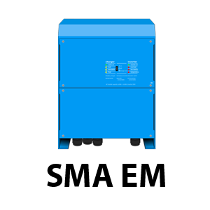

.. index:: Plugins; sma_em
.. index:: sma_em

======
sma_em
======

Das Plugin liest die Messdaten eines SMA Energy Meters aus, der seine Werte per Multicast im lokalen
Netzwerk verteilt. Die Werte stehen als Items für Leistungsbezug und -einspeisung, Blind- und
Scheinleistung sowie Spannung, Strom und Leistungsfaktor je Phase zur Verfügung.

Voraussetzungen
================

Das Plugin benötigt einen SMA Energy Meter im lokalen Netzwerk, der seine Messdaten per Multicast an
die Adresse 239.12.255.254 sendet. Der Rechner, auf dem SmartHomeNG läuft, muss diesen Multicast
empfangen können.

Konfiguration
=============

Die Informationen zur Konfiguration des Plugins sind unter :doc:`/plugins_doc/config/sma_em`
beschrieben.

Item-Structs
============

Das Plugin liefert zwei fertige Item-Structs mit, die die gängigen Datenpunkte des Energy Meters
bereits vorkonfiguriert enthalten:

- **main** - Bezug und Einspeisung von Wirkleistung inklusive Zählerständen, jeweils mit einem
  zusätzlichen Item **kw** in Kilowatt sowie den booleschen Items **supply_active**/**consume_active**.
- **detailed** - erweiterte Messwerte je Phase (Schein- und Blindleistung, Strom, Spannung,
  Leistungsfaktor).

::

    smaem:
        main:
            struct: sma_em.main

        detailed:
            struct: sma_em.detailed

Web Interface
=============

Das sma_em Plugin verfügt über ein Webinterface, das alle vom Plugin genutzten Items mit Pfad, Typ,
SMA EM Datentyp, aktuellem Wert sowie Zeitpunkt des letzten Updates und der letzten Änderung anzeigt.

Aufruf des Webinterfaces
------------------------

Das Plugin kann aus der Admin GUI (von der Seite Plugins/Plugin Liste aus) aufgerufen werden. Dazu auf
der Seite in der entsprechenden Zeile das Icon in der Spalte **Web Interface** anklicken.

Außerdem kann das Webinterface direkt über ``http://smarthome.local:8383/sma_em`` aufgerufen werden.
