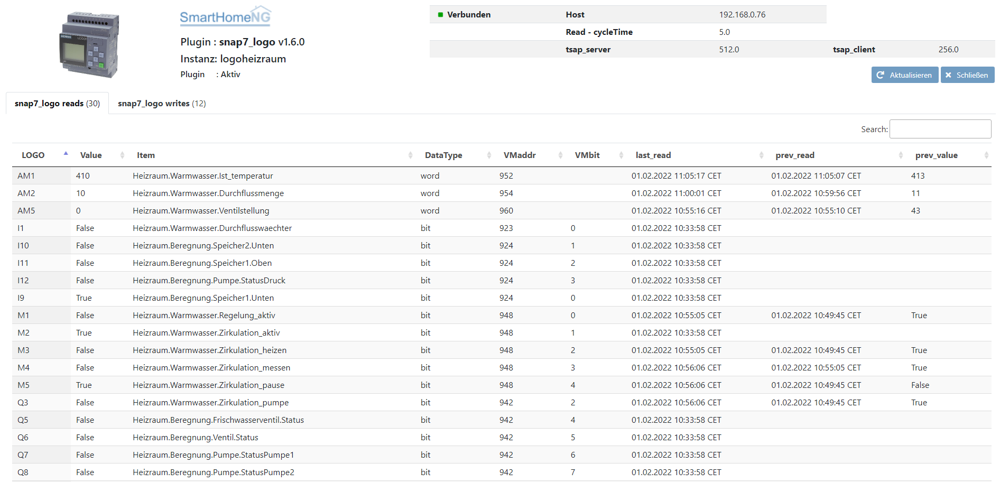

snap7_logo
=====================================================
SmarthomeNG plugin, zum Kommunizieren mit einer Siemens LOGO Kompaktsteuerung (PLC)

Anforderungen
-------------
* Python > 3.6
* python-snap7 >= 1.1
* snap7 >= 1.1.0 

Damit das Plungin beutzt werden kann müssen die Bibliotheken ``snap7`` and ``python-snap7`` installiert sein:

https://python-snap7.readthedocs.io/en/latest/installation.html

snap7
~~~~~

Die Bibliothek sollte unter Linux x64 selbstständig von python-snap7 installiert werden, ansonsten:

.. code-block:: text

    #download and compile snap7 for rpi
    wget http://sourceforge.net/projects/snap7/files/1.2.1/snap7-full-1.2.1.tar.gz/download
    tar -zxvf snap7-full-1.2.1.tar.gz
    cd snap7-full-1.2.1/build/unix
    # sudo make install
    sudo make –f arm_v7_linux.mk all
    
    #copy compiled library to your lib directories
    sudo cp ../bin/arm_v7-linux/libsnap7.so /usr/lib/libsnap7.so
    sudo cp ../bin/arm_v7-linux/libsnap7.so /usr/local/lib/libsnap7.so

python-snap7
~~~~~~~~~~~~
Die Bibliothek sollte selbstständig von SH installiert werden, ansonsten:

.. code-block:: text

    #install python pip if you don't have it:
    sudo apt-get install python-pip
    sudo pip install python-snap7

Hardware
-------------
Siemens LOGO version 0BA7

Siemens LOGO version 0BA8 8.1 8.2 (8.3 nicht getestet?)

Konfiguration
-------------

plugin.yaml
~~~~~~~~~~~

Bitte die Dokumentation lesen, die aus den Metadaten der plugin.yaml erzeugt wurde.

Konfigurationsbeispiel für die Kommunikation mit zwei LOGO's 

/etc/plugins.yaml

.. code-block:: yaml

    logo1:
        plugin_name: snap7_logo
        instance: logo1
        host: 10.10.10.99
        tsap_server: 0x200
        tsap_client: 0x100
        cycle: 60
        # port: 102
        # version: 0BA7
    logo2:
        plugin_name: snap7_logo
        instance: logo2
        host: 10.10.10.100
        version: 0BA8
        # port: 102
        # cycle: 5

* 'instance' = Name der Instanz, sollen mehrer Geräte angesprochen werden (Multiinstanz)
* 'cycle' = Zeit (sec) nachdem eine neue Verbindung zur Logo aufgebaut wird, um Änderungen zu holen. (Default 5 Sekunden)
* 'version' = Siemens LOGO Hardware Version. (Default 0BA7)

items.yaml
~~~~~~~~~~

.. code-block:: yaml

    logo_read@logo1: I1
    logo_write@logo1: M1

@logo1 = Instanzname (sollten mehrer Logo-Instanzen aktiv sein)

* 'I' Input bit to read I1, I2 I3,.. (max I24)
* 'Q' Output bit to read/write Q1, Q2, Q3,.. (0BA7 max Q16; OBA8 max Q20)
* 'M' Mark bit to read/write M1, M2 M3,.. (0BA7 max M27; OBA8 max M64)
* 'AI' Analog Input(word) to read AI1, AI2, AI3,.. (max AI8)
* 'AQ' Analog Output(word) to read/write AQ1, AQ2,.. (0BA7 max AQ2; OBA8 max AQ8)
* 'AM' Analog Mark(word) to read/write AM1, AM2, AM3,.. (0BA7 max AM16; OBA8 max AM64)
* 'NI' Network Input bit to read NI1, NI2,.. (OBA8 max NI64)
* 'NAI' Network Analog Input (word) to read NAI1, NAI2,.. (OBA8 max NAI32)
* 'NQ' Network Output bit to read NQ1, NQ2,.. (OBA8 max NQ64)
* 'NAQ' Network Analog Output (word) to read NAQ1, NAQ2,.. (OBA8 max NAQ16)
* 'VM' VM-Byte to read/write VM0, VM1, VM3,.. VM850
* 'VMx.x' VM-Bit to read/write VM0.0, VM0.7, VM3.4,.. VM850.7
* 'VMW' VM-Word to read/write VMW0, VM2, VMW4,.. VM849
 
.. code-block:: yaml
    
    Heizraum: 
        Warmwasser: 
            Ist_temperatur: 
                type: num
                eval: value/10
                visu_acl: rw
                logo_read@logoheizraum: AM1
            Soll_temperatur: 
                type: num
                visu_acl: rw
                cache: True
                logo_write@logoheizraum: VMW0
            Durchflusswaechter: 
                type: bool
                logo_read@logoheizraum: I1
            Zirkulation_pumpe: 
                type: bool
                logo_read@logoheizraum: Q3
    TestLOGO:
        I1:
            type: bool
            logo_read@logotest: "I1"
        Q1:
            type: bool
            logo_read@logotest: "Q1"
        M1:
            type: bool
            logo_write@logotest: "M1"
        M2:
            type: bool
            logo_read@logotest: "M2"
            logo_write@logotest: "M2"

Bitte die Dokumentation lesen, die aus den Metadaten der plugin.yaml erzeugt wurde.

logic.yaml
~~~~~~~~~~

Bitte die Dokumentation lesen, die aus den Metadaten der plugin.yaml erzeugt wurde.

Funktionen
~~~~~~~~~~

Bitte die Dokumentation lesen, die aus den Metadaten der plugin.yaml erzeugt wurde.

Changelog
---------
V1.6.0      Änderung im Verbindungsaufbau mit der LOGO
            | Kosmetische Verbesserung der Log-Ausgaben
            | Webinterface Ausgabe sortierbar
            | user_doc.rst hinzugefuegt

Aufruf des Webinterfaces
------------------------

Das Plugin kann aus dem Admin Interface aufgerufen werden. Dazu auf der Seite Plugins in der entsprechenden
Zeile das Icon in der Spalte **Web Interface** anklicken.

