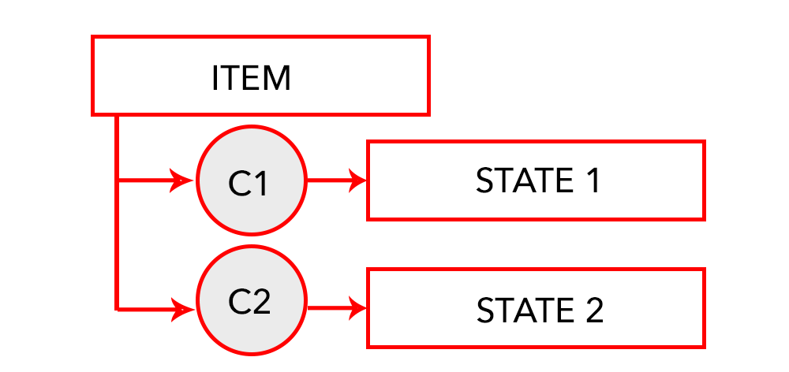

.. index:: Plugins; stateengine
.. index:: stateengine

===========
stateengine
===========

.. toctree::
  :titlesonly:

  user_doc/01_allgemein.rst
  user_doc/02_konfiguration.rst
  user_doc/03_regelwerk.rst
  user_doc/04_zustand.rst
  user_doc/05_bedingungen.rst
  user_doc/06_aktionen.rst
  user_doc/07_zeitpunkt.rst
  user_doc/08_beispiel.rst
  user_doc/09_vorlagen.rst
  user_doc/10_funktionen_variablen.rst
  user_doc/11_sonderzustaende.rst
  user_doc/12_aktioneneinzeln.rst
  user_doc/13_sonstiges.rst

Web Interface
=============

Das Webinterface bietet folgende Übersichtsinformationen:

-  **Allgemeines**: Oben rechts werden Loglevel, Logverzeichnis, Startverzögerung, standardmäßige Suspendzeit sowie die Anzahl Items angezeigt.

-  **SE_Item**: Item, das eine Stateengine definiert hat

-  **aktueller Zustand**

-  **aktuelles Bedingungsset**

-  **Visu**: Klick auf das Icon öffnet die Detailansicht

-  **Log Level**: Log Level des Items. Kann den Wert 1 (Standard), 2 (Verbose) oder 3 (Develop) enthalten.

-  **Zustände**: sämtliche konfigurierte Zustände des Items

  .. image:: user_doc/assets/webif_stateengine_overview.png
     :height: 1602px
     :width: 3320px
     :scale: 25%
     :alt: Web Interface Overview
     :align: center

Ein Klick auf das Lupensymbol in der Visu-Spalte öffnet die Detailansicht. Hier ist zu sehen, welcher Zustand eingenommen werden könnte, welcher aktiv ist und welche Aktionen bei welcher Bedingung ausgeführt werden. Ein Beispiel ist in der
Sektion zu finden.
