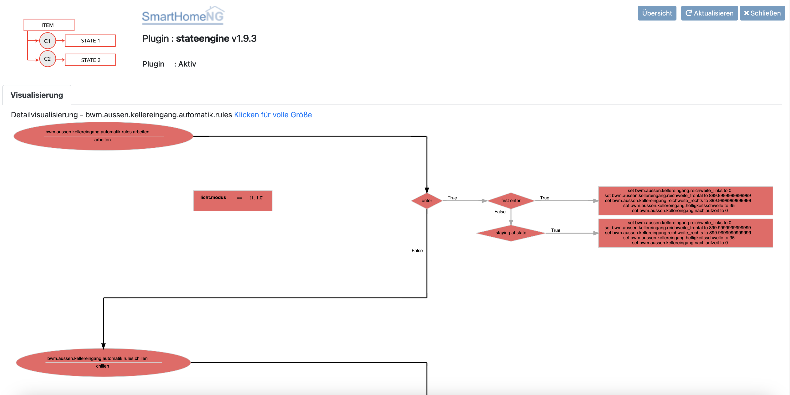

.. index:: Stateengine; Allgemein

=========
Allgemein
=========

.. important::

      Es ist nicht empfehlenswert, das stateengine Plugin
      für sicherheitsrelevante Zustände, wie zum Beispiel das Hochfahren
      von Jalousien bei zu viel Wind, zu verwenden. Sicherheitsrelevante
      Funktionen müssen so einfach wie möglich aufgebaut sein. Es wird
      daher dringend dazu geraten, solche Funktionen unabhängig von
      smarthomeNG und dem stateengine Plugin zu realisieren. Für das
      Hochfahren von Jalousien bei Windalarm beispielsweise sollte die
      Sperrfunktionalität verwendet werden, über die alle aktuellen
      Jalousieaktoren verfügen!

Einführung
----------

Als Einstieg in das Plugin empfiehlt es sich, die `Blogeinträge <https://www.smarthomeng.de/tag/stateengine>`_
auf der SmarthomeNG Seite zu lesen! Die Informationen zur Konfiguration des Plugins sind unter `Plugin stateengine <https://www.smarthomeng.de/user/plugins_doc/config/stateengine.html>`_ beschrieben.

Funktionalität
--------------

Über zusätzliche Items in den items/\*.yaml Dateien können für beliebige Items
Zustandsautomaten implementiert werden. Jeder Zustand kann Sets von Einstiegsbedingungen haben
und diverse Aktionen auslösen, wenn der Zustand aktiv wird.

In regelmäßigen Intervallen werden die Zustände für jedes Objekt der angegebenen
Reihe nach geprüft. Der erste Zustand, bei dem eine Gruppe Einstiegsbedingungen
vollständig erfüllt ist, wird zum aktuellen Zustand. Die
Aktionen, die für diesen Zustand definiert sind, werden ausgeführt.

Wenn kein passender Zustand gefunden wird, passiert nichts, das Objekt verbleibt im vorherigen Zustand.
Dies kann in manchen Fällen Sinn machen, meist bietet es sich aber an,
einen Standardzustand ohne Eingangsbedingungen ganz am Ende der Hierarchie festzulegen.

Die folgenden Bedingungen können Teil der Bedingungsgruppen sein:

-  Tageszeit (Minimum, Maximum, Wert)
-  Wochentag (Minimum, Maximum, Wert)
-  Azimut der Sonne (Minimum, Maximum, Wert)
-  Altitude der Sonne (Minimum, Maximum, Wert)
-  Alter des aktuellen Zustands (Minimum, Maximum, Wert)
-  Zufallszahl (Minimum, Maximum, Wert)
-  Vorheriger Zustand (Wert)
-  Trigger-Objekt, das die Zustandsermittlung ausgelöst hat

Zusätzlich können beliebige Items (z.B. Temperatur) als Bedingungen geprüft werden
(Minimum, Maximum oder Wert)

Umstieg von Autoblind
---------------------

Das `Autoblind Plugin <https://github.com/i-am-offline/smarthome.plugin.autoblind>`__
von i-am-offline wurde für SmarthomeNG 1.6 ins offizielle Repo übernommen und
dabei erweitert und optimiert. Für einen Umstieg ist es wichtig, die Attribute
``as`` durch ``se`` zu ersetzen. Im Pluginverzeichnis befindet sich ein Bash-
Script, das diesen Prozess deutlich vereinfacht und nicht nur die Attribute in
den items/\*.yaml Dateien ersetzt, sondern auch die Cachefiles umbenennt.

Webinterface
------------

Über das Webinterface lässt sich auf einen Blick erkennen, welche State Engine sich
in welchem Zustand befindet. Zusätzlich ist es möglich, durch Klick auf einen Eintrag
die komplette State Engine visuell zu betrachten. Dabei ist folgende Farbkodierung zu beachten:

- grau: wurde nicht evaluiert (weil bereits ein höherrangiger Zustand eingenommen wurde)
- grün: aktueller Zustand / ausgeführte Aktion
- rot: Bedingungen nicht erfüllt

Innerhalb einer Bedingungsgruppe wird bei evaluierten Zuständen ein rotes X angezeigt,
wenn die Bedingung nicht wahr ist oder ein grünes Häkchen, falls die Bedingung erfüllt ist.

Bei den Aktionen sind die einzelnen Zeilen unter Umständen ebenfalls farbkodiert:

- schwarz: Aktion normal ausgeführt
- weiß: Aktion nicht ausgeführt, da Bedingungen nicht erfüllt
- grau: Aktion wird erst mit Verzögerung ausgeführt
- rot: Fehler in der Konfiguration

Zudem wird hinter ausgeführten Aktionen ein grünes Häkchen angezeigt, hinter nicht ausgeführten
(weil beispielsweise Bedingungen nicht erfüllt sind) ein rotes X und hinter Problemen ein Warnsignal.

