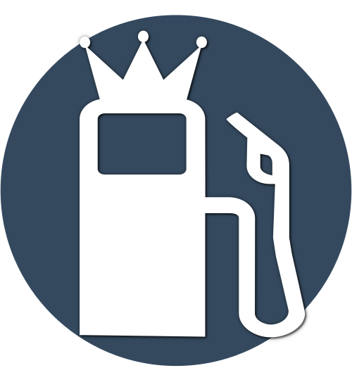

.. index:: Plugins; tankerkoenig
.. index:: tankerkoenig

============
tankerkoenig
============

Anforderungen
=============

Es wird ein persönlicher API-Key von Tankerkönig benötigt. Dafür muss man sich unter
https://creativecommons.tankerkoenig.de
registrieren.

.. important::

   Tankerkönig erlaubt nur eine begrenzte Anzahl an Anfragen. Es sollten nicht zu häufig
   und nicht für zu viele Tankstellen gleichzeitig Daten abgefragt werden - siehe
   https://creativecommons.tankerkoenig.de/#techInfo. Stammdaten einer Tankstelle (Name,
   Adresse, ...) ändern sich praktisch nie und sollten deshalb einmalig gespeichert werden
   (z.B. in einem Item oder einer eigenen Datenhaltung), statt sie bei jeder Preisabfrage
   erneut mit abzurufen. Andernfalls kann es zu einer Kontaktaufnahme durch Tankerkönig
   wegen unangemessener Nutzung der Schnittstelle kommen.

Konfiguration
=============

Diese Plugin Parameter und die Informationen zur Item-spezifischen Konfiguration des Plugins sind
unter :doc:`/plugins_doc/config/tankerkoenig` beschrieben.

Beispiele
=========

Günstigste Tankstelle im Umkreis ermitteln und in Items schreiben:

.. code:: python

    cheapest = sh.tankerkoenig.get_petrol_stations(sh._lat, sh._lon, 'diesel', 'price', rad='10')
    sh.petrol_station.cheapest.name(cheapest[0]['name'])
    sh.petrol_station.cheapest.isOpen(cheapest[0]['isOpen'])
    sh.petrol_station.cheapest.price(cheapest[0]['price'])

Daten einer bekannten, per ID referenzierten Tankstelle abrufen:

.. code:: python

    detail = sh.tankerkoenig.get_petrol_station_detail(sh.petrol_station.DemoBavariaPetrol.conf['tankerkoenig_id'])
    sh.petrol_station.DemoBavariaPetrol.name(detail['name'])
    sh.petrol_station.DemoBavariaPetrol.isOpen(detail['isOpen'])
    sh.petrol_station.DemoBavariaPetrol.diesel(detail['diesel'])

Web Interface
=============

Das WebIF bietet 3 Reiter. Auf Reiter 1 werden die verbundenen Items und deren Werte gezeigt. Auf Reiter 2 werden
die mit Items verbundenen Tankstellen (Station-IDs) mit Preisen und Öffnungszeiten dargestellt. Reiter 3 enthält
Maintenance/Debug Informationen und ist nur bei entsprechenden Log-Level aktiv.
