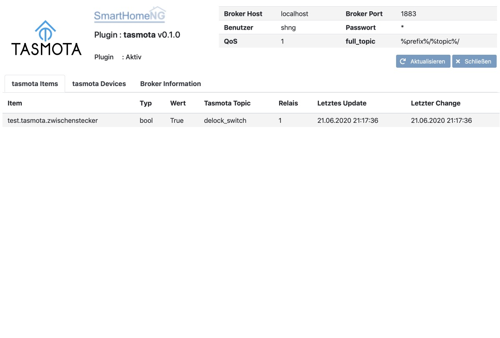
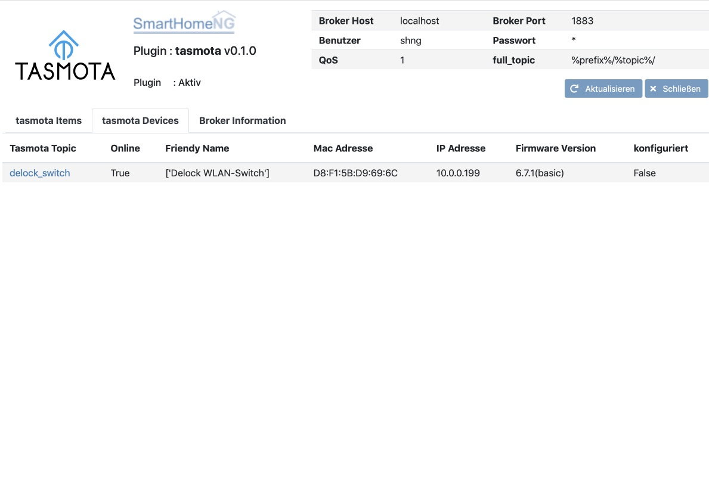
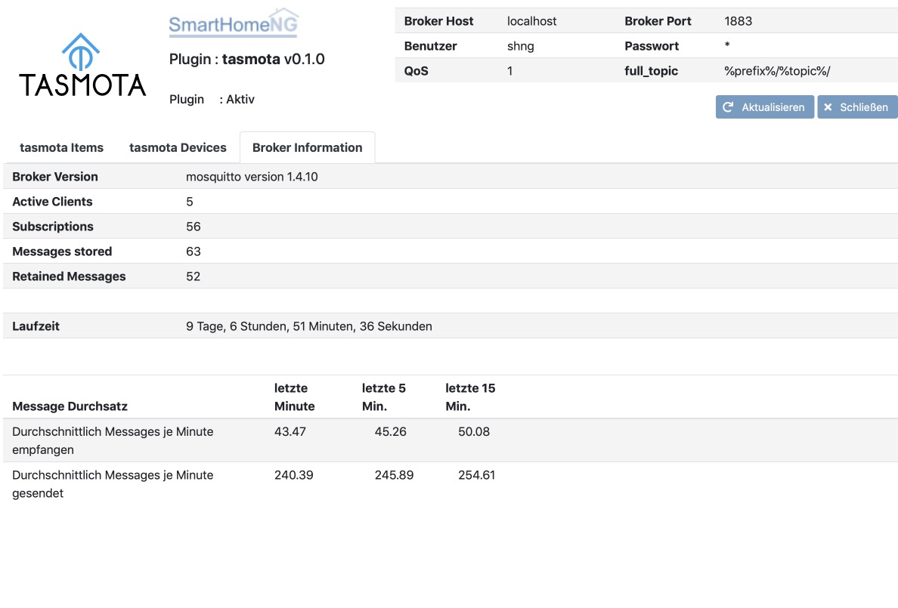

.. index:: tasmota plugin
.. index:: Plugins; tasmota
.. index:: Plugins; mqtt
.. index:: mqtt; tasmota plugin

=======
tasmota
=======

Das Plugin dienst zur Steuerung von Tasmota Devices über MQTT. Zur Aktivierung von MQTT für die Tasmota Devices
bitte die Dokumentation des jeweiligen Devices zu Rate ziehen.

Zurzeit wird nur die Schalter (Relay) Funktion unterstützt:

Es werden alle Relays eines Tasmota Devices (bis zu 4) unterstützt.

.. attention::

    Das Plugin kommuniziert über MQTT und benötigt das mqtt neues Modul, welches die Kommunikation mit dem MQTT Broker
    durchführt. Dieses Modul muß geladen und konfiguriert sein, damit das Plugin funktioniert.

Konfiguration
=============

Informationen zur Konfiguration und die vollständige Beschreibung der Item-Attribute sind
unter :doc:`/plugins_doc/config/tasmota` zu finden.

Web Interface des Plugins
=========================

Tasmota Items
-------------

Das Webinterface zeigt die Items an, für die ein Tasmota Device konfiguriert ist.

Tasmota Devices
---------------

Das Webinterface zeigt Informationen zu den konfigurierten Tasmota Devices an, sowie etwa hinzugekommen Devices die
in SmartHomeNG noch nicht konfiguriert (mit einem Item vebunden) sind.

Ein Klick auf das Tasmota Topic öffnet Konfigurationsseite des Devices.

Broker Information
------------------

Das Webinterface zeigt Informationen zum genutzten MQTT Broker an.

