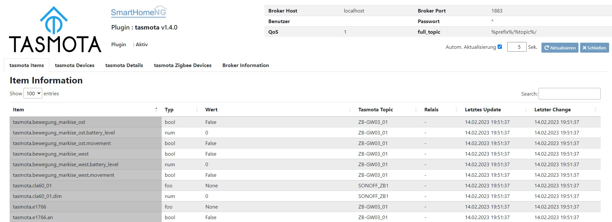
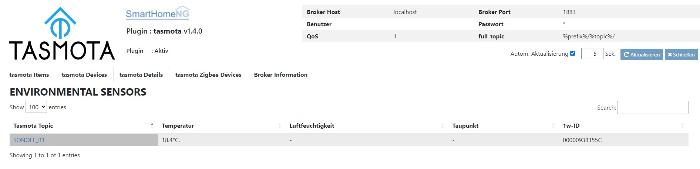

.. index:: tasmota
.. index:: Plugins; tasmota
.. index:: mqtt; tasmota Plugin

=======
tasmota
=======

Das Plugin dienst zur Steuerung von Tasmota Devices über MQTT. Zur Aktivierung von MQTT für die Tasmota Devices
bitte die Dokumentation des jeweiligen Devices zu Rate ziehen.

Unterstützte Funktionen sind:
    * Relays eines Tasmota Devices (bis zu 4)
    * DS18B20 Temperatursensoren
    * AM2301 Sensoren für Temperatur und Luftfeuchte
    * SHT3X Sensoren für Temperatur und Luftfeuchte
    * ADC-Eingang eines ESPs
    * interner Temperatursensor eines ESP32
    * RGBW Dimmer (H801) mit Senden und Empfangen von HSB
    * RF-Daten Senden und Empfangen mit Sonoff Bridge RF
    * Zigbee Daten Empfangen mit Sonoff Zigbee Bridge
    * Tasmota SML

.. attention::

    Das Plugin kommuniziert über MQTT und benötigt das mqtt neues Modul, welches die Kommunikation mit dem MQTT Broker
    durchführt. Dieses Modul muß geladen und konfiguriert sein, damit das Plugin funktioniert.

Konfiguration
=============

Für die Nutzung eines Tasmota Devices müssen in dem entsprechenden Item die zwei Attribute ``tasmota_topic`` und
``tasmota_attr`` konfiguriert werden, wie im folgenden Beispiel gezeigt:

.. code-block:: yaml

    schalter:
        type: bool
        tasmota_topic: delock_switch2
        tasmota_attr: relay

        leistung:
            type: num
            tasmota_topic: ..:.
            tasmota_attr: power

Für die Nutzung von Zigbee Devices über eine ZigbeeBridge mit Tasmota müssen in dem entsprechenden Item die drei Attribute
``tasmota_topic``, ``tasmota_zb_device`` oder  ``tasmota_zb_group`` und ``tasmota_zb_attr`` konfiguriert werden, wie im
folgenden Beispiel gezeigt:

.. code-block:: yaml

    temp:
        type: num
        tasmota_topic: SONOFF_ZB1
        tasmota_zb_device: snzb02_01
        tasmota_zb_attr: Temperature

Für die Nutzung von SML Devices über ein Tasmota-Gerät müssen in dem entsprechenden Item die drei Attribute
``tasmota_topic``, ``tasmota_sml_device`` und ``tasmota_sml_attr`` konfiguriert werden, wie im
folgenden Beispiel gezeigt:

.. code-block:: yaml

    smartmeter_1:
        type: bool
        tasmota_topic: tasmota_sml2mqtt
        tasmota_sml_device: MT631
        tasmota_attr: online

        volt_p1:
            type: num
            tasmota_topic: ..:.
            tasmota_sml_device: ..:.
            tasmota_sml_attr: volt_p1

        total_in:
            type: num
            tasmota_topic: ..:.
            tasmota_sml_device: ..:.
            tasmota_sml_attr: total_in

Dabei definiert

    - ``tasmota_topic`` die Tasmota-Topic des Gerätes, an dem der SML-Lesekopf angeschlossen ist.
    - ``tasmota_sml_device`` den Namen des SML-Lesekopfes (Sensorname)
    - ``tasmota_sml_attr`` den Namen des Keys aus dem Werte-Dictionary, dass dem Item zugewiesen werden soll.

Die/Eine MQTT Message zum Beispiel oben.
.. code-block:: text
    ``tele/tasmota_sml2mqtt/SENSOR = {"Time":"2023-01-27T17:20:45","MT631":{"Total_in":0001.000}}``

Den Namen des SML-Devices (hier MT631), die Keys für das gelieferte Dictionary (Zuweisung des Werte) etc. wird direkt im
Tasmota-Script zum Konfiguration des SML-Devices definiert.

    .. code-block:: text
        >D
        >B

        =>sensor53 r
        >M 1
        +1,3,s,0,9600,MT631
        1,77070100010800ff@1000,Gesamtverbrauch,KWh,Total_in,2
        1,77070100100700ff@1,aktueller Verbrauch,W,Power_curr,2
        #

Der Sendezykus der Werte über ebenfalls in der Konfiguration des Scripts mit <precision> definiert.
"number of decimal places. Add 16 to transmit the data immediately. Otherwise it is transmitted on TelePeriod only."
Siehe hierzu: https://tasmota.github.io/docs/Smart-Meter-Interface/#meter-metrics

    .. code-block:: text
        1,1-0:1.8.0*255(@1,consumption,KWh,Total_in,4 precision of 4, transmitted only on TelePeriod
        1,1-0:1.8.0*255(@1,consumption,KWh,Total_in,20 precision of 4, transmitted immediately (4 + 16 = 20)

Vollständige Informationen zur Konfiguration und die vollständige Beschreibung der Item-Attribute sind
unter **plugin.yaml** zu finden.

Web Interface des Plugins
=========================

Tasmota Items
-------------

Das Webinterface zeigt die Items an, für die ein Tasmota Device konfiguriert ist.

Tasmota Devices
---------------

Das Webinterface zeigt Informationen zu den konfigurierten Tasmota Devices an, sowie etwa hinzugekommen Devices die
in SmartHomeNG noch nicht konfiguriert (mit einem Item vebunden) sind.

.. image:: user_doc/assets/webif_tab2.jpg
   :class: screenshot

Ein Klick auf das Tasmota Topic öffnet Konfigurationsseite des Devices.

Tasmota Details
---------------

Das Webinterface zeigt Informationen mit Werten der Sensoren, Leuchten und RF, falls das jeweilige Tasmota Device diese
Informationen bereitstellt.

Tasmota Zigbee Devices
----------------------

Das Webinterface zeigt Informationen der ZigbeeDevices, die das jeweilige Device bereitstellt.
Dabei werden im jeweilgen Feld "Content Data" die verfügbaren Daten anzeigt. Um diese einem Item zuzuweisen,
muss die 'Device ID' als Wert für das Attribut 'tasmota_zb_device' und ein Key des Dictionary in der Spalte
'Content Data' als Wert für das Attribut 'tasmota_zb_attr' verwendet werden.

.. image:: user_doc/assets/webif_tab4.jpg
   :class: screenshot

Broker Information
------------------

Das Webinterface zeigt Informationen zum genutzten MQTT Broker an.

.. image:: user_doc/assets/webif_tab5.jpg
   :class: screenshot

Tasmota Maintenance
-------------------

Wenn der LogLevel des Plugin "DEVELOP" ist, erscheint ein weiterer Tab mit weiteren Informationen zum Plugin.
