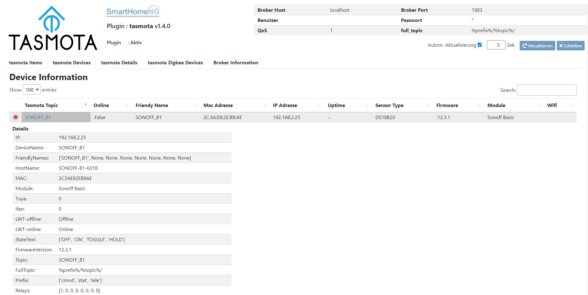
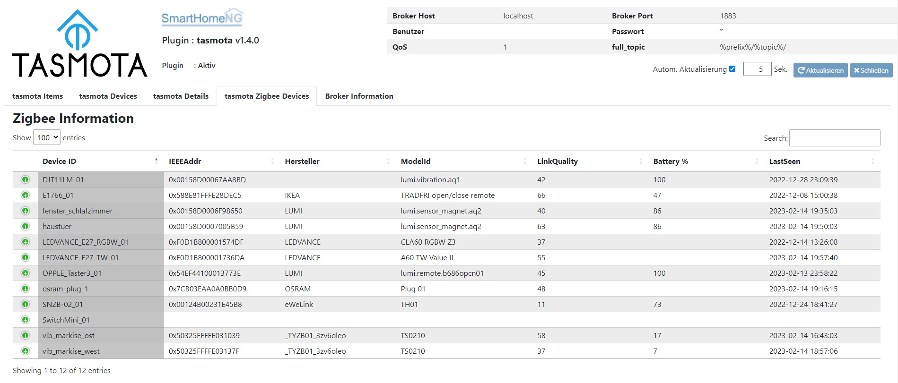

.. index:: tasmota
.. index:: Plugins; tasmota
.. index:: mqtt; tasmota Plugin

=======
tasmota
=======

Das Plugin dienst zur Steuerung von Tasmota Devices über MQTT. Zur Aktivierung von MQTT für die Tasmota Devices
bitte die Dokumentation des jeweiligen Devices zu Rate ziehen.

Unterstützte Funktionen sind:
    * Relays eines Tasmota Devices (bis zu 4)
    * Tasten eines Tasmota Devices (bis zu 4)
    * DS18B20 Temperatursensoren
    * AM2301 Sensoren für Temperatur und Luftfeuchte
    * SHT3X Sensoren für Temperatur und Luftfeuchte
    * ADC-Eingang eines ESPs
    * interner Temperatursensor eines ESP32
    * RGBW Dimmer (H801) mit Senden und Empfangen von HSB
    * RF-Daten Senden und Empfangen mit Sonoff Bridge RF
    * Zigbee Daten Empfangen mit Sonoff Zigbee Bridge
    * Tasmota SML

.. attention::

    Das Plugin kommuniziert über MQTT und benötigt das mqtt neues Modul, welches die Kommunikation mit dem MQTT Broker
    durchführt. Dieses Modul muß geladen und konfiguriert sein, damit das Plugin funktioniert.

Konfiguration
=============

Für die Nutzung eines Tasmota Devices müssen in dem entsprechenden Item die zwei Attribute ``tasmota_topic`` und
``tasmota_attr`` konfiguriert werden, wie im folgenden Beispiel gezeigt:

.. code-block:: yaml

    schalter:
        type: bool
        tasmota_topic: delock_switch2
        tasmota_attr: relay

        leistung:
            type: num
            tasmota_topic: ..:.
            tasmota_attr: power

Für die Nutzung von Zigbee Devices über eine ZigbeeBridge mit Tasmota müssen in dem entsprechenden Item die drei Attribute
``tasmota_topic``, ``tasmota_zb_device`` oder  ``tasmota_zb_group`` und ``tasmota_zb_attr`` konfiguriert werden, wie im
folgenden Beispiel gezeigt:

.. code-block:: yaml

    temp:
        type: num
        tasmota_topic: SONOFF_ZB1
        tasmota_zb_device: snzb02_01
        tasmota_zb_attr: Temperature

Das Plugin versucht eine ZigBee-Bridge automatisch zu erkennen. Zudem kann diese auch per Attribut dediziert definiert werden:

.. code-block:: yaml

    temp:
        type: num
        tasmota_topic: ZB-GW03_01
        tasmota_zb_device: bridge

Für die Nutzung von SML Devices über ein Tasmota-Gerät müssen in dem entsprechenden Item die drei Attribute
``tasmota_topic``, ``tasmota_sml_device`` und ``tasmota_sml_attr`` konfiguriert werden, wie im
folgenden Beispiel gezeigt:

.. code-block:: yaml

    smartmeter_1:
        type: bool
        tasmota_topic: tasmota_sml2mqtt
        tasmota_sml_device: MT631
        tasmota_attr: online

        volt_p1:
            type: num
            tasmota_topic: ..:.
            tasmota_sml_device: ..:.
            tasmota_sml_attr: volt_p1

        total_in:
            type: num
            tasmota_topic: ..:.
            tasmota_sml_device: ..:.
            tasmota_sml_attr: total_in

Dabei definiert

    - ``tasmota_topic`` die Tasmota-Topic des Gerätes, an dem der SML-Lesekopf angeschlossen ist.
    - ``tasmota_sml_device`` den Namen des SML-Lesekopfes (Sensorname)
    - ``tasmota_sml_attr`` den Namen des Keys aus dem Werte-Dictionary, dass dem Item zugewiesen werden soll.

Die/Eine MQTT Message zum Beispiel oben.

.. code-block:: text

    ``tele/tasmota_sml2mqtt/SENSOR = {"Time":"2023-01-27T17:20:45","MT631":{"Total_in":0001.000}}``

Den Namen des SML-Devices (hier MT631), die Keys für das gelieferte Dictionary (Zuweisung des Werte) etc. wird direkt im
Tasmota-Script zum Konfiguration des SML-Devices definiert.

.. code-block:: text

    >D
    >B

    =>sensor53 r
    >M 1
    +1,3,s,0,9600,MT631
    1,77070100010800ff@1000,Gesamtverbrauch,KWh,Total_in,2
    1,77070100100700ff@1,aktueller Verbrauch,W,Power_curr,2
    #

Der Sendezykus der Werte über ebenfalls in der Konfiguration des Scripts mit <precision> definiert.
"number of decimal places. Add 16 to transmit the data immediately. Otherwise it is transmitted on TelePeriod only."
Siehe hierzu: https://tasmota.github.io/docs/Smart-Meter-Interface/#meter-metrics

.. code-block:: text
    
    1,1-0:1.8.0*255(@1,consumption,KWh,Total_in,4 precision of 4, transmitted only on TelePeriod
    1,1-0:1.8.0*255(@1,consumption,KWh,Total_in,20 precision of 4, transmitted immediately (4 + 16 = 20)

Vollständige Informationen zur Konfiguration und die Beschreibung der Item-Attribute sind unter **plugin.yaml** zu finden.

Bekannte tasmota-Attribute
--------------------------

Die folgenden Attribute (Werte für das Item-Attribut ``tasmota-attr``) sind bisher bekannt und unterstützt:

    * "relay": Schalten des Relais -> bool, r/w
    * "button": Drücken einer Taste -> str, r/o
    * "online": Online Status des Tasmota Devices -> bool, r/o
    * "voltage": Spannung in Volt bei Tasmota Devices mit ENERGY Sensor -> num, r/o
    * "current": Strom in Ampere bei Tasmota Devices mit ENERGY Sensor -> num, r/o
    * "power": Leistung in Watt bei Tasmota Devices mit ENERGY Sensor -> num, r/o
    * "power_total": Verbrauch (gesamt) in kWh bei Tasmota Devices mit ENERGY Sensor -> num, r/o
    * "power_yesterday": Verbrauch (gestern) in kWh bei Tasmota Devices mit ENERGY Sensor -> num, r/o
    * "power_today": Verbrauch (heute) in kWh bei Tasmota Devices mit ENERGY Sensor -> num, r/o
    * "temp": Temperatur in °C bei Tasmota Devices mit TEMP Sensor (DS18B20, AM2301) -> num, r/o
    * "hum": Luftfeuchtigkeit in %rH bei Tasmota Devices mit HUM Sensor (AM2301) -> num, r/o
    * "dewpoint": Taupunkt in °C bei Tasmota Devices mit HUM und TEMP Sensor (AM2301) -> num, r/o
    * "hsb": Hue, Saturation, Brightness (HSB) bei RGBW Tasmota Devices (H801) -> list, r/w
    * "white": Color Temperature in Kelvin bei RGBW Tasmota Devices (H801) -> num, r/w
    * "ct": Color Temperature in Kelvin bei RGBW Tasmota Devices (H801) -> num, r/w
    * "dimmer": Dimmwert in % Tasmota Devices -> num, r/w
    * "rf_recv": Empfangene RF Daten bei Tasmota Device mit RF Sendemöglichkeit (SONOFF RF Bridge) -> dict, r/o
    * "rf_send": Zu sendende RF Daten bei Tasmota Device mit RF Sendemöglichkeit (SONOFF RF Bridge) -> dict {'RfSync': 12220, 'RfLow': 440, 'RfHigh': 1210, 'RfCode':'#F06104'}, r/w
    * "rf_key_send": Zu sendender RF-Key Tasmota Device mit RF Sendemöglichkeit (SONOFF RF Bridge) -> num [1-16], r/w
    * "rf_key_recv": Zu empfangender RF-Key Tasmota Device mit RF Sendemöglichkeit (SONOFF RF Bridge) -> num [1-16], r/w
    * "rf_key": RF Key
    * "zb_permit_join": Schaltet das Pairing an der ZigBee Bridge ein/aus -> bool, r/w
    * "zb_forget": Löscht das Zigbee-Gerät aus dem Item Wert aus der Liste bekannter Geräte in der Zigbee-Bridge -> str, r/w
    * "zb_ping": Sendet ein Ping zum Zigbee-Gerät aus dem Item Wert -> str, r/w
    * "power_total": Gemessener Gesamtenergieverbrauch
    * "power_today": Gemessener Energieverbrauch heute
    * "power_yesterday": Gemessener Energieverbrauch gestern
    * "analog_temp": Temperatur am Analogeingang
    * "analog_temp1": Temperatur am Analogeingang1
    * "analog_a0": ADC-Eingang eines ESPs
    * "analog_range": ADC-Eingang eines ESPs
    * "esp32_temp": Temperatur des ESP32

Die folgenden ZigBee-Attribute (Werte für das Item-Attribute ``tasmota-zb-attr``) sind bisher bekannt und unterstützt:

    * "device": Geräte_ID Kurzform -> str, r/o
    * "power": Schalter true/false -> bool, r/w
    * "dimmer": Helligkeit 0-100 -> num, r/w
    * "hue": Farbwert 0-360 -> num, r/w
    * "sat": Sättigung 0-100 -> num, r/w
    * "ct": Farbtemperatur (mired scale), 150-500 -> num, r/w
    * "ct_k": Farbtemperatur (Kelvin), 2000-6700 -> num, r/w
    * "temperature": Temperatur -> num, r/o
    * "humidity": Feuchtigkeit -> num, r/o
    * "reachable": Erreichbarkeit -> bool, r/o
    * "batterypercentage": Batteriefüllung in % -> num, r/o
    * "batterylastseenepoch": Letzte Batteriemeldung -> datetime, r/o
    * "lastseen": Letzter Kontakt vor xx Sekunden -> num, r/o
    * "lastseenepoch": Letzter Kontakt -> datetime, r/o
    * "linkquality": Verbindungsqualität -> num, r/o
    * "ieeeaddr": IEEE-Adresse -> str, r/o
    * "modelid": Model-ID -> str, r/o
    * "manufacturer": Hersteller -> str, r/o
    * "colormode": Farbmodus -> num, r/o
    * "zonestatus": Zonenstatus -> num, r/o
    * "contact": Kontakt -> bool, r/o
    * "movement": Bewegung -> bool, r/o
    * "colortempstepup": Farbtemperatur +
    * "colortempstepdown": Farbtemperatur -
    * "dimmerstepup": Dimmer +
    * "dimmerstepdown": Dimmer -
    * "dimmermove": Dimmer
    * "aqaravibrationmode": aqaravibrationmode
    * "aqaravibration505": aqaravibration505
    * "batteryvoltage": Batteriespannung
    * "shutterclose": Rollo schließen
    * "shutteropen": Rollo öffnen
    * "endpoint": Endlage erreicht
    * "huemove": Farbbewegung Hue
    * "0300!0a": 0300!0a
    * "0300!01": 0300!01
    * "0300!03": 0300!03
    * "0300!4c": 0300!4c
    * "0006!00": 0006!00
    * "0006!01": 0006!01
    * "0008!01": 0008!01
    * "0008!02": 0008!02
    * "0008!03": 0008!03
    * "0008!04": 0008!04
    * "0008!05": 0008!05

Weitere Attribute sind - z.B. bei neuen Geräten - möglich. In vielen Fällen können diese ohne weiter Änderungen genutzt werden; wenn dies in Einzelfällen nicht funktioniert, bitten wir um Information an die Entwickler.

Web Interface des Plugins
=========================

Tasmota Items
-------------

Das Webinterface zeigt die Items an, für die ein Tasmota Device konfiguriert ist.

.. image:: user_doc/assets/webif_tab1.jpg
   :class: screenshot

Tasmota Devices
---------------

Das Webinterface zeigt Informationen zu den konfigurierten Tasmota Devices an, sowie etwa hinzugekommen Devices die
in SmartHomeNG noch nicht konfiguriert (mit einem Item vebunden) sind.

Ein Klick auf das Tasmota Topic öffnet Konfigurationsseite des Devices.

Tasmota Details
---------------

Das Webinterface zeigt Informationen mit Werten der Sensoren, Leuchten und RF, falls das jeweilige Tasmota Device diese
Informationen bereitstellt.

.. image:: user_doc/assets/webif_tab3.jpg
   :class: screenshot

Tasmota Zigbee Devices
----------------------

Das Webinterface zeigt Informationen der ZigbeeDevices, die das jeweilige Device bereitstellt.
Dabei werden im jeweilgen Feld "Content Data" die verfügbaren Daten anzeigt. Um diese einem Item zuzuweisen,
muss die 'Device ID' als Wert für das Attribut 'tasmota_zb_device' und ein Key des Dictionary in der Spalte
'Content Data' als Wert für das Attribut 'tasmota_zb_attr' verwendet werden.

Broker Information
------------------

Das Webinterface zeigt Informationen zum genutzten MQTT Broker an.

Tasmota Maintenance
-------------------

Wenn der LogLevel des Plugin "DEVELOP" ist, erscheint ein weiterer Tab mit weiteren Informationen zum Plugin.
