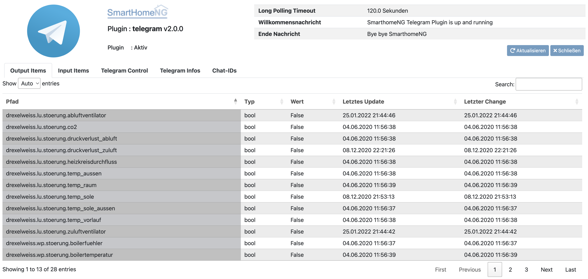

.. index:: Plugins; telegram
.. index:: telegram

========
telegram
========

.. image:: webif/static/img/plugin_logo.svg
   :alt: plugin logo
   :width: 300px
   :height: 300px
   :scale: 50 %
   :align: left
   
Das Plugin dient zum Senden und Empfangen von Nachrichten über den
`Telegram Nachrichten Dienst <https://telegram.org/>`_

Abhängigkeiten
==============

Es wird die Bibliothek ``python-telegram-bot`` benötigt.
Diese ist in der ``requirements.txt`` enthalten.
Bevor das Plugin genutzt werden kann, muß die Bibliothek installiert werden:

* Entweder mit ``sudo pip install -r requirements.txt``

oder

* unter Benutzung von ``pip install -r requirements.txt`` innerhalb
  des Verzeichnisses ``/usr/local/smarthome/plugins/telegram``.

Konfiguration von Telegram
==========================

Zuerst muß ein eigener Bot bei Telegram erstellt werden:

* An ``Botfather`` das Kommando ``/newbot`` senden.
* Dann muß ein **Bot Name** vergeben werden der noch nicht existiert.
* Weitere Bot Details können eingestellt werden, wenn das Kommando
  ``/mybots`` an den BotFather gesendet wird.

Der BotFather erstellt für den neuen Bot ein sogenanntes **token** also einen einzigartigen Schlüssel.

Konfiguration des Plugins
=========================

Die Konfiguration des Plugins ist auch unter :doc:`/plugins_doc/config/telegram` beschrieben bzw. in der **plugin.yaml** nachzulesen.

Der erstelle **token** muß in der ``plugin.yaml`` von SmartHomeNG eingetragen werden. Das kann im Admin-IF geschehen oder durch direkten Eintrag in die ``plugin.yaml``.

.. code::yaml

   telegram:
     plugin_name: telegram
     name: Mein Haus
     token: 123456789:BBCCfd78dsf98sd9ds-_HJKShh4z5z4zh22

* name: Eine Beschreibung des Bots
* token: Der oben beschriebene einzigartige Schlüssel mit dem der Bot bei Telegram identifiziert wird.

Item Konfiguration
==================

Jeder Chat, der auf den Bot zugreifen soll, muß SmartHomeNG bekannt gemacht werden.
Das geschieht über ein Item das das Attribut ``telegram_chat_ids`` mit dem Parameter True hat und als Wert ein Dictionary hat.
Im Dictionary sind Paare von Chat-ID und Berechtigung gespeichert.

.. code::yaml

  Chat_Ids:
    type: dict
    telegram_chat_ids: True
    # cache bietet sich an um Änderungen an den trusted_chat_ids während der
    # Laufzeit von SmartHomeNG zu speichern und nach Neustart wieder zu laden
    # es wird dann der letzte Wert geladen
    cache: 'True'
    # Beispiel value: '{ 3234123342: 1, 9234123341: 0 }'
    # Ein Dictionary mit chat id und:
    # 2 für Lese und Schreibzugriff ohne Willkommens- und Ende Nachricht
    # 1 für Lese und Schreibzugriff
    # 0 für einen nur Lese-Zugriff
    # Nachfolgend ein Chat dem Lese- und Schreibrechte gewährt werden
    value: '{ 3234123342: 1 }'

Um die Chat Id zu bekommen, muß der Bot (und  das Plugin) zunächst laufen. Dazu wird SmartHomeNG (neu) gestartet.

Im Telegram Client wird der Bot als Chatpartner aufgerufen und das Kommando ``/start`` an den Bot gesendet.

Der Bot reagiert mit einer Meldung, das die Chat-ID noch nicht bekannt ist und diese zunächst eingetragen werden muß. Mit der nun bekannten Chat-ID wird
über das AdminIF das Items Dictionary des entsprechenden Items aus dem obigen Beispiel mit den eigenen Chat-IDs erweitert.

Ein erneutes Kommando im Telegram Client an den Bot mit ``/start`` sollte nun die Meldung ergeben, das der Chat bekannt ist und weiterhin, welche
Zugriffsrechte der Chat auf den Bot hat.

telegram_chat_ids
-----------------

Es muß ein Item mit dem Typ Dictionary mit dem Attribut ``telegram_chat_ids`` und dem Parameterwert ``True`` angelegt werden.
In ihm werden Chat-IDs und Zugriff auf den Bot gespeichert. Siehe obiges Beispiel.

telegram_message
----------------

Items mit dem Attribut ``telegram_message`` lösen eine Nachricht aus, wenn sich der Itemwert ändert. Es ist möglich Platzhalter
in der Nachricht zu verwenden.

Verfügbare Platzhalter:

[ID] [NAME] [VALUE] [CALLER] [SOURCE] [DEST]

Einfaches Beispiel
''''''''''''''''''

.. code:: yaml

   Tuerklingel:
       name: Türklingel (entprellt)
       type: bool
       knx_dpt: 1
       telegram_message: 'Es klingelt an der Tür'

Beispiel mit Platzhaltern
'''''''''''''''''''''''''

.. code:: yaml

   state_name:
       name: Name des aktuellen Zustands
       type: str
       visu_acl: r
       cache: 'on'
       telegram_message: 'New AutoBlind state: [VALUE]'

telegram_condition
------------------

Da es Situationen gibt die für Items ein ``enforce_updates: True`` benötigen, würde bei ``telegram_message`` bei jeder Aktualisierung des Items eine Nachricht verschickt werden.
Um das zu verhindern, kann einem Item das Attribut ``telegram_condition: on_change`` zugewiesen werden.

Einfaches Beispiel
''''''''''''''''''

.. code:: yaml

   Tuerklingel:
       type: bool
       knx_dpt: 1
       enforce_updates: True
       telegram_message: 'Es klingelt an der Tür'
       telegram_condition: on_change
       telegram_value_match_regex: (true|True|1)

Dadurch wird auf eine mehrfache Zuweisung des Items mit dem Wert ``True`` nur einmal mit einer Nachricht reagiert. Um eine weitere Nachricht zu generieren
muss das Item zunächst wieder den Wert ``False`` annehmen. Das Attribut ``telegram_value_match_regex`` filtert den Wert so das es bei der Änderung des Itemwertes
auf ``False`` zu keiner Meldung *Es klingelt an der Tür* kommt.

telegram_value_match_regex
--------------------------

Ist zusätzlich zum Attribut ``telegram_message`` auch das Attribut ``telegram_value_match_regex`` gesetzt, wird der Itemwert geprüft, bevor eine
Nachricht gesendet wird. Geprüft wird gegen/mit den Regex, der als Parameterwert angegeben ist.

Beispiel
''''''''

.. code:: yaml

   TestNum:
       type: num
       cache: True
       telegram_message: 'TestNum: [VALUE]'
       telegram_value_match_regex: '[0-1][0-9]' # nur Nachrichten senden wenn Zahlen von 0 - 19
   TestBool:
       type: bool
       cache: True
       telegram_message: "TestBool: [VALUE]"
       telegram_value_match_regex: 1            # nur Nachricht senden wenn 1 (True)

telegram_message_chat_id
------------------------
Ist zusätzlich zum Attribut ``telegram_message`` auch das Attribut ``telegram_message_chat_id`` gesetzt, wird die Nachricht nur an die dort angegebene Chat-ID (hier 3234123342) gesendet.
Ist das Attribut nicht gesetzt, erfolgt der Versand der Nachricht an alle Chat-IDs, die dem Plugin bekannt sind.

Einfaches Beispiel
''''''''''''''''''

.. code:: yaml

   Tuerklingel:
       type: bool
       knx_dpt: 1
       enforce_updates: True
       telegram_message: 'Es klingelt an der Tür'
       telegram_message_chat_id: 3234123342
       telegram_value_match_regex: (true|True|1)

telegram_info
-------------

Für alle Items mit diesem Attribut wird eine Liste mit Kommandos für den Bot erstellt. Der Listeneintrag entspricht dabei dem Attributwert.
Wird das Kommando ``/info`` an den Bot gesendet, so erstellt der Bot ein Tastaturmenü, dass jedes Attribut mindestens einmal als Kommando enthält.
Bei Auswahl eines dieser Kommandos im Telegram Client wird dann für jedes Item, dass das Attribut ``telegram_info`` und als Attributwert den Kommandonamen enthält
der Wert des Items ausgegeben.

Beispiel
''''''''

.. code:: yaml

   Aussentemperatur:
       name: Aussentemperatur in °C
       type: num
       knx_dpt: 9
       telegram_info: wetter

   Wind_kmh:
       name: Windgeschwindigkeit in kmh
       type: num
       knx_dpt: 9
       telegram_info: wetter

   Raumtemperatur:
       name: Raumtemperatur Wohnzimmer in °C
       type: num
       knx_dpt: 9
       telegram_info: rtr_ist

Das Kommando ``/info`` veranlasst den Bot zu antworten mit

.. code::

   [/wetter] [/rtr_ist]

Wählt man am Telegram Client daraufhin ``[/wetter]`` aus, so werden

.. code::

   Aussentemperatur = -10,6
   Wind_kmh = 12.6

ausgegeben. Bei der Auswahl des Kommandos ``[/rtr_ist]`` antwortet der Bot mit

.. code::

   Raumtemperatur = 22.6

telegram_text
-------------

Items mit dem Attribut ``telegram_text`` und dem Attributwert ``True`` bekommen eine Mitteilung, die von einem Telegram Client an den Bot gesendet wird, als Wert zugewiesen.

Beispiel
''''''''

.. code:: yaml

   telegram_message:
       name: Textnachricht von Telegram
       type: str
       telegram_text: true

Nach der Eingabe von ``Hello world!`` am Telegram wird das Item ``telegram_message``
auf ``<Benutzername des chat Partners>: Chat-ID: Hello world!`` gesetzt.
Ein John Doe ergäbe also ``John Doe: xxxxxxx: Hello world!``

Mit einer Logik kann basierend darauf ein Menu und entsprechende Abfragen an shNG gestellt werden.
Siehe dazu ein Beispiel weiter unten.

telegram_control
----------------

Für alle Items mit diesem Attribut wird eine Liste mit Kommandos für den Bot erstellt. Der Listeneintrag muss mit ``name`` spezifiziert werden.
Wird das Kommando ``/control`` an den Bot gesendet, so erstellt der Bot ein Tastaturmenü, dass jedes Attribut als Kommando enthält.
Dabei werden auch alle aktuellen Werte der Items ausgegeben.
Bei Auswahl eines dieser Kommandos im Telegram Client kann dann ein Item vom Type bool geschalten werden (on/off) oder beim Type 'num' kein eine Zahl zum SH-Item gesendet werden.

``name``
    Item wird mit diesem Namen im Bot als Kommando dargestellt
``type``
    Möglichkeiten: on, off, onoff, toggle, num
        on
            * nur Einschalten ist möglich
        off
            * nur Ausschalten ist möglich
        onoff
            * das Ein- und Ausschalten muss mit einen weiteren Kommando vom Tastaturmenu ausgewählt werden
              [On] [Off] (nach einem Timeout ohne Antwort wird der Befehl abgebrochen)
        toggle
            * der Wert des Items wird umgeschltet (0 zu 1; 1 zu 0)
        num
            * es kann eine Zahl an SH gesendet werden und das entsprechende Item wird damit geschrieben. (nach einem Timeout ohne Antwort wird der Befehl abgebrochen)
``question``
    Sicherheitsabfrage vor dem Schalten des Items (verwendbar bei type:on/off/toggle - nach einem Timeout ohne Antwort wird der Befehl abgebrochen) [Yes] [No]
``min``
    Minimalwert (verwendbar bei type:num)
``max``
    Maximalwert (verwendbar bei type:num)
``timeout``
    Zeit nach welcher der Befehl mit Antwort(onoff/question/num) abgebrochen wird (default 20Sekunden)

Beispiel
''''''''

.. code:: yaml

    BeregnungZone1:
        type: bool
        cache: True
        telegram_control: "name:BeregnungZ1, type:onoff"
    BeregnungZone2:
        type: bool
        cache: True
        telegram_control: "name:BeregnungZ2, type:toggle, question:Ventil wirklich umschalten?"
    Gartentor:
        type: bool
        cache: True
        telegram_control: "name:Gartentor, type:on, question:Gartentor wirklich öffnen?"
    Dachfenster:
        type: num
        cache: True
        telegram_control: "name:Dachfenster, type:num, min:0, max:100, timeout:30"
     Kamera:
        type: bool
        cache: True
        telegram_control: "name:Kamera, type:toggle"
        eval: sh.plugins.return_plugin("telegram").photo_broadcast("http://192.168.0.78/snapshot/view0.jpg", datetime.datetime.now().strftime("%H:%M %d.%m.%Y"))

Das Kommando ``/control`` veranlasst den Bot zu antworten mit

.. code::

   [/BeregnungZ1] [/BeregnungZ2] [/Gartentor]
   [/Dachfenster] [/Kamera]

Funktionen
==========

Das Plugin stellt derzeit zwei Funktionen zur Nutzung in Logiken bereit:

msg_broadcast
-------------

Argumente beim Funktionsaufruf:

**msg**: Die Nachricht, die verschickt werden soll

**chat_id**:
  - Eine Chat-ID oder eine Liste von Chat-IDs.
  - Wird keine ID oder None angegeben, so wird an alle autorisierten Chats gesendet

photo_broadcast
---------------

Argumente beim Funktionsaufruf:

**path_or_URL**:
  - entweder ein lokaler Pfad, der auf eine Bilddatei zeigt log_directory oder
  - eine URL mit einem Link. Wenn der Link lokal ist,

**caption**:
  - Titel der Bilddatei, kann auch Dateiname sein oder Datum
  - Vorgabewert: None

**chat_id**:
  - eine Chat Id oder eine Liste von Chat ids. Wird keine ID oder None angegeben,
    so wird an alle autorisierten Chats gesendet
  - Vorgabewert: None

**local_prepare**
  - Ist für das zu sendende Bild eine URL angegeben, ruft das Plugin die
    Daten von der URL lokal ab und sendet die Daten dann an den Telegram Server.
    Beispiel dafür ist eine URL einer lokalen Webcam.
    Soll stattdessen eine im Internet frei zugängliche URL abgerufen werden,
    so wird dieses Argument auf False gesetzt und es wird nur die URL
    an Telegram geschickt und der lokale Rechner von den Daten entlastet.
    Aktuell kann das Plugin nicht mit Benutzername und Passwort geschützten
    URL umgehen.
  - Vorgabewert: True

Beispiele
---------

Die folgende Beispiellogik zeigt einige Nutzungsmöglichkeiten für die Funktionen:

.. code:: python

   telegram_plugin = sh.plugins.return_plugin('telegram')

   # Eine Nachricht `Hello world!` wird an alle vertrauten Chat Ids gesendet
   msg = "Hello world!"
   telegram_plugin.msg_broadcast(msg)

   # Ein Bild von einem externen Server soll gesendet werden.
   # Nur die URL wird an Telegram gesendet und keine Daten lokal aufbereitet
   telegram_plugin.photo_broadcast("https://cdn.pixabay.com/photo/2018/10/09/16/20/dog-3735336_960_720.jpg", "A dog", None, False)

   # Bild auf lokalem Server mit aktueller Zeit an Telegram senden
   my_webcam_url = "http:// .... bitte lokale URL hier einfügen zum Test ..."
   telegram_plugin.photo_broadcast(my_webcam_url, "My webcam at {:%Y-%m-%d %H:%M:%S}".format(sh.shtime.now()))

   # Bild senden aber den Inhalt lokal vorbereiten
   telegram_plugin.photo_broadcast("https://cdn.pixabay.com/photo/2018/10/09/16/20/dog-3735336_960_720.jpg", "The dog again (data locally prepared)")

   local_file = "/usr/local/smarthome/var/ ... bitte eine lokal gespeicherte Datei angeben ..."
   telegram_plugin.photo_broadcast(local_file, local_file)

Anwendungen
===========

Menugestützte Interaktion zwischen Telegram und SmartHomeNG
-----------------------------------------------------------

Diese Anwendung nutzt den Wert, den Telegram in das Item mit dem Attribut ``telegram_text`` schreibt.
Dieser Wert beinhaltet den den User, die Chat-ID und die Message. Basierend auf diesem wird mit einer Logik ein Menu im Chat
dargestellt und die entsprechenden Aktionen ausgeführt.

.. code:: python

    #!/usr/bin/env python3
    # telegram_message.py

    logger.info(f"Logik '{logic.id()}' ausgelöst durch: {trigger['by']} und {trigger['source']} mit Wert {trigger['value']}")

    telegram_plugin = sh.plugins.return_plugin('telegram')

    def bool2str(wert, typus, logic=logic):
        logger.info(f"bool2str wert = {wert}, typus = {typus}")
        if type(wert) is bool:
            if typus == 1:
                result = 'verschlossen' if wert is True else 'offen'
            elif typus ==2:
                result = 'an' if wert is True else 'aus'
            elif typus ==3:
                result = 'ja' if wert is True else 'nein'
            else:
                result = 'typus noch nicht definiert'
        else:
            result = 'Wert ist nicht vom Type bool'
        return result
    logic.bool2str = bool2str

    # Telegram Message einlesen und verarbeiten
    message = sh.telegram.info.message()
    message_user = message[:message.find(":")].lower()
    message_chat_id = message[message.find(":")+2:len(message)]
    message_text = message_chat_id[message_chat_id.find(":")+2:].lower()
    message_chat_id = message_chat_id[:message_chat_id.find(":")]

    ## Menu definieren
    if message_chat_id == 'xxxxxxx':
        # Menu Ebene1
        custom_keyboard_ubersicht = {'keyboard':[['Rolladen','Tür&Tor'], ['Heizung','Schalten'], ['Wetter','Verkehr','Tanken']] , 'resize_keyboard': True, 'one_time_keyboard': False}
    elif message_chat_id == 'yyyyyyy':
        # Menu Ebene1
        custom_keyboard_ubersicht = {'keyboard':[['Wetter','Tür&Tor'], ['Heizung','Tanken']] , 'resize_keyboard': True, 'one_time_keyboard': False}

    # Menu Ebene2
    custom_keyboard_wetter = {'keyboard':[['zurück'], ['aktuell', 'historisch']] , 'resize_keyboard': True, 'one_time_keyboard': False}
    custom_keyboard_schalten = {'keyboard':[['zurück'], ['LED Nische WZ', 'LED Nische EZ']] , 'resize_keyboard': True, 'one_time_keyboard': False}
    custom_keyboard_heizung = {'keyboard':[['zurück'], ['Heizung Status'],['HK_2 Standby', 'HK_2 Normal'], ['EG/OG bewohnt', 'EG/OG unbewohnt'], ['Warmwasser Status'],['Warmwasser AN', 'Warmwasser AUS']] , 'resize_keyboard': True, 'one_time_keyboard': False}
    custom_keyboard_verkehr = {'keyboard':[['zurück'], ['Arbeitsweg', 'Heimweg']] , 'resize_keyboard': True, 'one_time_keyboard': False}
    custom_keyboard_rolladen = {'keyboard':[['zurück'], ['Rollladen Status'], ['EG Automatik An','OG Automatik An'], ['EG Automatik Aus','OG Automatik Aus']] , 'resize_keyboard': True, 'one_time_keyboard': False}

    ## Menu auswählen und senden
    msg = ''
    parse_mode = 'HTML'
    reply_markup = {}

    if message_text == 'menu' or message_text == "zurück":
        msg = 'Bitte auswählen:'
        reply_markup = custom_keyboard_ubersicht
    elif message_text == 'wetter':
        msg = 'Bitte auswählen:'
        reply_markup = custom_keyboard_wetter
    elif message_text == 'heizung':
        msg = 'Bitte auswählen:'
        reply_markup = custom_keyboard_heizung
    elif message_text == 'schalten':
        msg = 'Bitte auswählen:'
        reply_markup = custom_keyboard_schalten
    elif message_text == 'verkehr':
        msg = 'Bitte auswählen:'
        reply_markup = custom_keyboard_verkehr
    elif message_text == 'rolladen':
        msg = 'Bitte auswählen:'
        reply_markup = custom_keyboard_rolladen

    ## Messages definieren und senden
    # Wetter
    if message_text == 'aktuell':
        msg = '<b>Wetter:</b>\n<i>aktuelle. Temp.:</i> ' + str(sh.raumtemp.aussen.nord()) + ' °C \
            \n<i>gefühlte Temp.:</i> ' + str(sh.wetter.froggit.wetterstation.feelslikec()) + ' °C \
            \n<i>rel. Luftfeuchte:</i> ' + str(sh.raumtemp.aussen.nord.luftfeuchtigkeit.hum_ist()) + ' % \
            \n<i>Regen letzte h:</i> ' + str(sh.wetter.froggit.wetterstation.hourlyrainmm()) + ' l/m² \
            \n<i>Regen heute:</i> ' + str(sh.wetter.froggit.wetterstation.dailyrainmm()) + ' l/m² \
            \n<i>Luftdruck:</i> ' + str(sh.raumtemp.eg.diele.luftdruck()) + ' hPa \
            \n<i>Wind Mittel:</i> {:3.2f}'.format(sh.wetter.froggit.wetterstation.windgustkmh_max10m()) + ' km/h \
            \n<i>Wind Spitze:</i> {:3.2f}'.format(sh.wetter.froggit.wetterstation.maxdailygust()) + ' km/h '
    elif message_text == 'historisch':
        msg = '<i>bislang nicht definiert</i>'

    # Warmwasser
    elif message_text == 'warmwasser status':
        msg = '<b>Warmwasser:</b>\n<i>Soll_Temp:</i> ' + str(sh.heizung.warmwasser.temperatur_soll()) + ' °C \
            \n<i>Ist_Temp:</i> ' + str(sh.heizung.warmwasser.temperatur_ist()) + ' °C \
            \n<i>Pumpe:</i> ' + logic.bool2str(sh.heizung.warmwasser.speicherladepumpe_knx(), 2)
    elif message_text == 'warmwasser aus':
        sh.heizung.warmwasser.temperatur_soll(10)
        msg = '<b>Warmwasser:</b>\n<i>Soll_Temp:</i> ' + str(sh.heizung.warmwasser.temperatur_soll()) + ' °C \
            \n<i>Ist_Temp:</i> ' + str(sh.heizung.warmwasser.temperatur_ist()) + ' °C \
            \n<i>Pumpe:</i> ' + logic.bool2str(sh.heizung.warmwasser.speicherladepumpe_knx(), 2)
    elif message_text == 'warmwasser an':
        sh.heizung.warmwasser.temperatur_soll(40)
        msg = '<b>Warmwasser:</b>\n<i>Soll_Temp:</i> ' + str(sh.heizung.warmwasser.temperatur_soll()) + ' °C \
            \n<i>Ist_Temp:</i> ' + str(sh.heizung.warmwasser.temperatur_ist()) + ' °C \
            \n<i>Pumpe:</i> ' + logic.bool2str(sh.heizung.warmwasser.speicherladepumpe_knx(), 2)

    # Heizung
    elif message_text == 'heizung status':
        msg = '<b>HK_2:</b>\n<i>Betriebsart A1:</i> ' + str(sh.heizung.heizkreis_a1m1.betriebsart.betriebsart.betriebsart_str()) +'\
            \n<i>Betriebsart M2:</i> ' + str(sh.heizung.heizkreis_m2.betriebsart.betriebsart.betriebsart_str()) +'\
            \n<i>Pumpe A1:</i> ' + logic.bool2str(sh.heizung.heizkreis_a1m1.status.hk_pumpe_knx(), 2) +'\
            \n<i>Pumpe M2:</i> ' + logic.bool2str(sh.heizung.heizkreis_m2.status.hk_pumpe_knx(), 2) +'\
            \n<i>EG/OG bewohnt:</i> ' + logic.bool2str(sh.raumtemp.anwesend_eg_og(), 3) +'\
            \n<i>UG bewohnt:</i> ' + logic.bool2str(sh.raumtemp.anwesend_eg_og(), 3)
    elif message_text == 'hk_2 standby':
        sh.heizung.heizkreis_m2.betriebsart.betriebsart(0)
        msg = '<b>HK_2:</b>\n<i>neue Betriebsart M2:</i> ' + str(sh.heizung.heizkreis_m2.betriebsart.betriebsart.betriebsart_str())
    elif message_text == 'hk_2 normal':
        sh.heizung.heizkreis_m2.betriebsart.betriebsart(2)
        msg = '<b>HK_2:</b>\n<i>neue Betriebsart M2:</i> ' + str(sh.heizung.heizkreis_m2.betriebsart.betriebsart.betriebsart_str())
    elif message_text == 'eg/og bewohnt':
        sh.raumtemp.anwesend_eg_og(1)
        msg = '<b>HK_2:</b>\n<i>EG/OG bewohnt:</i> ' + logic.bool2str(sh.raumtemp.anwesend_eg_og(), 3)
    elif message_text == 'eg/og unbewohnt':
        sh.raumtemp.anwesend_eg_og(0)
        msg = '<b>HK_2:</b>\n<i>EG/OG bewohnt:</i> ' + logic.bool2str(sh.raumtemp.anwesend_eg_og(), 3)

    # Schalten
    elif message_text == 'led nische wz':
        sh.licht.wohnzimmer.vorsatz_nische.onoff(not sh.licht.wohnzimmer.vorsatz_nische.onoff())
        msg = '<b>Nischenbeleuchtung:</b>\n<i>Wohnzimmer:</i> ' + logic.bool2str(sh.licht.wohnzimmer.vorsatz_nische.onoff(), 2)

    elif message_text == 'led nische ez':
        sh.licht.wohnzimmer.tv_wand_nische.onoff(not sh.licht.wohnzimmer.tv_wand_nische.onoff())
        msg = '<b>Nischenbeleuchtung:</b>\n<i>Esszimmer:</i> ' + logic.bool2str(sh.licht.wohnzimmer.tv_wand_nische.onoff(), 2)

    # Verkehr
    elif message_text == 'arbeitsweg':
        sh.verkehrsinfo.calculate_way_work(1)
        time.sleep(0.5)
        msg = '<b>Arbeitsweg:</b>\n ' + str(sh.verkehrsinfo.travel_summary())
    elif message_text == 'heimweg':
        sh.verkehrsinfo.calculate_way_home(1)
        time.sleep(0.5)
        msg = '<b>Heimweg:</b>\n ' + str(sh.verkehrsinfo.travel_summary())

    # Tür&Tor
    elif message_text == 'tür&tor':
        msg = '<b>Tür&Tor:</b>\n<i>Kellertür:</i> ' + logic.bool2str(sh.fenster_tuer_kontakte.kellertuer.verschlossen(), 1) +'\
            \n<i>Garagentür:</i> ' + logic.bool2str(sh.fenster_tuer_kontakte.seitentuer_garage.verschlossen(), 1) +'\
            \n<i>Garagentor links:</i> ' + str(sh.fenster_tuer_kontakte.garagentor_links.text()) +'\
            \n<i>Garagentor rechts:</i> ' + str(sh.fenster_tuer_kontakte.garagentor_rechts.text())

    # Rolladen
    elif message_text == 'rollladen status':
        msg = '<b>Rolladen:</b>\n<i>EG Beschattungsautomatik:</i> ' + logic.bool2str(sh.rollladen.eg.beschattungsautomatik(), 2) +'\
            \n<i>EG Fahrautomatik:</i> ' + logic.bool2str(sh.rollladen.eg.alle.automatik(), 2) +'\
            \n<i>OG Beschattungsautomatik:</i> ' + logic.bool2str(sh.rollladen.og.beschattungsautomatik(), 2) +'\
            \n<i>EG Fahrautomatik:</i> ' + logic.bool2str(sh.rollladen.og.alle.automatik(), 2)
    elif message_text == 'eg automatik an':
        sh.rollladen.eg.alle.automatik(1)
        msg = '<b>Rolladen:</b>\n<i>EG Fahrautomatik:</i> ' + logic.bool2str(sh.rollladen.eg.alle.automatik(), 2)
    elif message_text == 'eg automatik aus':
        sh.rollladen.eg.alle.automatik(0)
        msg = '<b>Rolladen:</b>\n<i>EG Fahrautomatik:</i> ' + logic.bool2str(sh.rollladen.eg.alle.automatik(), 2)
    elif message_text == 'og automatik an':
        sh.rollladen.og.alle.automatik(1)
        msg = '<b>Rolladen:</b>\n<i>OG Fahrautomatik:</i> ' + logic.bool2str(sh.rollladen.og.alle.automatik(), 2)
    elif message_text == 'og automatik aus':
        sh.rollladen.og.alle.automatik(0)
        msg = '<b>Rolladen:</b>\n<i>OG Fahrautomatik:</i> ' + logic.bool2str(sh.rollladen.og.alle.automatik(), 2)

    # Message senden
    if msg != '':
        telegram_plugin.msg_broadcast(msg, message_chat_id, reply_markup, parse_mode)

Changelog
---------
V2.0.3 Plugin mit stop/run/pause_item steuerbar
V2.0.2 Fehler beim Kommando ``/control`` behoben
V2.0.0 Umbau auf neues Telegram Paket (V20.2+) mit async 

Web Interface
=============

Das Webinterface bietet folgende Informationen:

-  **Allgemeines**: Oben rechts wird das Timeout, Begrüßungs- und Verabschiedungsnachricht angezeigt

-  **Output Items**: Sämtliche Items, die zum Senden einer Nachricht beitragen

-  **Input Items**: Items, über die Nachrichten empfangen werden können

-  **Telegram Control**: Items, die über Telegram geändert werden können

-  **Telegram Infos**: Befehle mit den zugehörigen Items, deren Werte auf eine Abfrage hin kommuniziert werden

-  **Chat IDs**: Registrierte Chat IDs inkl. Angabe der Zugriffe

