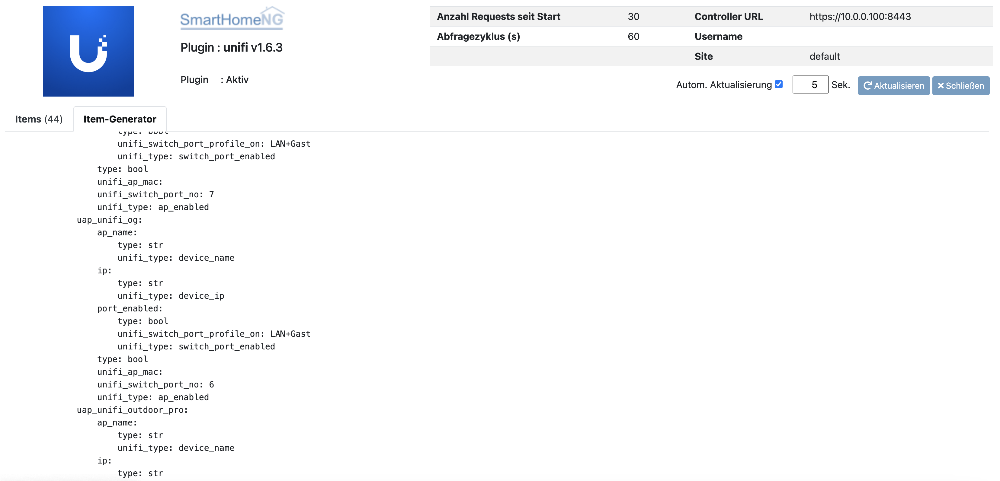
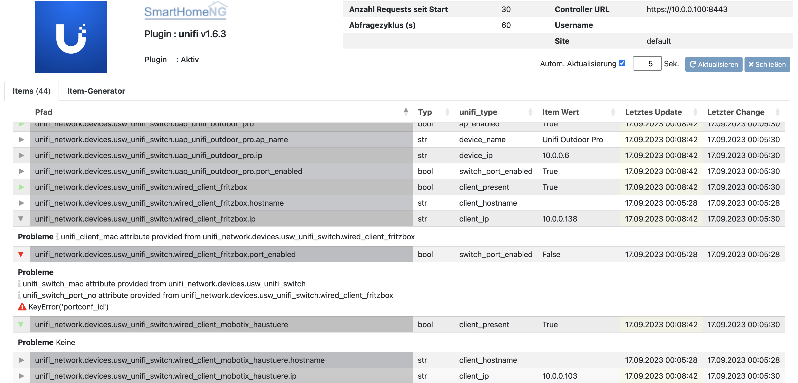

.. index:: Plugins; unifi
.. index:: unifi

=====
unifi
=====

Anforderungen
=============

Dieses Plugin benötigt einen ständig verfügbaren UniFi Controller oder einen UniFi
Cloud-Schlüssel.

Unterstützte Hardware
=====================

Da dieses Plugin nur mit dem UniFi Controller kommuniziert, können grundsätzlich alle
UniFi verwaltete Geräte unterstützt werden.

Getestet mit:

* UniFi Controller 5.10.23 im Docker Container auf Synology
* UniFi UAP AC Lite, Mesh, Longrange, Pro
* UniFi Switch US-8-60W
* Unifi Express

Konfiguration
=============

.. important::

      Detaillierte Informationen zur Konfiguration des Plugins sind unter :doc:`/plugins_doc/config/unifi` zu finden.

.. code-block:: yaml

    # etc/plugin.yaml
    unifi:
        plugin_name: unifi
        unifi_user: ubnt        # User Name
        unifi_password: ubnt    # Password
        unifi_controller_url: https://192.168.1.12:8443 # URL of YOUR controller / cloud-key
        poll_cycle_time: 60     # Cycle time for data retrieval in seconds

Das Plugin sollte aktiviert und SHNG neu gestartet werden. Im Web Interface ist
der Item-Generator zu öffnen. Der Text sollte 1:1 in ein items/Unifi.yaml File
kopiert werden. Switch-Ports sind mit ``unifi_switch_port_profile_on`` und
``unifi_switch_port_profile_off`` zu ergänzen/aktualisieren.

Web Interface
=============

Neben dem Item-Generator bietet das Web Interface Informationen zu sämtlichen
konfigurierten Unifi Geräten: Item, Typ, Unifi-Typ, aktueller Wert, letzte Aktualisierung und letzte Änderung.

