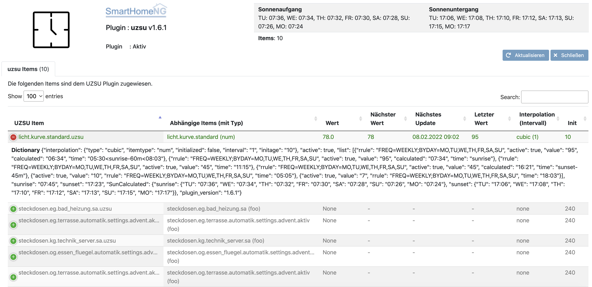

.. index:: Plugins; uzsu
.. index:: uzsu

====
uzsu
====

Dieses Plugin ermöglicht gezielte Schaltvorgänge von Items zu bestimmten Uhrzeiten oder abhängig vom
Sonnenstand. Die automatischen Schaltungen können dabei pro Wochentag separat definiert werden.

Außerdem ermöglicht eine Interpolationsfunktion das Errechnen von Werten zwischen zwei manuell
angelegten Schaltzeiten, wodurch z.B. Lichtkurven über den Tagesverlauf umgesetzt werden können

Einführung
==========

Die Funktionsweise der universellen Zeitschaltuhr wird auf dem `SmarthomeNG Blog <https://www.smarthomeng.de/tag/uzsu>`_
beschrieben. Dort finden sich auch einige praktische Beispiele.

Konfiguration
=============

.. important::

      Detaillierte Informationen zur Konfiguration des Plugins sind unter :doc:`/plugins_doc/config/uzsu` zu finden.

.. code-block:: yaml

    # etc/plugin.yaml
    uzsu:
        plugin_name: uzsu
        #remove_duplicates: True

In der Item Hierarchie muss ein Kind-Item zum Item erstellt werden, das zeitlich gesteuert werden soll.

.. code-block:: yaml

    # items/my.yaml
    someroom:

        someitem:
            type: num

            uzsu:
                type: dict
                uzsu_item: someroom.someitem #Ab smarthomeNG 1.6 ist es möglich, einfach nur '..' zu nutzen, um auf das Parent-Item zu verweisen.
                cache: 'True'

                active: # Dieser Eintrag kann genutzt werden, um die UZSU durch einen einfachen Item Call zu (de)aktivieren.
                    type: bool
                    eval: sh...activate(value)
                    visu_acl: rw

Ab *smarthomeNG 1.6* ist das Anlegen der nötigen Items via ``struct`` besonders einfach:

.. code-block:: yaml

    # items/my.yaml
    someroom:

        someitem:
            type: num
            struct: uzsu.child

SmartVISU
=========

Das UZSU Plugin wird durch die smartVISU ab Version 2.9 sowohl in Form eines Popups als auch einer grafischen Darstellung mittels *device.uzsu Widget* unterstützt.
Bei Problemen bitte das entsprechende Supportforum konsultieren. Es wird empfohlen, die Visualisierung für das Einstellen der UZSU zu verwenden.

Standard Einstellungen
-----------------------

Für die universelle Zeitschaltuhr können folgende Einstellungen vorgenommen werden:

* Allgemein Aktivieren: Komplette UZSU (de)aktivieren
* Wochentag: Es können beliebig viele Wochentage aktiviert werden. Wird kein Wochentag in der Visu gewählt, werden automatisch alle Wochentage aktiviert.
* Wert: Der zu schaltende Wert
* Zeit: Die Uhrzeit, zu der der gewünschte Wert geschaltet werden soll. Im Experten- und Serienmodus kann dieser Parameter auch detaillierter konfiguriert werden.
* Aktivieren: Eintrag aktivieren oder deaktivieren.

Experteneinstellungen
---------------------

Alternativ zu fest definierten Schaltzeiten lassen sich die Zeitpunkte auch in Abhängigkeit des Sonnenstandes
definieren. Hier ist außerdem ein Offset zum Sonnenauf- und Sonnenuntergang in Minuten oder Grad einstellbar.
Pro Eintrag kann auch ein frühester oder spätester Zeitpunkt gewählt werden, der dann herangezogen wird,
wenn die sonnenbasierte Schaltung über diese Grenzwerte hinaus berechnet werden würde.

Zeitserie
---------

Für wiederkehrende Schaltungen können auch Serien angelegt werden. Dabei ist ein Startzeitpunkt und ein Intervall zu definieren. Das Ende kann entweder über einen Zeitpunkt oder die Anzahl Wiederholungen definiert werden. Start- und Endzeitpunkte können wie bei der normalen UZSU auch sonnenstandsabhängig deklariert werden.

Interpolation
=============

.. important::

      Wenn die Interpolation aktiviert ist, wird das UZSU Item im gegebenen Intervall aktualisiert, auch wenn der nächste UZSU Eintrag über die Tagesgrenze hinaus geht. Gibt es beispielsweise heute um 23:00 einen Eintrag mit dem Wert 100 und morgen um 1:00 einen Eintrag mit dem Wert 0, wird zwischen den beiden Zeitpunkten der Wert kontinuierlich abnehmen. Bei linearer Interpolation wird um Mitternacht der Wert 50 geschrieben.

Interpolation ist ein eigenes Dict innerhalb des UZSU Dictionary mit folgenden Einträgen:

-  **type**: string, setzt die mathematische Interpolationsfunktion cubic, linear oder none. Ist der Wert cubic oder linear gesetzt, wird der für die aktuelle Zeit interpolierte Wert sowohl beim Pluginstart als auch im entsprechenden Intervall gesetzt.

-  **interval**: integer, setzt den zeitlichen Abstand (in Sekunden) der automatischen UZSU Auslösungen

-  **initage**: integer, definiert die Anzahl Sekunden, innerhalb der beim Pluginstart etwaige versäumte UZSU Einträge gesucht werden sollen. Diese Einstellung ist obsolet, wenn die Interpolation nicht auf none ist, weil dann beim Pluginstart der errechnete Wert automatisch gesetzt wird.

-  **itemtype**: Der Item-Typ des uzsu_item, das durch die UZSU gesetzt werden soll. Dieser Wert wird beim Pluginstart automatisch ermittelt und sollte nicht verändert werden.

-  **initizialized**: bool, wird beim Pluginstart automatisch gesetzt, sobald ein gültiger Eintrag innerhalb der initage Zeit gefunden wurde und diese Initialisierung tatsächlich ausgeführt wurde.

Pluginfunktionen
================

Detaillierte Informationen zu den Funktionen des Plugins sind unter :doc:`/plugins_doc/config/uzsu` zu finden.

Web Interface
=============

Das Webinterface bietet folgende Informationen:

-  **Allgemeines**: Oben rechts werden die berechneten Sonnenauf- und Sonnenuntergänge der nächsten 7 Tage und die Anzahl der UZSU Items angezeigt.

-  **UZSUs**: Liste aller UZSU Items mit farbkodierter Information über den Status (inaktiv = grau, aktiv = grün, Problem = rot)

-  **UZSU Items**: Info zu den Items, die über die UZSU geschaltet werden (inkl. Typ)

-  **UZSU Item Wert**: Aktueller Wert des Items, das durch die UZSU geschaltet wird.

-  **Nächster Wert**: geplanter nächster Wert und Zeitpunkt der Schaltung

-  **Nächstes Update**: geplanter nächster Zeitpunkt der Schaltung

-  **Letzter Wert**: zuletzt berechneter Wert (relevant bei Interpolation). Dies ist NICHT ident mit property.last_value!

-  **Interpolation**: Interpolationstyp und Intervall

-  **Init**: Back in Time bzw. init age Wert

-  **dict**: Durch Klicken auf das Plus am Beginn jeder Zeile wird das gesamte Dictionary einer UZSU angezeigt.

Beispiel
========

Folgender Python Aufruf bzw. Dictionary Eintrag schaltet das Licht jeden zweiten Tag um 16:30 auf den Wert 100% und deaktiviert es um 17:30 Uhr. Dazwischen wird im Abstand von 5 Minuten der Wert linear interpoliert. Um 17:00 Uhr ist er somit bei 50%.

.. code:: python

   sh.eg.wohnen.leuchte.uzsu({'active':True, 'list':[
   {'value':100, 'active':True, 'rrule':'FREQ=DAILY;INTERVAL=2', 'time': '16:30'},
   {'value':0, 'active':True, 'rrule':'FREQ=DAILY;INTERVAL=2', 'time': '17:30'}],
   'interpolation': {'interval': 5, 'type': 'cubic', 'initialized': False, 'itemtype': 'num', 'initage': 0}, 'sunrise': '07:45', 'sunset': '17:23', 'SunCalculated': {'sunrise':
   {'TU': '07:36', 'WE': '07:38', 'TH': '07:34', 'FR': '07:32', 'SA': '07:30', 'SU': '07:28', 'MO': '07:26'},
   'sunset': {'TU': '17:16', 'WE': '17:18', 'TH': '17:20', 'FR': '17:22', 'SA': '17:23', 'SU': '17:25', 'MO': '17:27'}},
   'plugin_version': '1.6.1'})

Datenformat
===========

Jedes USZU Item wird als dict-Typ gespeichert. Jeder Listen-Eintrag ist wiederum ein dict, das aus Key und Value-Paaren besteht. Im Folgenden werden die möglichen Dictionary-Keys gelistet. Nutzt man das USZU Widget der SmartVISU, muss man sich um diese Einträge nicht kümmern.

-  **dtstart**: Ein datetime Objekt, das den exakten Startwert für den rrule Algorithmus bestimmt. Dieser Parameter ist besonders bei FREQ=MINUTELY rrules relevant.

-  **value**: Der Wert, auf den das uzsu_item gesetzt werden soll.

-  **active**: ``True`` wenn die UZSU aktiviert ist, ``False`` wenn keine Aktualisierungen vorgenommen werden sollen. Dieser Wert kann über die Pluginfunktion activate gesteuert werden.

-  **time**: Zeit als String. Entweder eine direkte Zeitangabe wie ``17:00`` oder eine Kombination mit Sonnenauf- und Untergang wie bei einem crontab, z.B. ``17:00<sunset``, ``sunrise>8:00``, ``17:00<sunset``.

-  **rrule**: Hier können Wiederholungsregeln wie in `rrule <https://dateutil.readthedocs.io/en/stable/rrule.html>`_ beschrieben festgelegt werden.
