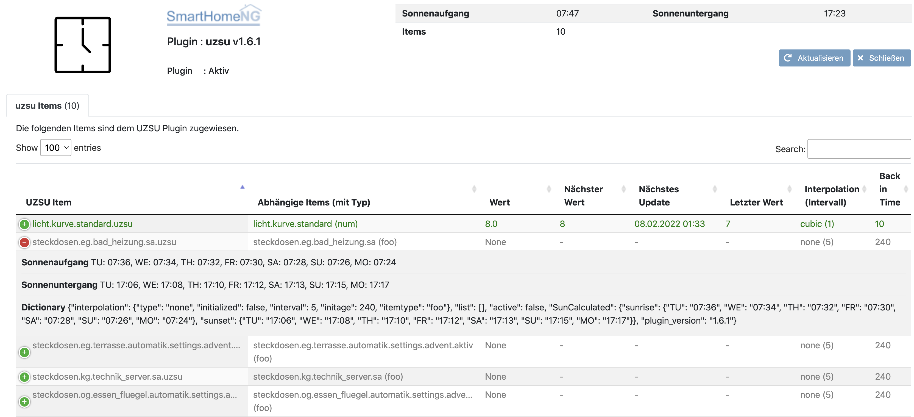

.. index:: Plugins; uzsu
.. index:: uzsu

uzsu
####

Configuration
=============

.. important::

      Please find detailed information on the configuration at :doc:`/plugins_doc/config/uzsu`.

.. code-block:: yaml

    # etc/plugin.yaml
    uzsu:
        plugin_name: uzsu
        #remove_duplicates: True

.. code-block:: yaml

    # items/my.yaml
    someroom:

        someitem:
            type: num

            UZSU:
                type: dict
                uzsu_item: someroom.someitem #With SmarthomeNG 1.6+ you can use '..' instead
                cache: 'True'

                active: # You can use this item to easily (de)activate your UZSU via logics or visu.
                    type: bool
                    eval: sh...activate(value)
                    visu_acl: rw

SmartVISU
=========

There is a widget available which gives an interface to the UZSU. If you have problems please consult the corresponding forum. It is recommended to use the widget to create UZSU entries. The following information on data format can be skipped.

Data format
===========

Each UZSU item is of type list. Each list entry has to be a dict with specific key and value pairs. Here are the possible keys and what their for:

- **dtstart**: a datetime object. Exact datetime as start value for the rrule algorithm. Important e.g. for FREQ=MINUTELY rrules (optional).

- **value**: the value which will be set to the item.

- **active**: `True` if the entry is activated, `False` if not. A deactivated entry is stored to the database but doesn't trigger the setting of the value. It can be enabled with the `activate` function.

- **time**: time as string to use sunrise/sunset arithmetics like in the crontab eg. `17:00<sunset`, `sunrise>8:00`, `17:00<sunset`. You also can set the time with `17:00`.

- **rrule**: You can use the recurrence rules documented for [rrule](https://dateutil.readthedocs.io/en/stable/rrule.html) for recurrence use of a switching entry.

Interpolation
=============

.. important::

      If Interpolation is activated the value will always be set in the given interval even if the next event is not on the same day. If you an entry at 11pm with a value of 100 and tomorrow at 1am one entry with value 0, with a linear interpolation the uzsu will write the interpolated value 50 at midnight.

Interpolation is a separate dict within the uzsu dict-entry with the following keys:

- **type**: string, sets the mathematical function to interpolate between values. Can be cubic, linear or none. If set to cubic or linear the value calculated for the current time will be set on startup and change.

- **interval**: integer, sets the time span in seconds between the automatic triggers based on the interpolation calculation

- **initage**: integer, sets the amount of minutes the plugin should go back in time at startup to find the last UZSU item and triggers that right on startup of the plugin. This is useless if interpolation is active as the interpolated time will get set on init anyhow.

- **itemtype**: the type of the item that should be changed by the UZSU. This is set automatically on init and should not be touched.

- **initizialized**: bool, gets set automatically at startup as soon as a valid UZSU entry was found in the specified initage and the item was indeed initialized with that value.

Functions
=========

.. important::

      Detaillierte Informationen zu den Funktionen des Plugins sind unter :doc:`/plugins_doc/config/uzsu` zu finden.

Webinterface
============

The web interface gives you the following information:
-  **UZSUs**: list of all UZSU items with color coded info: gray = inacitve, green = active, red = problem

-  **UZSU Items**: items to be set as well as their item type (bool, string, num, etc.)

-  **UZSU Item Werte**: current value of the item to be set as well as the planned next value + timestamp of that scheduling

-  **UZSU Interpolation**: interpolation type and interval

-  **UZSU Init**: Back in Time / init age value

-  **UZSU dict**: show the complete dictionary entry of an UZSU entry as a popup by clicking on it

Example
=======

Activates the light with a dim value of 100% every other day at 16:30 and shuts it off at 17:30. Between the UZSU entries the values are interpolated every 5 minutes linearly meaning at 17:00 the value will be 50%.

.. code:: python

    sh.eg.wohnen.kugellampe.uzsu({'active':True, 'list':[
    {'value':100, 'active':True, 'rrule':'FREQ=DAILY;INTERVAL=2', 'time': '16:30'},
    {'value':0, 'active':True, 'rrule':'FREQ=DAILY;INTERVAL=2', 'time': '17:30'}],
    {'interval': 5, 'type': 'linear', 'initialized': False, 'itemtype': 'num', 'initage': 0}
    })

Further information
===================

See `SmarthomeNG Blog <https://www.smarthomeng.de/tag/uzsu>`_ for more examples and getting started info.
