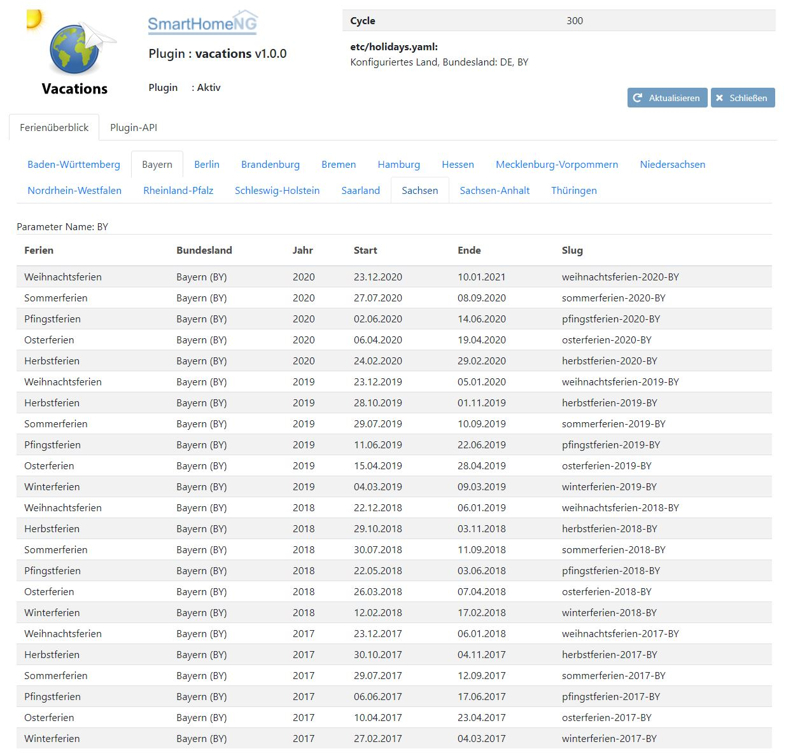
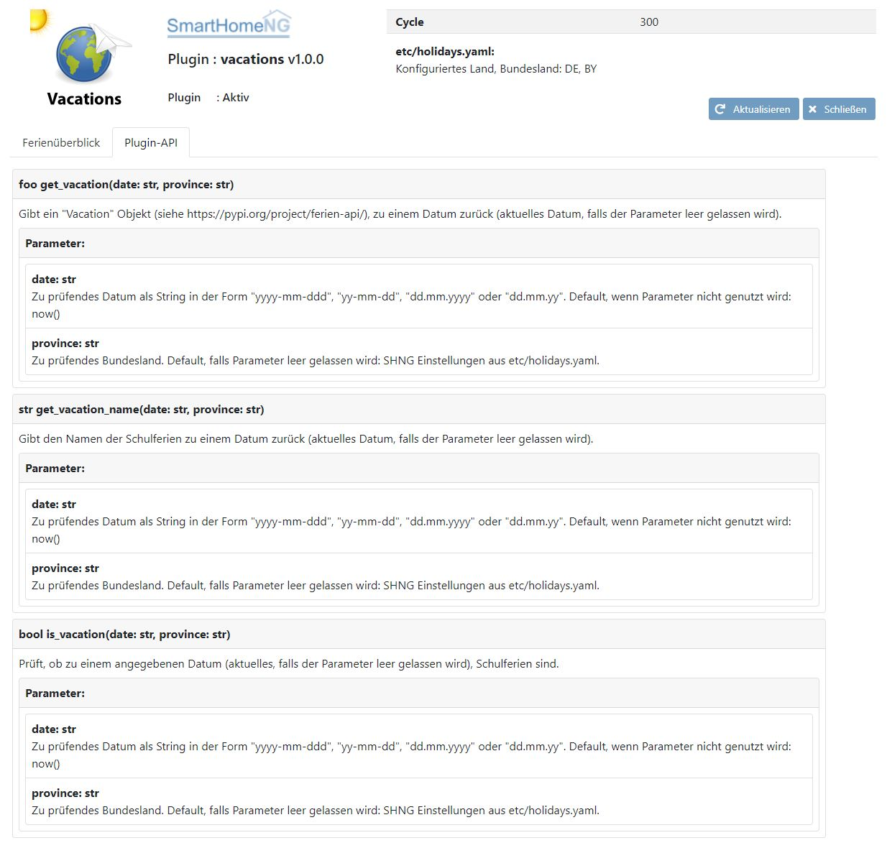

.. index:: Plugins; vacations (Deutsche Schulferien)
.. index:: vacations
.. index:: Ferien; vactions

vacations
#########

Konfiguration
=============

Die Informationen zur Konfiguration des Plugins sind unter :doc:`/plugins_doc/config/vacations` beschrieben.

Web Interface
=============

Das vacations Plugin verfügt über ein Webinterface, mit dessen Hilfe die Daten des Plugins
übersichtlich dargestellt werden.

.. important::

   Das Webinterface des Plugins kann mit SmartHomeNG v1.4.2 und davor **nicht** genutzt werden.
   Es wird dann nicht geladen. Diese Einschränkung gilt nur für das Webinterface. Ansonsten gilt
   für das Plugin die in den Metadaten angegebene minimale SmartHomeNG Version.

Aufruf des Webinterfaces
------------------------

Das Plugin kann aus dem backend aufgerufen werden. Dazu auf der Seite Plugins in der entsprechenden
Zeile das Icon in der Spalte **Web Interface** anklicken.

Außerdem kann das Webinterface direkt über ``http://smarthome.local:8383/vacations`` aufgerufen werden.

Beispiele
---------

Folgende Informationen können im Webinterface angezeigt werden:

Oben rechts werden allgemeine Parameter zum Plugin angezeigt.

Im ersten Tab werden die Feriendaten angezeigt, die das vacations Plugin bereitstellt:

Im zweiten Tab wird die API des vacations Pluggins angezeigt. Die Funktionen können bspw. aus einer Logik heraus zur
Bedatung von Items genutzt werden:

