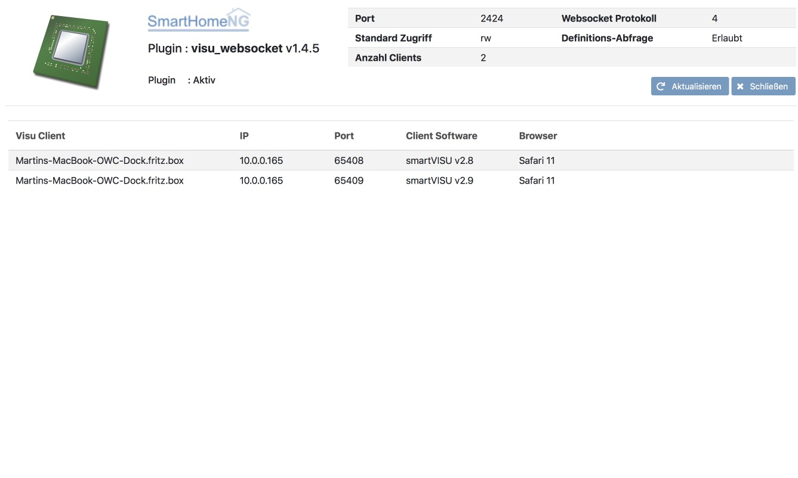

.. index:: Plugins; visu_websocket (Websocket Protokoll Unterstützung)
.. index:: visu_websocket

visu_websocket
##############

Konfiguration
=============

Die Informationen zur Konfiguration des Plugins sind unter :doc:`/plugins_doc/config/visu_websocket` beschrieben.

Web Interface
=============

Das visu_websocket Plugin verfügt über ein Webinterface, mit dessen Hilfe die Clients die das Plugin nutzen
übersichtlich dargestellt werden.

.. important::

   Das Webinterface des Plugins kann mit SmartHomeNG v1.4.2 und davor **nicht** genutzt werden.
   Es wird dann nicht geladen. Diese Einschränkung gilt nur für das Webinterface. Ansonsten gilt
   für das Plugin die in den Metadaten angegebene minimale SmartHomeNG Version.

Aufruf des Webinterfaces
------------------------

Das Plugin kann aus dem backend aufgerufen werden. Dazu auf der Seite Plugins in der entsprechenden
Zeile das Icon in der Spalte **Web Interface** anklicken.

Außerdem kann das Webinterface direkt über ``http://smarthome.local:8383/visu_websocket`` bzw.
``http://smarthome.local:8383/visu_websocket<Instanz>`` aufgerufen werden.

Beispiele
---------

Folgende Informationen können im Webinterface angezeigt werden:

Oben rechts werden allgemeine Parameter zum Plugin angezeigt.

Im unteren Teil Tab werden Informationen zu den Clients angezeigt, die das Plugin nutzen.

Informationen für Entwickler
============================

::

  Copyright 2012-2013 Marcus Popp                      marcus@popp.mx
  Copyright 2016- Martin Sinn                           m.sinn@gmx.de
  Copyright 2019- Bernd Meiners                 Bernd.Meiners@mail.de

  This plugin is part of SmartHomeNG.

  Visit:  https://github.com/smarthomeNG/
          https://knx-user-forum.de/forum/supportforen/smarthome-py

This file gives **SmartHomeNG** developers of visualization software
additional information about the visu\_websocket plugin. The following
sections describe the implemented websocket protocol, that can be used
by a visu to interface with SmartHomeNG.

For information about the configuration of the plugin refer to
**README.md**.

WebSocket Interface
-------------------

The plugin implements a WebSocket server. This section describes
the implemented protocol. The messages of the protocol consist of data
in JSON format. Following are the request commands which the visu plugin
handles.

Requests sent from the Visu to SmartHomeNG
------------------------------------------

item
~~~~

With the **item** command a client requests to change the value of
an item. The example requests the item with the id
"wohnung.buero.schreibtischleuchte.onoff" to be turned off:

.. code-block:: JSON

  {
  "cmd":"item",
  "id":"wohnung.buero.schreibtischleuchte.onoff",
  "val":"0"
  }

The plugin does not send an answer to the **item** command.

monitor
~~~~~~~

With the **monitor** command a client requests the actual value of a
list of items. The list of the requested item names has to be comma
seperated. Take a look at the following example:

.. code-block:: JSON

  {
    "cmd":"monitor",
    "items":[
      "wohnung.hauswirtschaft.deckenlicht",
      "wohnung.hauswirtschaft.waschmaschine",
      "wohnung.hauswirtschaft.waschmaschine.status",
      "wohnung.hauswirtschaft.waschmaschine.ma",
      "wohnung.hauswirtschaft.trockner",
      "wohnung.hauswirtschaft.trockner.status",
      "wohnung.hauswirtschaft.trockner.ma",
      ]
  }

The plugin answers with a list of of pairs. Each pair consists of an
item name and the corresponding value. This list is followed by the
command-type which initiated this response. The answer to the request
above could look like this:

.. code-block:: JSON

  {
    "items": [
      ["wohnung.hauswirtschaft.deckenlicht", false],
      ["wohnung.hauswirtschaft.waschmaschine", true],
      ["wohnung.hauswirtschaft.waschmaschine.status", 1],
      ["wohnung.hauswirtschaft.waschmaschine.ma", 37],
      ["wohnung.hauswirtschaft.trockner", true],
      ["wohnung.hauswirtschaft.trockner.status", 1],
      ["wohnung.hauswirtschaft.trockner.ma", 0]
    ],
    "cmd": "item"
  }

Additionally, the plugin initiates an update routine, which sends
updates for item values, if the item in smarthome.py has changed. For
example:

.. code-block:: JSON

  {
    "items": [
      ["wohnung.hauswirtschaft.waschmaschine.ma", 36]
    ],
    "cmd": "item"
  }

ping
~~~~

With the **ping** command a client checks if the connection to the
plugin is alive.

.. code-block:: JSON

  {"cmd":"ping"}

The plugin answers with:

.. code-block:: JSON

  {"cmd":"pong"}

logic
~~~~~

With the **logic** command a client requests a logic to be triggered
or enabled/disabled. **name** is the name of the logic, as defined in
``etc/logic.yaml``. Furthermore, in ``etc/logic.yaml`` the
attribute ``visu_acl`` for that logic has to be set to ``True``.

.. code-block:: JSON

  {"cmd":"logic",  "name":"az_licht",  "val":0}

or

.. code-block:: JSON

  {"cmd":"logic",  "name":"az_licht",  "enabled":1}
  {"cmd":"logic",  "name":"az_licht",  "enabled":0}

Following information is passed to the logic via the trigger variable:

.. code-block:: python

  trigger[source] = <ip:port of the client (visu)>
  trigger[by]     = 'Visu'
  trigger[value]  = <value, as defined in the logic-command>

The plugin does not send an answer to the **``logic``** command.

series
~~~~~~

With the **series** command a client requests a series of values for
an item. The values which are requested are stored in a database using
the sqlite plugin. The **series** command only returns data for
items which are configured to store data via the **sqlite** plugin.

The series command is for instance used by SmartVISU to get data for the
plot widget. The following example requests a series of the average
values of the last 48 hours:

.. code-block:: JSON

  {
   "cmd":"series",
   "item":"wohnung.verteilung.zaehler.wirkleistung",
   "series":"avg",
   "start":"48h",
   "end":"now",
   "count":100
  }

The attribute ``series`` defines which function is used to return
the values for the series. The possible functions are **min**, **max**,
**avg** and **sum**. These functions are implemented in the **sqlite**
plugin v1.0. The new sqlite plugin (v2.8) implements the functions
**min**, **max**, **avg** and **on**. **on** returns the percentage (as
float from 0.00 to 1.00) where the value has been greater than 0.

If the ``end`` attribute is ommitted, **"end":"now"** is assumed by
the plugin. 
If the ``count`` attribute is ommitted, **"count":100**
is assumed by the plugin.

The answer to the request above could look like this:
.. .. code-block:: JS

  <code>

.. code-block:: JSON

  {
    "series": [
        [1460636598495, 1831.97],
        [1460637648422, 1458.14],
        [1460639298307, 757.22],
        [1460641098243, 577.38],
        "... 102 values in total",
        [1460802051217, 740.61],
        [1460803884973, 637.61],
        [1460805521319, 744.41],
        [1460807229532, 718.03],
        [1460808823757, 681.25],
        [1460809294663, 681.25]
    ],
    "cmd": "series",
    "params": {
      "end": "now",
      "start": 1460809294663,
      "update": true,
      "item": "wohnung.verteilung.zaehler.wirkleistung",
      "step": 1728000.01,
      "func": "avg",
      "sid": "wohnung.verteilung.zaehler.wirkleistung|avg|48h|now"
    },
    "update": "2016-04-16T21:14:50.20.8227+02:00",
    "sid": "wohnung.verteilung.zaehler.wirkleistung|avg|48h|now"
  }

The plugin answers with a list of of pairs. Each pair consists of a
timestamp and the corresponding value. This list is followed by the
command-type which initiated this response and the parameters used to
produce the series of data.

The last two attributes define an identifier for this series and a time
at which an update is sent by the plugin.

Additionally, the plugin initiates an update routine, which sends
updates for series values after a defined period of time. For example:

.. code-block:: JSON

    {
      "series": [
        [1460810141323, 711.25],
        [1460811024119, 711.25]
        ],
      "cmd": "series",
      "sid": "wohnung.verteilung.zaehler.wirkleistung|avg|48h|now"
    }

series_cancel
~~~~~~~~~~~~~

With the **series_cancel** command a client requests the updates for a series that it has
subscribed to earlier.

.. code-block:: JSON

  {
   "cmd":"series_cancel",
   "item":"wohnung.verteilung.zaehler.wirkleistung",
   "series":"avg",
   "start":"48h",
   "end":"now",
   "count":100
  }

The plugin answers with:

.. code-block:: JSON

  {
   "cmd":"series_cancel",
   "result": "..."
  }

or

.. code-block:: JSON

  {
   "cmd":"series_cancel",
   "error": "..."
  }

log
~~~

With the **log** command a client requests the last entries of a
specified log. The example command requests the last 5 log entries of
the core log:

.. code-block:: JSON

  {"cmd":"log","name":"env.core.log","max":"5"}

The plugin answers with a message like this:

.. code-block:: JSON

  {
   "init":"y",
   "cmd":"log",
   "name":"env.core.log",
   "log":[
      {"message":"VISU: WebSocketHandler uses protocol version 4","level":"WARNING","thread":"Main","time":"2016-04-16T15:53:21.354815+02:00"},
      {"message":"Using sonos section [sonos_bo], sonos_uid = RINCON_B8E93792D35401400","level":"WARNING","thread":"myradio","time":"2016-04-16T15:52:28.980100+02:00"},
      {"message":"Mondaufgang um 15:26:50 bei Azimuth 76.9 und Monduntergang um 04:39:55 bei Azimuth 285.5","level":"WARNING","thread":"mysunmoon","time":"2016-04-16T15:52:27.678330+02:00"},
      {"message":"No broker url given, assuming current ip and default broker port: http://10.0.0.182:12900","level":"WARNING","thread":"Main","time":"2016-04-16T15:52:14.006478+02:00"},
      {"message":"mlgw: Serial number of ML Gateway is 22804066","level":"WARNING","thread":"Main","time":"2016-04-16T15:52:13.869275+02:00"}
   ]
  }

proto
~~~~~

With the **proto** command a client requests the WebSocket protocol
version, it wants to use for communication:

.. code-block:: JSON

  {"cmd":"proto","ver":4}

The plugin answers with the protocol version it supports. Additionally
it sends the actual date time and timezone:

.. code-block:: JSON

  {
   "cmd": "proto",
   "ver": 4,
   "time":"2016-04-14T21:23:20.248227+02:00"
  }

identity
~~~~~~~~

--> This command is new with **SmartHomeNG 1.3**

With the **identity** command a client sends information about
itself to SmartHomeNG. The command should be issued right after opening
a connection.

The following example shows, what a smartVISU v2.7 running in a Safari
Browser would send:

.. code-block:: JSON

  {
   "cmd": "identity",
   "sw": "smartVISU",
   "ver": "v2.7",
   "browser": "Safari",
   "bver": "9"
  }

list\_items
~~~~~~~~~~~

--> This command is new with **SmartHomeNG 1.4**

With the **list_items** command a client requests the list of items
that are defined in SmartHomeNG:

.. code-block:: JSON

  {"cmd":"list_items", "path":""}

The plugin does not answer unless it has been configured with
**querydef: True**.

**path** defines the level for which item definitions are requested. if
**path** is empty, the top level items are returned.

The plugin answers with a dict containing the information about
accessible items.

.. code-block:: JSON

  {
   "cmd": "list_items",
   "items": [
     {"path":"root.child", "name":"child", "type":"num"},
     {"path":"root.another", "name":"another child", "type":"bool"}
   ]
  }

list\_logics
~~~~~~~~~~~~

--> This command is new with **SmartHomeNG 1.4**

With the **list_logics** command a client requests the list of
logics that can be triggered by the client:

.. code-block:: JSON

  {"cmd":"list_logics", "enabled":1}

The plugin does not answer unless it has been configured with
**querydef: True**.

**enabled** is optional. As default, the request returns information for
all loaded user logics. When **"enabled":1** is specified, only enabled
user logics are being returned.

The plugin answers with a dict containing the information about
accessible logics.

.. code-block:: JSON

  {
   "cmd": "list_logics",
   "logics": [
     {"name":"az_licht", "desc":"...", "enabled":1},
     {"name":"gz_licht", "desc":"...", "enabled":0}
   ]
  }

Requests sent from SmartHomeNG to the Visu
------------------------------------------

dialog
~~~~~~

**dialog** is a command sent from the plugin to the smartVISU clients.
With the **dialog** command the smartVISU client can be instructed to
display a dialog.

The following command instructs smartVISU to display a dialog:

.. code-block:: JSON

  {"cmd": "dialog", "header": "This is the dialog header", "content": "This is the dialog message"}

The smartVISU client does not send an answer to the **dialog** command.

url
~~~

--> This command is new with **SmartHomeNG 1.3**

--> This command works with **smartVISU 2.9** and up, for **smartVISU
2.8** a modified driver **``io_smarthome.py``** is needed.

**url** is a command sent from the plugin to the smartVISU clients.
With the **``url``** command the smartVISU client can be instructed to
change to another page.

The following command instructs smartVISU to change to the main page:

.. code-block:: JSON

  {"cmd":"url", "url": "index.php"}

The smartVISU client does not send an answer to the **url** command.

