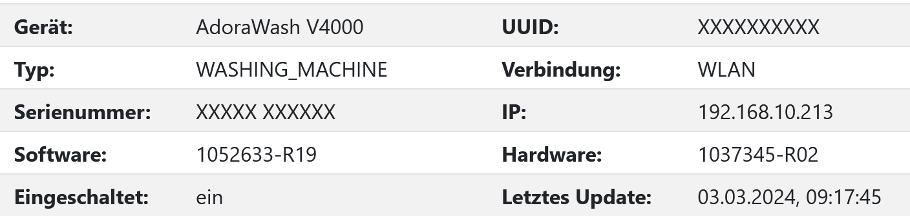
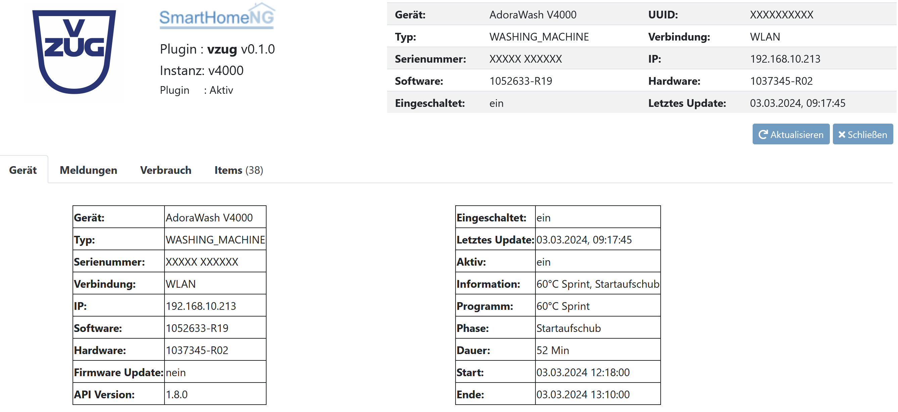
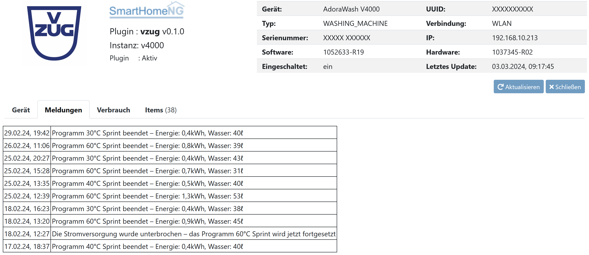
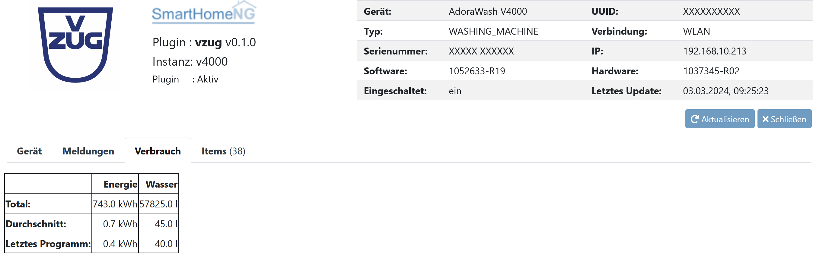
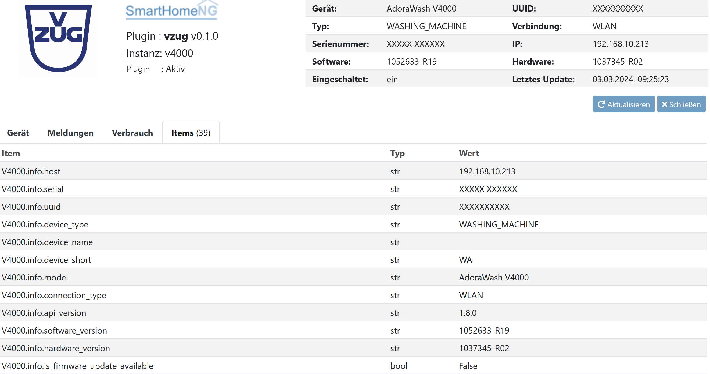

.. index:: Plugins; vzug
.. index:: vzug

====
vzug
====

WICHTIGER HINWEIS: Dieses Plugin ist nicht offiziell von V-Zug erstellt worden !

Dieses Plugin liest Daten aus einem V-Zug Gerät aus. Das Plugin verwendet dazu die http-Schnittstelle des Gerätes.

V-Zug ist ein Schweizer Hersteller, der u.a. Geräte für den Haushalt produziert. (https://www.vzug.com/ch/de/)

HINWEIS: Das Plugin liest nur Daten, Befehle sind aktuell nicht implementiert.

Das Plugin ist Multi-Instanz-fähig. Pro Gerät muss eine Instanz erstellt werden.

Beispiel mit 1 V-Zug-Gerät
--------------------------

plugin.yaml
+++++++++++

vzug_v4000:
    plugin_name: vzug
    host: '192.168.10.213'
    log_data: true
    log_age: 30

Für dieses Gerät wird ein Item definiert:

V4000:
    struct: vzug.vzug_struct

Beispiel mit 2 V-Zug-Geräten
----------------------------

plugin.yaml
+++++++++++

vzug_v4000:
    plugin_name: vzug
    instance: v4000
    host: '192.168.10.213'
    log_data: true
    log_age: 30
    
vzug_v6000:
    plugin_name: vzug
    instance: v6000
    host: '192.168.10.214'
    log_data: true
    log_age: 30

Für diese 2 Gerät werden die folgenden 2 Items definiert:

V4000:
    struct: vzug.vzug_struct
    vzug_root@v4000: true
        
V6000:
    struct: vzug.vzug_struct
    vzug_root@v6000: true

Nach Ende eines Programmes wird der Energie- und Wasserverbrauch in die Datenbank geschrieben:

* V4000\program\power
* V4000\program\water

Die Nachrichten vom Gerät werden in 2 Varianten für die Anzeige zur Verfügung gestellt (Beispiele für SmartVisu):

HTML-Tabelle:

  {{ basic.print('','V4000.pushmessages.html','html') }}
  {{ basic.print('','V6000.pushmessages.html','html') }}
  
JSON-Daten:

  {{ status.activelist('','V4000.pushmessages.jsonlist','title','date','content','level') }}
  {{ status.activelist('','V6000.pushmessages.jsonlist','title','date','content','level') }}
  
Wenn der Parameter 'log_data' auf 'true' gesetzt ist, werden die Log-Daten tageweise in Logdateien im Verzeichnis 'var/log/vzug_logs' gespeichert. Der Parameter 'log_age' definiert, wie viele Tage die Logs gespeichert bleiben sollen.

Die Änderungen im Plugin sind am Anfang der Datei '__init__.py' im Abschnitt 'History' dokumentiert.

Anforderungen
=============

Das V-Zug Gerät muss sich im gleichen LAN wie SmartHomeNG befinden.

Unterstützte Geräte
-------------------

Das Plugin wurde mit den folgenden Geräten getestet:

* V4000 - Waschmaschine
* V6000 - Geschirrspüler

Es ist nicht sicher, ob ein nicht gelistetes Gerät direkt mit dem Plugin funktionieren wird. Bei Problemen bitte wie folgt vorgehen:

* Parameter 'save_raw: true' in der Plugin-Konfiguration ergänzen
* SmartHomeNG neu starten und mind. 1 Programm mit dem Gerät machen
* Datei 'var/log/vzug_special_XXXX.log' an den Plugin-Autor senden

Konfiguration
=============

Detaillierte Information sind :doc:`/plugins_doc/config/vzug` zu entnehmen.

Web Interface
=============

Oben rechts werden die wichtigsten Daten Gerät angezeigt.

Im Tab "Gerät" sind die wesentlichen Daten und der aktuelle Status dargestellt:

Im Tab "Meldungen" sind die letzten Meldungen vom Gerät dargestellt:

Im Tab "Verbrauch" sind Verbrauchsdaten vom Gerät dargestellt:

Im Tab "Items" sind alle Items vom Gerät dargestellt:

