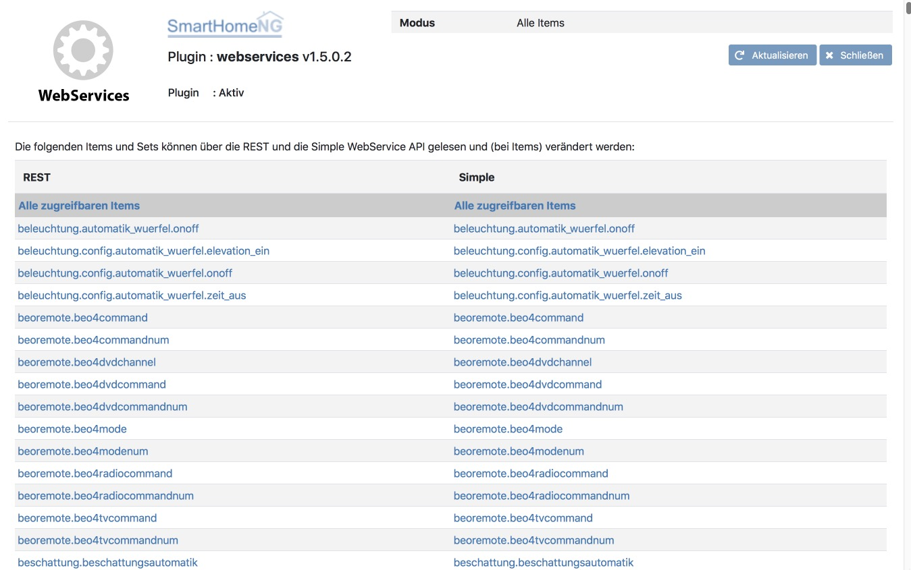

.. index:: Plugins; Webservices (REST Interface)
.. index:: Webservices
.. index:: REST Interface

webservicew
===========

Das Webservices Plugin stellt ein REST basiertes API für SmartHomeNG bereit.
Es werden PUT und GET Kommandos unterstützt.

Anforderungen
-------------

Das Plugin benötigt CherryPy um zu laufen, sowie ein konfiguriertes http Modul in SmartHomeNG.
Grundsätzlich ist das http Modul in SmartHomeNG bereits konfiguriert. Die Konfiguration kann über das
Admin Interface geändert werden oder durch direkte Änderung in der Datei ``etc/module.yaml`` jeweils mit anschließendem
Neustart von SmartHomeNG.

Konfiguration
-------------

Die Informationen zur Konfiguration des Plugins sind unter :doc:`/plugins_doc/config/webservices` beschrieben.

plugin.yaml
~~~~~~~~~~~

Bitte die Dokumentation lesen, die aus den Metadaten der plugin.yaml erzeugt wurde.

items.yaml
~~~~~~~~~~

Bitte die Dokumentation lesen, die aus den Metadaten der plugin.yaml erzeugt wurde.

logic.yaml
~~~~~~~~~~

Bitte die Dokumentation lesen, die aus den Metadaten der plugin.yaml erzeugt wurde.

Funktionen
~~~~~~~~~~

Bitte die Dokumentation lesen, die aus den Metadaten der plugin.yaml erzeugt wurde.

Beispiele und Nutzungshinweise
------------------------------

Das Webservices Plugin unterstützt drei leicht unterschiedliche Arten von
Zugriffen, die im Folgenden beschrieben werden.

.. tabs::

   .. tab:: Einfaches Interface

      .. tabs::

         .. tab:: Itemwert abfragen

            Mit einer URL ``http://{SmartHomeNG IP}:{http_modul_services_port}/ws/items/{item_path}``
            wird ein Datensatz inklusive Metadaten abgefragt.

            Beispielsweise liefern Abfragen wie ``http://192.168.1.1:8384/ws/items/knx.gf.office.light``
            folgende JSON formatierte Daten:

            .. code:: JSON

               {"changed_by": "Cache", "enforce_updates": "False", "age": 1896.412548, "triggers": ["bound method KNX.update_item of plugins.knx.KNX", "bound method WebSocket.update_item of plugins.visu_websocket.WebSocket", "bound method Simulation.update_item of plugins.simulation.Simulation"], "last_change": "2017-12-02 06:53:56.310862+01:00", "autotimer": "False", "eval": "None", "value": true, "previous_age": "", "previous_value": true, "type": "bool", "config": {"alexa_actions": "turnOn turnOff", "alexa_name": "Lampe B\u00fcro", "knx_dpt": "1", "knx_init": "2/3/50", "knx_listen": "2/3/50", "knx_send": ["2/3/10"], "nw": "yes", "sim": "track", "visu_acl": "rw"}, "name": "knx.gf.office.light", "path": "knx.gf.office.light", "threshold": "False", "cache": "/python/smarthome/var/cache/knx.gf.office.light", "cycle": "", "last_update": "2017-12-02 06:53:56.310862+01:00", "previous_change": "2017-12-02 07:18:22.911165+01:00", "eval_trigger": "False", "crontab": "", "logics": ["LightCheckLogic"]}

            Sollte das Attribut ``webservices_data`` des Items auf ``val`` gesetzt sein, liefert die Abfrage nur den Wert des Items.

         .. tab:: Itemwert setzen

            Mit der URL ``http://{SmartHomeNG IP}:{http_modul_services_port}/ws/items/{item_path}/{value}``
            wird der Wert eines Items auf den Wert ``value`` gesetzt.

            Beispielsweise sorgt eine Abfrage ``http://192.168.1.1:8384/ws/items/knx.gf.office.light/1`` dafür das im Falle eines Items
            mit dem Pfad ``knx.gf.office.light`` der Wert auf ``True`` gesetzt wird und damit z.B. das Licht angeht.

      Wenn ein Fehler auftritt (z.B. Item nicht gefunden) liefert das Plugin eine JSON formatierte Fehlermeldung aus:

      .. code:: JSON

         {"Error": "No item with item path <itemname> found."}

      Eine erfolgreiche Wertänderung eines Items dagegen liefert eine JSON formatierte Rückgabe der Art:

      .. code:: JSON

         {"Success": "Item with item path <itemname> set to <value>."}

   .. tab:: REST Interface

      Hinweis: Die unten dokumentierten POST und PUT Requests via REST Standard können bspw. mit dem Tool **Postman** getestet werden.

      .. tabs::

         .. tab:: Gesamte Itemliste abfragen (HTTP GET)

            Mit der URL ``http://\<SmartHomeNG IP}:\<http_modul_services_port}/rest/items/``
            wird eine Liste aller Items ausgegeben, deren Werte abgefragt oder gesetzt werden können.
            Dabei werden nur Items der Typen String, Numerisch und Boolean, sowie die Systemitems
            ``env.location.moonrise``, ``env.location.moonset``, ``env.location.sunrise`` und ``env.location.sunset``
            berücksichtigt.
            Deren Typ ist mit ``foo`` definiert und effektiv sind es datetime Objekte.

            Im Folgenden eine Liste mit nur einem Item um den Rückgabewert zu illustrieren:

            .. code:: JSON

               { "A_Crontab.OneBool": { "path": "A_Crontab.OneBool", "name": "A_Crontab.OneBool", "type": "bool", "value": true, "age": 113731.985496, "last_update": "2020-04-25 00:00:00.361957+02:00", "last_change": "2020-04-24 09:06:15.333481+02:00", "changed_by": "Init:Initial_Value", "previous_value": true, "previous_age": 0, "previous_change": "2020-04-24 09:06:15.333481+02:00", "enforce_updates": "False", "cache": "False", "eval": "None", "eval_trigger": "False", "cycle": "", "crontab": "", "autotimer": "False", "threshold": "False", "config": {}, "logics": [], "triggers": [], "url": "http://192.168.x.y:8383/rest/items/A_Crontab.OneBool" }}

         .. tab:: Einzelnen Itemwert abfragen (HTTP GET)

            Mit der URL ``http://{SmartHomeNG IP}:{http_modul_services_port}/rest/items/{item_path}``
            (HTTP GET) wird ein Datensatz inklusive Metadaten abgefragt.

            Beispielsweise liefern Abfragen wie ``http://192.168.1.1:8384/rest/items/knx.gf.office.light``
            folgende JSON formatierte Daten:

            .. code:: JSON

               {"changed_by": "Cache", "enforce_updates": "False", "age": 1896.412548, "triggers": ["bound method KNX.update_item of plugins.knx.KNX", "bound method WebSocket.update_item of plugins.visu_websocket.WebSocket", "bound method Simulation.update_item of plugins.simulation.Simulation"], "last_change": "2017-12-02 06:53:56.310862+01:00", "autotimer": "False", "eval": "None", "value": true, "previous_age": "", "previous_value": true, "type": "bool", "config": {"alexa_actions": "turnOn turnOff", "alexa_name": "Lampe B\u00fcro", "knx_dpt": "1", "knx_init": "2/3/50", "knx_listen": "2/3/50", "knx_send": ["2/3/10"], "nw": "yes", "sim": "track", "visu_acl": "rw"}, "name": "knx.gf.office.light", "path": "knx.gf.office.light", "threshold": "False", "cache": "/python/smarthome/var/cache/knx.gf.office.light", "cycle": "", "last_update": "2017-12-02 06:53:56.310862+01:00", "previous_change": "2017-12-02 07:18:22.911165+01:00", "eval_trigger": "False", "crontab": "", "logics": ["LightCheckLogic"]}

            Sollte das Attribut ``webservices_data`` des Items auf ``val`` gesetzt sein, liefert die Abfrage nur den Wert des Items.

         .. tab:: Itemgruppe abfragen (HTTP GET)

            Ähnlich wie bei der Abfrage eines einzelnen Items gibt es die Möglichkeit eine bestimmte Gruppe von Items
            gleichzeitig abzufragen. Dazu muss beim Item ein Attribut ``webservices_set`` mit dem Namen der Gruppe definiert werden.

            Beispielsweise sorgt eine Abfrage ``http://192.168.1.1:8384/rest/itemset/lights`` dafür, dass
            die Daten der Items mit dem Attribut ``webservices_set: lights`` als JSON formatierte Daten zurückgeliefert werden.

         .. tab:: Itemwert ändern (HTTP PUT)

            Ein HTTP PUT Request verändert (setzt) den Wert eines Items. Nur String, Numerisch und Boolean Items werden hierbei unterstützt.
            Für boolsche Items können die Integer Werte 0 und 1, aber auch "yes", "no", "y", "n", "true" für **Wahr** oder
            "false", "t", "f", "on", "off" für **Falsch** genutzt werden.
            Zeichenketten oder Boolesche Werte als Zeichenkettendarstellung müssen in doppelte Hochkommata eingeschlossen werden "...".

            Es muss sichergestellt sein, das im **HTTP HEADER** der ``Content-Type: application/json`` gesetzt ist.

            ``http://\<SmartHomeNG IP\>:\<http_modul_services_port\>/rest/items/\<item_pfad\>``

            Beispielsweise könnte ein HTTP PUT Request mit 0 als Argument ``http://192.168.1.1:8384/rest/items/office.light`` das Licht ausschalten.

         .. tab:: Itemwert ändern (HTTP POST)

            Ein HTTP POST Request an die URL setzt den Wert eines Items genauso, wie beim HTTP PUT. Dabei werden nur Items der Typen String, Numerisch und Boolean.
            Der HTTP POST Request legt derzeit noch keine neuen Items an, wie man das bei REST eigentlich erwarten würde.
            Für boolsche Werte können Ganzzahlwerte  0 und 1 benutzt werden oder aber auch "yes", "no", "y", "n", "true" für **Wahr** oder
            "false", "t", "f", "on", "off" für **Falsch** genutzt werden.
            Zeichenketten oder Boolesche Werte als Zeichenkettendarstellung müssen in doppelte Hochkommata eingeschlossen werden "...".

            Es muss sichergestellt sein, das im **HTTP HEADER** der ``Content-Type: application/json`` gesetzt ist.

            ``http://\<SmartHomeNG IP\>:\<http_modul_services_port\>/rest/items/\<item_pfad\>``

            Beispielsweise könnte ein HTTP POST request mit ``0`` als Argument ``http://192.168.1.1:8384/rest/items/office.light`` das Licht ausschalten.

Web Interface
-------------

Das webservices Plugin verfügt über ein Webinterface, mit dessen Hilfe die Items, die das Plugin nutzen kann,
übersichtlich dargestellt werden.

.. important::

   Das Webinterface des Plugins kann mit SmartHomeNG v1.4.2 und davor **nicht** genutzt werden.
   Es wird dann nicht geladen. Diese Einschränkung gilt nur für das Webinterface. Ansonsten gilt
   für das Plugin die in den Metadaten angegebene minimale SmartHomeNG Version.

Aufruf des Webinterfaces
------------------------

Das Plugin kann aus dem Admin Interface aufgerufen werden. Dazu auf der Seite Plugins in der entsprechenden
Zeile das Icon in der Spalte **Web Interface** anklicken.

Außerdem kann das Webinterface direkt über ``http://\<SmartHomeNG_IP\>:\<http_modul_port\>/plugin/\<webservices\>``
aufgerufen werden.

``http_modul_port`` steht in diesem Fall für den im http Modul definierten Port.
``webservices`` steht für den Namen mit dem das Plugin in ``etc/plugin.yaml`` definiert worden ist.

Beispiele
---------

Folgende Informationen können im Webinterface angezeigt werden:

Oben rechts werden allgemeine Parameter zum Plugin angezeigt.

Im unteren Teil werden die Items angezeigt, die per REST Interface abgefragt werden können:

