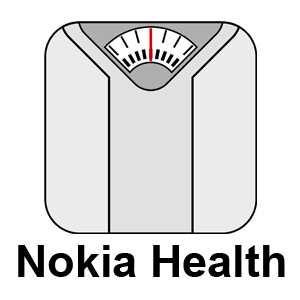
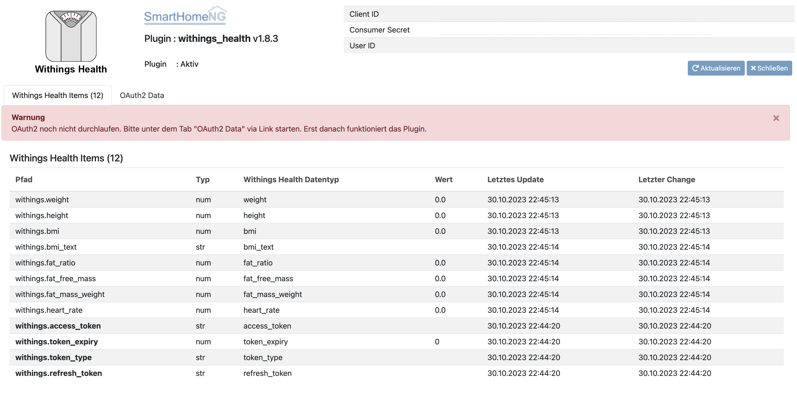

.. index:: Plugins; withings_health
.. index:: withings_health

===============
withings_health
===============

Dieses Plugin ermöglicht den Abruf von Daten aus der Withings (ehemals Nokia)
`Health API <https://developer.withings.com/api>`_. Derzeit bietet es nur
Unterstützung für den "Withings WS-50 Smart Body Analyzer", eine WLAN-fähige Waage.

Vorbereitung
============

Dieses Plugin benötigt die withings-api.

Sie müssen sich unter `Withings Account <https://account.withings.com/>`_ registrieren und im Dashboard
eine Applikation anlegen. Der Name ist frei wählbar, die (lokale) Callback-URL wird über die Weboberfläche des Plugins
angezeigt: http://<IP>:<Webinterface-Port>/plugin/withings_health (Die IP sollte die von SmartHomeNG sein!).
Wenn Sie sich bei der `Withings App <https://app.withings.com/>`_ einloggen, kann die achtstellige Zahl
in der URL ausgelesen und in der Pluginkonfiguration als user_id angegeben werden.

Weiters muss das Plugin struct mittles ``struct: withings_health.body`` eingebunden werden.

Der OAuth2-Prozess muss dann über die Weboberfläche des
Plugins ausgelöst werden. Daher müssen zumindest die ersten vier Elemente des folgenden Beispiels
vorhanden sein müssen (access_token, token_expiry, token_type, refresh_token).

Falls Ihre SmartHomeNG-Instanz zu lange offline ist, verfallen die Token.
Sie müssen dann den OAuth2-Prozess über das Webinterface neu starten. In diesem Fall werden Fehler protokolliert!

Konfiguration
=============

.. important::

      Detaillierte Informationen zur Konfiguration des Plugins sind unter :doc:`/plugins_doc/config/withings_health` zu finden.

plugin.yaml
-----------

.. code-block:: yaml

   withings_health:
       plugin_name: withings_health
       user_id: <your user id>
       client_id: <your client id>
       consumer_secret: <your consumer secret>
       cycle: 300
       instance: withings_health

items.yaml
----------

Bitte beachten Sie, dass es Abhängigkeiten bei den Werten gibt. So wird z.B. der
Körpermaßindex nur berechnet, wenn eine Körpergröße vorhanden ist. Diese wird nur einmal übertragen, nämlich
wenn die Waage das erste Mal mit den Withings (ehemals Nokia) Servern kommuniziert.
Notfalls muss der Wert manuell hinterlegt werden.

Die ersten vier Elemente sind obligatorisch, da sie für OAuth2-Daten benötigt werden!
Die sinnvollste Herangehensweise ist hier, das Plugin struct ``body`` komplett zu integrieren.

.. code-block:: yaml

   body:

       access_token:
           type: str
           visu_acl: ro
           cache: yes
           withings_type@withings_health: access_token

       token_expiry:
           type: num
           visu_acl: ro
           cache: yes
           withings_type@withings_health: token_expiry

       token_type:
           type: str
           visu_acl: ro
           cache: yes
           withings_type@withings_health: token_type

       refresh_token:
           type: str
           visu_acl: ro
           cache: yes
           withings_type@withings_health: refresh_token

       weight:
           type: num
           visu_acl: ro
           withings_type@withings_health: weight

       height:
           type: num
           visu_acl: ro
           withings_type@withings_health: height

       bmi:
           type: num
           visu_acl: ro
           withings_type@withings_health: bmi

       bmi_text:
           type: str
           visu_acl: ro
           withings_type@withings_health: bmi_text

       fat_ratio:
           type: num
           visu_acl: ro
           withings_type@withings_health: fat_ratio

       fat_free_mass:
           type: num
           visu_acl: ro
           withings_type@withings_health: fat_free_mass

       fat_mass_weight:
           type: num
           visu_acl: ro
           withings_type@withings_health: fat_mass_weight

       heart_rate:
           type: num
           visu_acl: ro
           withings_type@withings_health: heart_rate

Web Interface
=============

Das Webinterface sollte zur erstmaligen Herstellung der Verbindung (Authentifizierung) genutzt werden.

Außerdem werden die Informationen zu den passenden Items angezeigt.

