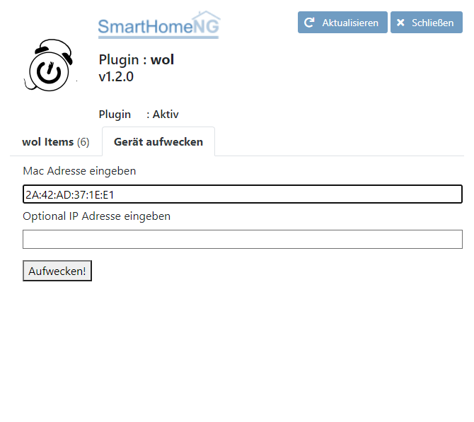

.. index:: Plugins; wol (Wake on Lan)
.. index:: wol

===
wol
===

`Wake on LAN <https://wikipedia.org/wiki/Wake-on-LAN>`_ 
(kurz WOL) ist ein 1995 von AMD in Zusammenarbeit mit Hewlett-Packard veröffentlichter Standard,
um einen ausgeschalteten Computer über die eingebaute Netzwerkkarte zu starten.

Anforderungen
-------------

Es sollte vorab mit einer zusätzlichen Software geprüft werden, ob ein Gerät überhaupt mit Wake-on-Lan eingeschaltet werden kann.
Gerade Geräte die mit Windows 10 ausgestattet sind, funktionieren nicht immer ohne spezielle Einstellungen.

Notwendige Software
~~~~~~~~~~~~~~~~~~~~~~

Es wird keine weitere Software benötigt.

Unterstützte Geräte
~~~~~~~~~~~~~~~~~~~~~

Alle Netzwerkkarten die WOL bzw. Wake-on-LAN unterstützen. 
Wenn eine Netzwerkverbindunge über einen Switch oder einen Hub hergestellt wird sollte geprüft werden, ob dieser
ein sogenanntes Magic Packet auch weiterleitet. Anderenfalls funktioniert das Aufwecken nicht.

Konfiguration
-------------

plugin.yaml
~~~~~~~~~~~

Bitte die Dokumentation lesen, die aus den Metadaten der plugin.yaml erzeugt wurde.

items.yaml
~~~~~~~~~~

Bitte die Dokumentation lesen, die aus den Metadaten der plugin.yaml erzeugt wurde.

logic.yaml
~~~~~~~~~~

Bitte die Dokumentation lesen, die aus den Metadaten der plugin.yaml erzeugt wurde.

Funktionen
~~~~~~~~~~

Bitte die Dokumentation lesen, die aus den Metadaten der plugin.yaml erzeugt wurde.

Ab SmartHomeNG 1.8 gibt es in ``lib.network`` die Funktion ``send_wol(mac, ip='255.255.255.255')``
die die gleiche Funktionalität aufweist.
Wer kein extra Item erstellen möchte und nur mit Logiken arbeitet, kann innerhalb einer Logik
diese Funktion nutzen und braucht das Plugin nicht.

Beispiele
---------

.. code:: yaml

    wakeonlan_item:
        type: bool
        wol_mac: fc:02:dc:04:aa:06
        # wol_ip: 1.2.3.4
 

Web Interface
-------------

Im Web Interface werden die aktuell registrierten Items mit dem Attribut ``wol_mac`` angezeigt und
wenn vorhanden auch der Wert des Attributs ``wol_ip``

Im zweiten Tab des Web Interface kann eine Mac Adresse und optional eine IP Adresse eingegeben werden 
um dann auf Knopfdruck das entsprechende Gerät aufzuwecken.

