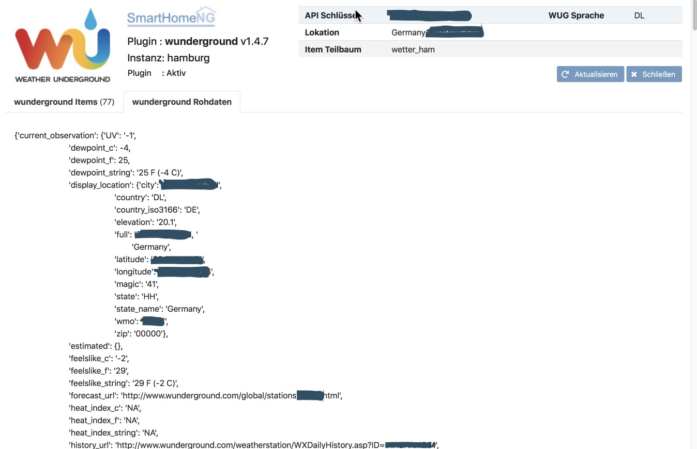

.. index:: Plugins; wunderground (Wunderground Wetterdaten)
.. index:: wunderground
.. index:: Wetter; wunderground

wunderground
############

.. attention::
   wunderground.com gibt keine kostenfreien API-Keys mehr heraus. Dieses Plugin ist daher nur für User nutzbar,
   die bereits einen entsprechenden API-Key besitzen (z.B. für die Wetterdaten Anzeige in smartVISU).

   Als Alternative haben wir kurzfristig das Plugin **darksky** bereitgestellt.

Konfiguration
=============

Die Informationen zur Konfiguration des Plugins sind unter :doc:`/plugins_doc/config/wunderground` beschrieben.

Web Interface
=============

Das wunderground Plugin verfügt über ein Webinterface, mit dessen Hilfe die Items die das Plugin nutzen
übersichtlich dargestellt werden.

.. important::

   Das Webinterface des Plugins kann mit SmartHomeNG v1.4.2 und davor **nicht** genutzt werden.
   Es wird dann nicht geladen. Diese Einschränkung gilt nur für das Webinterface. Ansonsten gilt
   für das Plugin die in den Metadaten angegebene minimale SmartHomeNG Version.

Aufruf des Webinterfaces
------------------------

Das Plugin kann aus dem backend aufgerufen werden. Dazu auf der Seite Plugins in der entsprechenden
Zeile das Icon in der Spalte **Web Interface** anklicken.

Außerdem kann das Webinterface direkt über ``http://smarthome.local:8383/wunderground`` bzw.
``http://smarthome.local:8383/wunderground_<Instanz>`` aufgerufen werden.

Beispiele
---------

Folgende Informationen können im Webinterface angezeigt werden:

Oben rechts werden allgemeine Parameter zum Plugin angezeigt.

Im ersten Tab werden die Items angezeigt, die das wunderground Plugin nutzen:

Im zweiten Tab werden die wunderground Rohdaten angezeigt:

