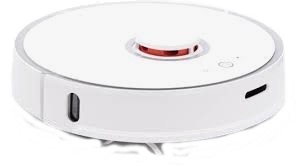
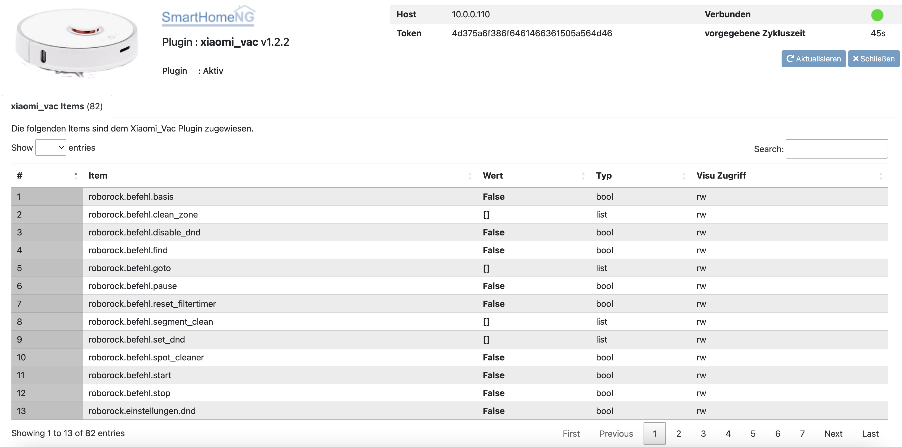

.. index:: Plugins; xiaomi_vac
.. index:: xiaomi_vac

==========
xiaomi_vac
==========

Konfiguration
=============

.. important::

      Detaillierte Informationen zur Konfiguration des Plugins sind unter :doc:`/plugins_doc/config/xiaomi_vac` zu finden.

Das Plugin basiert auf der `python-miio <https://github.com/rytilahti/python-miio>`_ Bibliothek. Zuerst muss gemäß `Anleitung auf der github Seite <https://python-miio.readthedocs.io/en/latest/discovery.html#installation>`_ des python-miio Moduls das Token eures Roboters eruiert werden.
Folgender Befehl via SSH auf dem Staubsauger selbst offenbart das unverschlüsselte Token: ``printf $(cat /mnt/data/miio/device.token)``. Dieses muss schließlich noch umgewandelt werden: ``printf "<TOKEN>" | xxd -p``.
Im Anschluss macht es Sinn, die Kommunikation mit dem Roboter in der Kommandozeile eures Rechners zu testen:

.. code-block:: console

     export MIROBO_IP=192.xxx.xxx.xxx
     export MIROBO_TOKEN=euerToken
     mirobo

Die Ausgabe sollte in etwa so aussehen:

.. code-block:: console

    > State: Charging
    > Battery: 100
    > Fanspeed: 60
    > Cleaning since: 0:00:00
    > Cleaned area: 0.0 m²
    > DND enabled: 0
    > Map present: 1
    > in_cleaning: 0

Funktionen
==========

Folgende Werte/Funktionen können vom Saugroboter ausgelesen bzw. gestartet werden:

- Start

- Stop/ zur Ladestation fahren

- Pause

- Finden

- Spotreinigung

- Lüftergeschwindigkeit ändern

- Lautstärke ansage ändern

- gereinigte Fläche

- Reinigungszeit

- Status

und viele mehr. Es wird empfohlen, die Items durch das ``struct`` Template **saugroboter** des Plugins automatisch zu implementieren.

Web Interface
=============

Das Webinterface bietet einen schnellen und einfachen Überblick über die Statusinformationen des Roboters.

